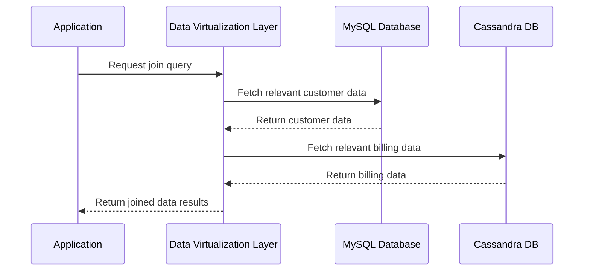

---

linkTitle: "Cross-Store Joins"
title: "Cross-Store Joins"
category: "Polyglot Persistence Patterns"
series: "Data Modeling Design Patterns"
description: "A design pattern for performing joins or aggregations across datasets stored in heterogeneous databases using data virtualization or other cross-store connectors."
categories:
- Data Integration
- Polyglot Persistence
- Data Modeling
tags:
- Cross-Store Processing
- Data Virtualization
- Federated Queries
- Distributed Systems
- Multi-Database
date: 2024-07-10
type: docs

canonical: "https://softwarepatternslexicon.com/102/7/23"
license: "© 2024 Tokenizer Inc. CC BY-NC-SA 4.0"
---

## Cross-Store Joins

### Description

The **Cross-Store Joins** pattern addresses the challenge of performing queries that involve data distributed across multiple database systems, each optimized for specific data types or access patterns. This pattern enables the melding of disparate data sources, such as SQL databases, NoSQL stores, and big data platforms, to effectively handle complex data queries that one system alone cannot efficiently process.

### Architectural Approach

Cross-store joins leverage the modular architecture of data virtualization, data federation, or cross-store query processors that abstract the heterogeneity of underlying databases and provide a unified query interface. This abstraction layer employs a connector architecture to interface with different backend data stores and employs query planners for optimization and execution.

- **Data Virtualization**: Provides a real-time abstraction layer which presents an integrated view of the underlying data, allowing for dynamic data retrieval without data duplication.

- **Federated Query Engines**: Such as Apache Drill or Presto, these systems allow for querying across various data sources providing near real-time join capabilities.

### Best Practices

- **Consistent Schemas**: Maintain consistent mappings of data schema across stores to ensure coherency and compatibility in cross-store joins.
- **Efficient Indexing**: Leverage indexes in individual databases to speed up local query execution.
- **Network Optimizations**: Optimize network settings to reduce data transfer overhead and plan queries to minimize data movement by executing filtering operations closer to data sources.
- **Security Measures**: Implement reliable Authentication and Authorization mechanisms since dataflows span multiple stores.

### Example Code

An example using a hypothetical framework to illustrate how cross-store joins could be approached within a Java environment:

```java
public class CrossStoreJoinQuery {
    public static void main(String[] args) {
        DataSource mysqlDataSource = DataSourceProvider.getMySQLDataSource();
        DataSource cassandraDataSource = DataSourceProvider.getCassandraDataSource();

        QueryExecutor executor = new QueryExecutor();
        String sql = """
            SELECT c.customer_id, c.customer_name, b.total_amount
            FROM mysql_customers c
            JOIN cassandra_billing b ON c.customer_id = b.customer_id
            WHERE b.total_amount > 1000
        """;

        ResultSet results = executor.executeJoinedQuery(sql, mysqlDataSource, cassandraDataSource);
        results.forEach(result -> System.out.println("Customer: " + result));
    }
}
```

### Diagrams

#### Sequence Diagram



### Related Patterns

- **Data Virtualization**: Provides a federated view over multiple, heterogeneous data sources.
- **Extract, Transform, Load (ETL)**: Often used to move or transform data to a common repository for easy querying.
- **Materialized Views**: Pre-compute and store the results of cross-store joins for performance optimization.

### Additional Resources

- [Polyglot Persistence](https://martinfowler.com/bliki/PolyglotPersistence.html) by Martin Fowler - A foundational article on data persisting across multiple databases.
- [Presto](https://prestodb.io/) - An open-source distributed SQL query engine for running interactive analytics against varied data sources.
- [Apache Drill](https://drill.apache.org/) - Provides SQL query capabilities for semi-structured/nested data across heterogeneous data sources.

### Summary

The Cross-Store Joins pattern offers a sophisticated approach to integrate and query data spread over various database systems, enabling organizations to leverage diverse and decentralized data assets cohesively. By abstracting complexity using federated queries or data virtualization, this pattern facilitates broader insights and responsiveness in data analytics and operations without sacrificing the specialized strengths of individual data stores.


