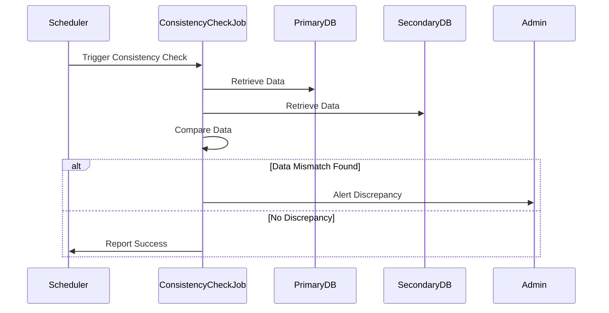

---

linkTitle: "Consistency Checker Utilities"
title: "Consistency Checker Utilities"
category: "Polyglot Persistence Patterns"
series: "Data Modeling Design Patterns"
description: "Tools or services that periodically verify data consistency across different data stores to ensure data integrity in polyglot persistence environments."
categories:
- Polyglot Persistence
- Data Integrity
- Database Management
tags:
- Consistency
- Data Integrity
- Polyglot Persistence
- Distributed Systems
- Data Quality
date: 2024-07-07
type: docs
canonical: "https://softwarepatternslexicon.com/102/7/24"
license: "© 2024 Tokenizer Inc. CC BY-NC-SA 4.0"
---


In the realm of polyglot persistence, various data stores are used to optimize data storage and retrieval depending on the use case specifics. The Consistency Checker Utilities design pattern addresses the challenge of ensuring data consistency in such diverse ecosystems. Despite the power and flexibility offered by using multiple data stores, maintaining data integrity can become complex. Consistency Checker Utilities are crucial for ensuring that the same logical data is indeed consistent across all these different stores.

## Detailed Explanation

### What are Consistency Checker Utilities?

Consistency Checker Utilities are tools or services designed to periodically or intermittently verify the consistency of data distributed across multiple heterogeneous databases. These utilities assess and ensure that all data representations across various data stores reflect the intended reality without discrepancies.

### Core Functions

- **Comparison Mechanism**: Functionality for comparing data across different data sources to identify discrepancies.
- **Alert System**: Notifies relevant stakeholders about detected inconsistencies for timely resolution.
- **Reconciliation Process**: Facilitates automatic or manual processes to reconcile divergent data points into a consistent state.
- **Logging and Reporting**: Supplies detailed logs and reports for audit purposes and future reference.

### Architectural Approach

1. **Scheduled Tasks**: Implement jobs scheduled to perform consistency checks at regular intervals. Utilize cron jobs or similar scheduling systems.
   
2. **Event-Triggered Checks**: Initiate consistency checks in reaction to certain events or thresholds, e.g., after batch updates or upon detection of a major data mismatch anomaly.

3. **Distributed Log Aggregation**: Use distributed logging mechanisms to aggregate and analyze consistency check logs for detection and reporting of systemic issues.

4. **Blob Comparison**: For certain complex data types, compare serialized data 'blobs' instead of individual fields where direct comparison is impractical.

5. **Versioning Systems**: Employ systems to track data versioning to ensure updates across all stores are synchronized appropriately.

### Example Code

```java
public class ConsistencyCheckJob {

    private final DataSource primaryDataSource;
    private final DataSource secondaryDataSource;

    public ConsistencyCheckJob(DataSource primary, DataSource secondary) {
        this.primaryDataSource = primary;
        this.secondaryDataSource = secondary;
    }

    public void runConsistencyCheck() {
        List<DataRecord> primaryRecords = primaryDataSource.getAllRecords();
        List<DataRecord> secondaryRecords = secondaryDataSource.getAllRecords();

        Map<String, DataRecord> secondaryMap = secondaryRecords.stream()
            .collect(Collectors.toMap(DataRecord::getId, Function.identity()));

        for (DataRecord primaryRecord : primaryRecords) {
            DataRecord secondaryRecord = secondaryMap.get(primaryRecord.getId());
            if (!primaryRecord.equals(secondaryRecord)) {
                reportDiscrepancy(primaryRecord, secondaryRecord);
            }
        }
    }

    private void reportDiscrepancy(DataRecord primary, DataRecord secondary) {
        System.out.println("Discrepancy found: " + primary + " vs " + secondary);
    }
}
```

### Diagram



### Related Patterns

- **Event Sourcing**: Captures changes as a sequence of events that can be used to produce eventual consistency across systems.
- **Command Query Responsibility Segregation (CQRS)**: Separates read and write operations to different databases which can leverage consistency checking utilities.
- **Saga Pattern**: Used for managing long-lived transactions and inconsistencies in distributed microservices architectures.

## Additional Resources

- [Polyglot Persistence Guide from Martin Fowler](https://martinfowler.com/bliki/PolyglotPersistence.html)
- [Designing Data-Intensive Applications](https://dataintensive.net/) by Martin Kleppmann
- [Consistency Guarantees in Distributed Systems](https://somepublication.com)

## Summary

Consistency Checker Utilities are essential for systems utilizing polyglot persistence to maintain data consistency across diverse data stores. By implementing regular checks, alert systems, and reconciliation processes, these utilities proactively manage inconsistencies, thus promoting data integrity and overall system reliability.


