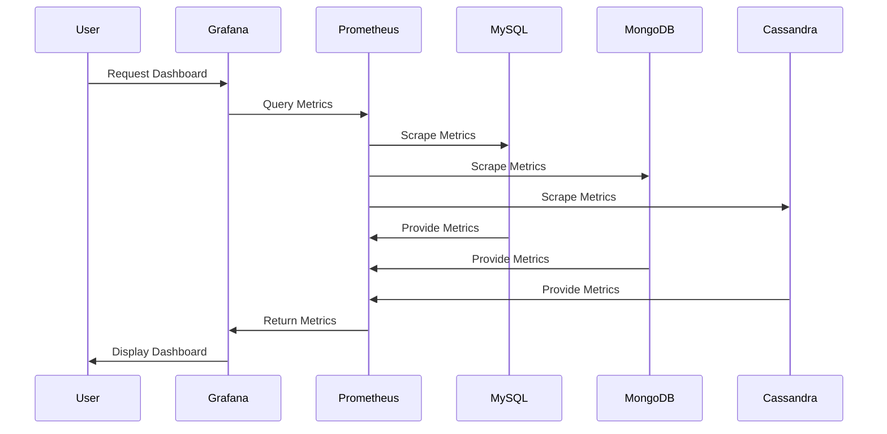

## Introduction

Polyglot Persistence Monitoring is an architectural pattern focused on the effective tracking of performance and potential issues across a heterogeneous assortment of database technologies. As modern applications often employ multiple types of data storage solutions (SQL, NoSQL, NewSQL, etc.) based on their unique requirements and strengths, it becomes essential to maintain cohesive monitoring practices across these varied systems. This pattern helps ensure that an organization can maintain consistent visibility into their data infrastructure performance irrespective of the specific technologies involved.

## Detailed Explanation

### Core Concepts

- **Heterogeneity in Data Stores**: Applications today frequently rely on multiple database management systems, each catering to specific needs such as relational data, document storage, key-value pairs, graph databases, and others.
  
- **Unified Monitoring Interface**: Despite using different technologies, it is possible to provide a unified view of system performance and health. Tools such as Prometheus or Grafana offer integrations with various database technologies to facilitate this consolidation.

### Architectural Approach

- **Metrics Collection**: Utilize a monitoring solution capable of collecting metrics from a diverse range of sources. Prometheus, for example, can scrape metrics from endpoints exposed by database systems.
  
- **Visualization and Alerting**: Implement Grafana dashboards for visual representation and alerts on thresholds, allowing for quick response to issues.
  
- **Interface and Integration**: Develop or leverage existing exporters to facilitate communication between your databases and monitoring tools. For example, exporters for PostgreSQL, MongoDB, and Cassandra are readily available.

### Example Implementation

```yaml
global:
  scrape_interval: 15s  # Fetch metrics every 15 seconds

scrape_configs:
  - job_name: 'mysql'
    static_configs:
      - targets: ['mysql_exporter:9104']

  - job_name: 'mongo'
    static_configs:
      - targets: ['mongo_exporter:9216']

  - job_name: 'cassandra'
    static_configs:
      - targets: ['cassandra_exporter:8080']
```

### Best Practices

- **Customization of Metrics**: Customize the metrics you collect to suit your organization's specific needs. Different applications might require specific insights depending on their use case.

- **Scalability Concerns**: Ensure that the monitoring solution scales well with the growth of data and diversity of data stores.

- **Security Practices**: Secure the monitoring setup to prevent unauthorized access to sensitive performance data.

## Diagrams



## Related Patterns

- **Centralized Logging**: Combine this pattern with centralized logging to provide comprehensive observability for your system.
  
- **Telemetry Correlation**: Utilize this pattern in conjunction with telemetry correlation for deeper insights into cross-system interactions.

## Additional Resources

- *[Prometheus Documentation](https://prometheus.io/docs/introduction/overview/)*
- *[Grafana Documentation](https://grafana.com/docs/grafana/latest/)*

## Summary

The Polyglot Persistence Monitoring pattern provides a robust approach to maintaining visibility across diverse database systems in modern architectures. By leveraging unified monitoring solutions with customizable metrics and visualization tools, organizations can ensure consistent database performance and fast issue resolution regardless of the underlying database technologies in use.
