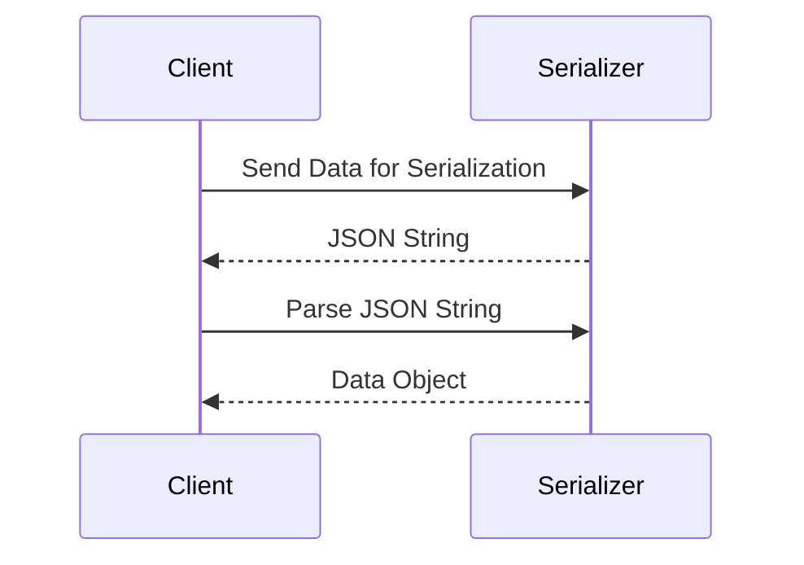

---

linkTitle: "Data Serialization Formats"
title: "Data Serialization Formats"
category: "7. Polyglot Persistence Patterns"
series: "Data Modeling Design Patterns"
description: "Using consistent serialization formats (e.g., JSON, XML, Avro) to facilitate data exchange between systems."
categories:
- Data Modeling
- Polyglot Persistence
- Integration
tags:
- Serialization
- JSON
- XML
- Avro
- Data Exchange
date: 2024-07-07
type: docs

canonical: "https://softwarepatternslexicon.com/102/7/26"
license: "© 2024 Tokenizer Inc. CC BY-NC-SA 4.0"
---

## Introduction

In the diverse world of polyglot persistence, where different data storage systems might be used for their specific strengths, data serialization formats ensure seamless data interchange. Serialization refers to converting data structures or objects into a format that can be easily stored or transmitted and later reconstructed. Common serialization formats include JSON, XML, Avro, Protocol Buffers, and others, each tailored to specific use cases and system interoperability requirements.

## Detailed Explanation

### Importance of Serialization

1. **Interoperability**: Facilitates seamless communication between disparate systems.
2. **Consistency**: Ensures that data remains uniform across different platforms and technologies.
3. **Efficiency**: Some formats allow lightweight, compressed data transit.

### Common Serialization Formats

1. **JSON (JavaScript Object Notation)**: 
   - **Benefits**: Human-readable, widely used in web applications, supported by most programming languages.
   - **Use Cases**: RESTful web services, configuration files.

2. **XML (eXtensible Markup Language)**:
   - **Benefits**: Highly structured, supports complex nested data, extensible.
   - **Use Cases**: Enterprise integrations, document systems.

3. **Avro**:
   - **Benefits**: Compact binary format, rich data structuring, schema evolution support.
   - **Use Cases**: Hadoop ecosystems, big data applications.

4. **Protocol Buffers (Protobuf)**:
   - **Benefits**: Efficient serialization, language-neutral, supports schema evolution.
   - **Use Cases**: Internal service communication in large-scale systems.

## Architectural Approaches

Implement appropriate serialization techniques based on the system requirements:
- **Data Interchange**: Use JSON or XML for easier data parsing across different platforms.
- **Performance**: Opt for Avro or Protobuf for data-heavy traffic to minimize latency.
- **Evolving Schemas**: Consider Avro or Protobuf where schema evolution is necessary.

### Best Practices:
- **Consistency**: Establish and enforce serialization standards across your organization.
- **Versioning**: Implement a robust versioning strategy to handle changes in data schemas.
- **Documentation**: Maintain comprehensive documentation for your data formats to ease onboarding and trouble-shooting.

## Example Code

### JSON Serialization in Java

```java
import com.fasterxml.jackson.databind.ObjectMapper;

public class JsonSerializationExample {
    public static void main(String[] args) {
        ObjectMapper objectMapper = new ObjectMapper();

        // Assume MyData is a class with appropriate fields and getters
        MyData data = new MyData("Example", 123);

        try {
            // Serialization
            String jsonString = objectMapper.writeValueAsString(data);
            System.out.println("Serialized JSON: " + jsonString);

            // Deserialization
            MyData deserializedData = objectMapper.readValue(jsonString, MyData.class);
            System.out.println("Deserialized Data: " + deserializedData);

        } catch (Exception e) {
            e.printStackTrace();
        }
    }
}
```

### Diagrams
Below is a simple sequence diagram demonstrating a typical serialization process using JSON.



## Related Patterns

- **Schema Evolution Patterns**: Manage changes to data structures without breaking compatibility.
- **Data Transformation Patterns**: Facilitate data adaptation between incompatible data formats.
- **Canonical Data Model**: Use a standard format to translate between different data formats.

## Additional Resources

- [Official Avro Documentation](https://avro.apache.org/docs/current/)
- [Google Protobuf Documentation](https://developers.google.com/protocol-buffers)
- [JSON.org](https://www.json.org/json-en.html)

## Summary

Data serialization formats play a crucial role in achieving interoperability and efficient data exchange in systems employing polyglot persistence. By choosing the appropriate format aligned with your system needs, and by following best practices, you ensure robustness and flexibility in your data architecture, contributing significantly to the overall success of your software systems.


