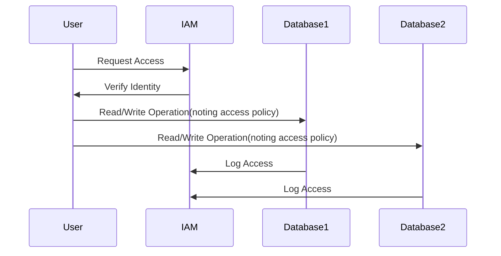

## Overview

The **Data Governance Across Stores** pattern ensures the establishment of uniform policies and standards to manage data quality, security, and compliance across different types of databases. In a polyglot persistence environment, where multiple data stores (SQL, NoSQL, NewSQL, etc.) are utilized, maintaining consistent data governance becomes a challenge due to the varied nature of data storage solutions. This pattern offers a structured approach to mitigate such challenges.

## Applicability

This pattern is applicable in scenarios where:
- Organizations utilize multiple data stores to handle varied data types and loads.
- There is a need to uniformly enforce data-related policies and standards.
- Security, quality assurance, and compliance are critical across different databases.
- A centralized view of data governance is required to audit, monitor, and control data activities.

## Architectural Approaches

1. **Centralized Data Governance Framework**: Develop a centralized data governance framework that acts as a single point of control for defining policies, monitoring compliance, and revoking unauthorized access across all data stores.

2. **Policy Abstraction Layer**: Implement a policy abstraction layer that can translate generic governance policies into specific controls applicable to each type of data store.

3. **Data Catalog and Metadata Management**: Use data catalogs and metadata management tools to maintain a consistent view and control over the data assets across all stores. This supports lineage tracking, impact analysis, and governance audits.

4. **Identity and Access Management (IAM)**: Integrate a robust IAM solution that provides unified access control and audit logs across heterogeneous data stores to ensure consistent security practices.

5. **Data Quality Framework**: Set up a data quality management framework that uniformly applies data validation, cleaning, and transformation rules across all databases.

## Best Practices

- **Consistent Policy Enforcement**: Ensure that governance policies are consistently enforced across different database technologies.
- **Regular Audits**: Conduct audits regularly to evaluate compliance with governance policies and to identify potential security gaps.
- **Stakeholder Involvement**: Engage stakeholders from IT, legal, and business teams to ensure comprehensive policy coverage and compliance with regulatory requirements.
- **Automated Monitoring**: Use automated tools to monitor data changes, access patterns, and compliance breaches in real-time.
- **Continuous Improvement**: Regularly review and update governance policies to adapt to changing technological and regulatory landscapes.

## Example Code

Implementing a simple access control rule using a centralized IAM for MongoDB and PostgreSQL:

```javascript
// Pseudocode

// Define a uniform access control policy
const accessPolicy = {
    roles: {
        admin: ['read', 'write', 'delete'],
        user: ['read'],
    }
};

// Apply access control on MongoDB
function applyMongoAccessControl(db, collection, role) {
    db.collection(collection).applyRole(accessPolicy.roles[role]);
}

// Apply access control on PostgreSQL
function applyPostgresAccessControl(client, table, role) {
    client.query(`GRANT ${accessPolicy.roles[role].join(', ')} ON TABLE ${table} TO ${role};`);
}

// Usage
applyMongoAccessControl(mongoDBInstance, 'orders', 'user');
applyPostgresAccessControl(postgresClient, 'customers', 'user');
```

## Diagrams

### Data Governance Process Flow



## Related Patterns

- **Data Federation**: Provides virtual integration of multiple data sources allowing unified data access and queries.
- **Schema Management**: Ensures consistent and governed evolution of data schemas across databases.
- **Event Sourcing**: Utilizes an append-only store to capture all changes, assisting in compliance and audit practices.

## Additional Resources

- [The DAMA Guide to the Data Management Body of Knowledge (DAMA-DMBOK)](https://dama.org)
- [Data Governance Institute Resources](https://datagovernance.com)
- [Cloud Security Alliance: Data Governance WG Usage](https://cloudsecurityalliance.org)

## Summary

The **Data Governance Across Stores** pattern is crucial for maintaining data integrity, security, and compliance in multi-database environments. By establishing a centralized governance framework and applying uniform policies and controls, organizations can effectively manage data across diverse storage technologies, reducing risk and ensuring regulatory compliance. Adopting this pattern leads to improved data governance efficiency and effectiveness, aiding businesses in data-driven decision-making processes.
