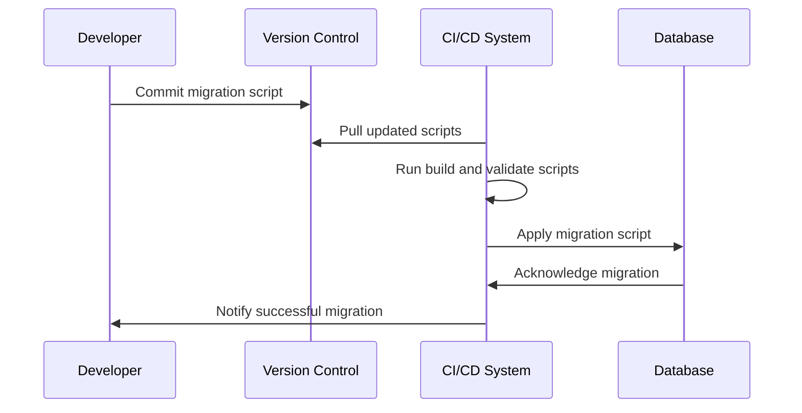

Data versioning and migration are essential processes in managing changes to schema and data in databases, especially when dealing with multiple databases that might have different schema evolution approaches. This pattern helps ensure consistency, reliability, and traceability in database management, which are critical for maintaining the integrity of applications that rely on these data stores.

## **Overview**

In a microservices architecture with polyglot persistence, different services might use different databases, each supporting distinct schema change patterns. This results in the need to manage versioning and migrations effectively to accommodate releases, updates, and rollbacks.

## **Design Pattern Context**

- **Problem**: As applications evolve, the underlying databases need schema changes, often with data that requires orderly transitions—a process known as data migration. Implementing these changes manually can lead to errors, inconsistencies, and difficulties managing versions across environments such as testing, staging, and production.
  
- **Solution**: Implement tools and practices that help automate, track, and manage database schema changes. Version control for the database, using tools like Flyway or Liquibase, can be achieved by following best practices for automated migrations and data handling.

## **Implementation Techniques**

1. **Version-Controlled Migrations**: Tools such as Flyway and Liquibase provide mechanisms to version database schemas. You manage changes with versioned scripts that can be applied automatically, ensuring orderly development and deployment processes.

2. **Schema Evolution Strategies**:
   - Use backward-compatible schema changes when possible, supporting old versions to prevent breaking downstream services during a transition.
   - Flagging the application or service to process different schema versions simultaneously, utilizing feature toggles and rollout strategies.
   - Develop database contracts by separating read/write patterns and applying schema changes incrementally.

3. **Automated Processes**: Automate the application of migration scripts using Continuous Integration/Continuous Deployment (CI/CD) pipelines to enhance efficiency and reduce manual intervention errors.

## **Example Code Using Flyway**

```java
import org.flywaydb.core.Flyway;

// Create the Flyway instance and point it to the database
Flyway flyway = Flyway.configure()
    .dataSource("jdbc:mysql://localhost:3306/mydb", "user", "password")
    .load();

// Start the migration
flyway.migrate();
```

## **Mermaid UML Sequence Diagram for Migration Process**



## **Related Patterns**

- **Database Sharding**: Often used in cases with large datasets to distribute data across multiple databases, each shard might require versioned migrations.
  
- **API Gateway**: Used to route requests correctly while schemas or database architectures are being updated seamlessly.

- **Event Sourcing**: Used to apply changes precisely and allow replaying of past events in the database to achieve the desired state.

## **Best Practices**

- Always test migrations in a staging environment before applying to production.
- Ensure migrations are backward compatible and permit rollbacks in case of failure.
- Implement comprehensive logging and alerting for migrations to track any anomalies.

## **Additional Resources**

- **Flyway Documentation**: [Flyway](https://flywaydb.org/documentation/)
- **Liquibase Documentation**: [Liquibase](https://www.liquibase.org/documentation/)
- **Database Version Control Guidance**: Database Lifecycle Management (DLM) literature.

## **Conclusion**

Data versioning and migrations are central to maintaining consistency in dynamic applications where databases undergo constant change. By employing tools like Flyway and Liquibase, organizations can manage schema changes effectively, reduce downtime, and maintain high service quality. Implementing these processes within a CI/CD framework ensures each migration is safe, validated, and documented, providing both flexibility and robustness in database management.


