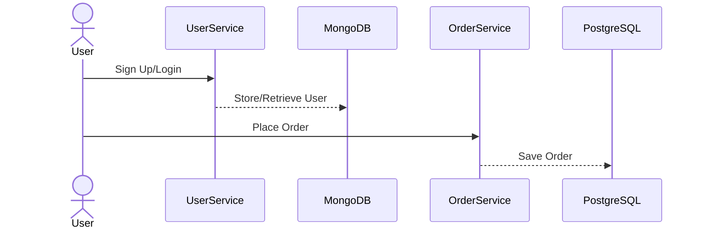

---

linkTitle: "Service-Oriented Architecture (SOA)"
title: "Service-Oriented Architecture (SOA)"
category: "7. Polyglot Persistence Patterns"
series: "Data Modeling Design Patterns"
description: "Structuring the application into separate services, each with its own database, communicating over a network."
categories:
- Architectural Patterns
- Cloud Design Patterns
- Data Modeling Patterns
tags:
- SOA
- Microservices
- Polyglot Persistence
- Distributed Systems
- Cloud Architecture
date: 2024-07-07
type: docs

canonical: "https://softwarepatternslexicon.com/102/7/3"
license: "© 2024 Tokenizer Inc. CC BY-NC-SA 4.0"
---

## Service-Oriented Architecture (SOA)

### Overview

Service-Oriented Architecture (SOA) is a design pattern where applications are composed of multiple services. Each service is responsible for a specific business function and typically operates independently of others. SOA enables the creation of scalable, flexible, and reusable components, thereby facilitating efficient integration and interaction over a network.

### Architectural Approach

#### Key Characteristics:

- **Loose Coupling**: Each service is a distinct unit that interacts with others through well-defined interfaces, minimizing dependencies.
  
- **Interoperability**: Services communicate using standard protocols, ensuring they can work across various platforms and languages.
  
- **Reusability**: Components are designed for reuse in different applications or contexts.

- **Scalability**: Components can be independently scaled according to demand.

#### Implementation Strategies:

- **SOAP/REST APIs**: Use of network calls (HTTP/SOAP) to invoke services.
- **Message Brokers**: Implementing messaging systems like Apache Kafka for asynchronous communication.

### Example

Consider a microservices architecture for an e-commerce platform:

- **User Service**: Manages user data, authentication, and profile management using **MongoDB**.

- **Order Service**: Handles order processing and history with **PostgreSQL**.

  
*Example diagram demonstrates separate services communicating via API gateways.*

### Best Practices

- **Define Service Boundaries**: Clearly define responsibilities and interactions to reduce inter-service dependencies.
  
- **Versioning**: Implement versioning in APIs to handle changes gracefully.

- **Centralized Logging**: Enable centralized logging and monitoring to trace transactions across services efficiently.

- **Security**: Utilize OAuth, HTTPS, and API keys to secure communications between services.

### Related Patterns

- **Microservices Architecture**: An evolution of SOA with finer-grained services focused on specific business capabilities.
  
- **Event-Driven Architecture**: Complements SOA by using events to trigger service responses asynchronously.
  
- **Middleware and Messaging**: Leveraging middleware for service integration and communication.

### Additional Resources

- **SOA Principles** by Thomas Erl
- **Building Microservices** by Sam Newman
- [Microservices vs. SOA on AWS](https://aws.amazon.com/microservices)

### Summary

Service-Oriented Architecture is a mature approach central to designing modular systems appreciated for its flexibility and scalability. By breaking down complex applications into manageable, independent services, organizations can respond more rapidly to change and leverage heterogeneous technology ecosystems, embracing Polyglot Persistence effortlessly.

