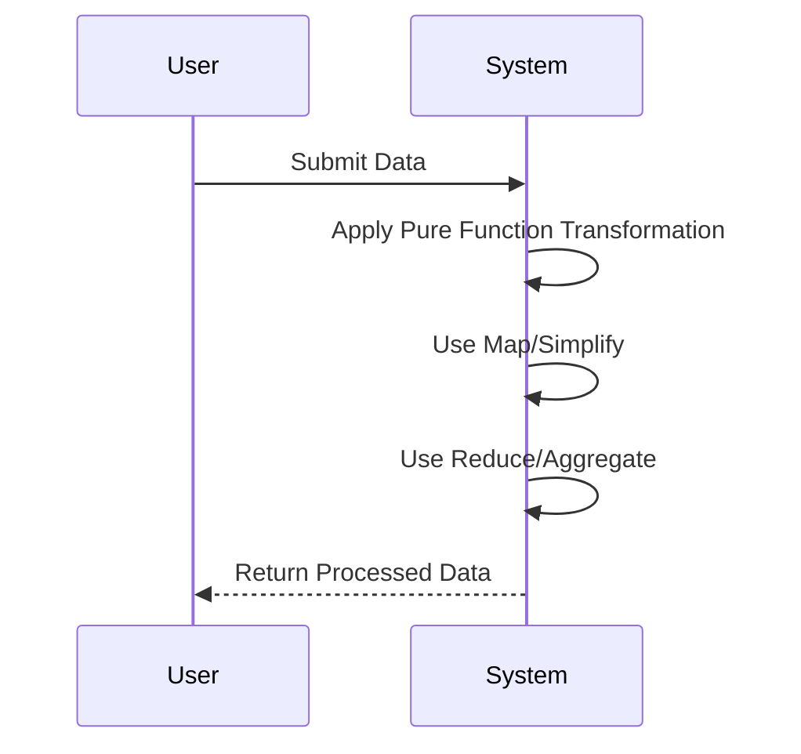

## Introduction

Functional Programming (FP) is a paradigm that treats computation as the evaluation of mathematical functions, avoiding changing-state and mutable data. This pattern focuses on applying functional programming principles to model data transformations across various storage systems in a polyglot persistence environment. By leveraging FP techniques, operations on data become predictable and concise, enhancing the maintainability and scalability of applications that interact with multiple data stores.

## Key Concepts

- **Immutability**: Ensures that data structures cannot be modified, promoting thread-safe data processing.
- **First-class and Higher-order Functions**: Functions are treated as first-class citizens, allowing them to be passed around and composed to build complex transformations.
- **Pure Functions**: Critical to functional programming, these functions always produce the same output for the same input and have no side effects.
- **Lazy Evaluation**: Delaying computation until necessary, optimizing execution and resource usage.
  
## Architectural Approaches

Various architectural approaches can incorporate functional programming:

1. **Lambda Architecture**: Combines batch and real-time processing using FP principles to enhance reliability.
2. **Event Sourcing**: Utilizes immutable event logs to reconstruct the state, making full use of FP for event processing.
3. **Functional Reactive Programming (FRP)**: Focuses on the asynchronous data flow, allowing systems to react to new data.

## Best Practices

- **Use Immutable Data Structures**: They ensure consistency and help avoid side effects.
- **Encapsulate Side Effects**: Isolate side effects to ensure functions remain pure.
- **Apply Function Composition**: Chain simple functions to build more complex operations.

## Example Code

### Scala Map-Reduce on Hadoop

```scala
import org.apache.hadoop.io._
import org.apache.hadoop.mapreduce._

class WordCountMapper extends Mapper[LongWritable, Text, Text, IntWritable] {
  val one = new IntWritable(1)
  val word = new Text()

  override def map(key: LongWritable, value: Text, context: Mapper[LongWritable, Text, Text, IntWritable]#Context) {
    val words = value.toString.split("\\s+")
    words.foreach { w =>
      word.set(w)
      context.write(word, one)
    }
  }
}
```

### JavaScript Functional Pipeline in MongoDB

```javascript
db.collection.aggregate([
  { $match: { status: "active" } },
  { $group: { _id: "$category", total: { $sum: 1 } } },
  { $sort: { total: -1 } }
]);
```

## Diagrams

### Functional Programming Process in Data Transformation



## Related Patterns

- **Pipeline and Filters**: This pattern uses a sequence of processing elements arranged to transform data, similar to the composition pattern in functional programming.
- **Event-Driven Architecture**: Often leveraged alongside FP to manage state and data transformations.

## Additional Resources

- [Functional Programming in Java](https://www.oreilly.com/library/view/functional-programming-in/9781449370779/)
- [High-Performance Spark](https://www.oreilly.com/library/view/high-performance-spark/9781491943199/)

## Summary

Functional Programming Patterns provide a robust methodology for processing complex data transformations across heterogeneous data stores. By emphasizing principles like immutability, purity, and compositionality, they ensure reliable, scalable, and maintainable data processing solutions, especially in polyglot persistence environments. Embracing these patterns can lead to more predictable and efficient outcomes, particularly when applied to modern big data and cloud-based architectures.
