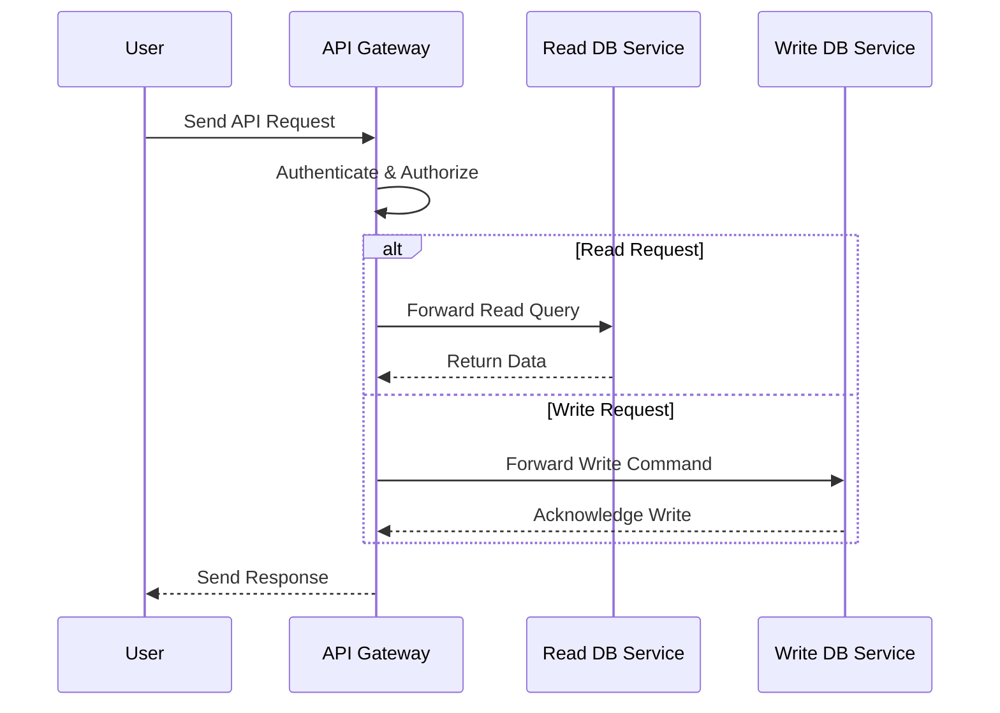

## Overview

### Description

The Data API Gateway pattern offers a unified entry point for all data requests in a distributed system architecture. It decouples the client applications from the underlying database services by abstracting the complexity involved in data retrieval, transformation, and routing. This pattern is particularly useful in environments where multiple types of databases, such as SQL, NoSQL, and NewSQL, are used simultaneously, a concept known as "polyglot persistence." The Data API Gateway translates client request formats to database-specific formats, balancing load and optimizing resource utilization.

### Architectural Approach

Incorporating a Data API Gateway requires careful planning of the routes and transformations it handles. Essential components include:

- **API Gateway Layer**: The central component that receives client requests, authenticates and authorizes them, then delegates them to the appropriate backend services.
- **Routing and Load Balancing**: The gateway uses routing rules to direct requests to different databases or data services.
- **Adapters and Translators**: Middleware components that translate API calls into the appropriate query languages or protocols needed by backend data stores (e.g., SQL for relational databases, CQL for Cassandra).
- **Caching Layer**: Optional layer to minimize data fetch times and reduce load on the data services.
- **Service Registry and Discovery**: Used to dynamically locate available backend data services and their endpoints.

The pattern enhances design flexibility by abstracting backend data source complexities, thus empowering front-end applications to change without impacting data layer implementations.

### Example Code

Below is an example of a simplified Data API Gateway built using Node.js and Express.js that routes requests to different databases based on the operation.

```javascript
const express = require('express');
const mongoose = require('mongoose'); // Example for MongoDB
const { Pool } = require('pg'); // Example for PostgreSQL

const app = express();
app.use(express.json());

// Connect to databases
mongoose.connect('mongodb://localhost:27017/mydb', { useNewUrlParser: true, useUnifiedTopology: true });
const pgPool = new Pool({ user: 'user', host: 'localhost', database: 'mydb', password: 'pass', port: 5432 });

// Routing logic
app.post('/write', async (req, res) => {
  // Write to a primary database, e.g., PostgreSQL
  const { data } = req.body;
  await pgPool.query('INSERT INTO my_table(data) VALUES($1)', [data]);
  res.sendStatus(201);
});

app.get('/read', async (req, res) => {
  // Read from a secondary database, e.g., MongoDB
  const docs = await mongoose.model('MyModel').find();
  res.json(docs);
});

app.listen(3000, () => {
  console.log('Data API Gateway running on port 3000');
});
```

### Diagram

Here is a high-level sequence diagram using Mermaid:



### Related Patterns

- **Backend for Frontend (BFF)**: Similar to the Data API Gateway in that it provides custom APIs for client interfaces, optimized for specific frontend needs.
- **CQRS (Command Query Responsibility Segregation)**: Another approach that separates read methods from write methods, complementing the Data API Gateway’s ability to optimize data-centric operations.
- **Database Sharding**: Involves horizontally partitioning data across multiple database instances, which can be managed by a Data API Gateway to route queries efficiently.

### Additional Resources

- [API Gateway in Microservices Architecture](https://microservices.io/patterns/apigateway.html)
- [Polyglot Persistence](https://martinfowler.com/bliki/PolyglotPersistence.html)
- [Effective API Design](https://www.oreilly.com/library/view/software-architecture-patterns/9781491971437/ch01.html)

### Summary

By implementing a Data API Gateway, organizations can streamline data interactions across disparate database technologies, leveraging a singular interface for clients. This approach promotes scalability and flexibility, vital for agile and responsive application development in modern cloud infrastructures. Key to its success is the careful orchestration of routing, transformations, and data source interactions.
