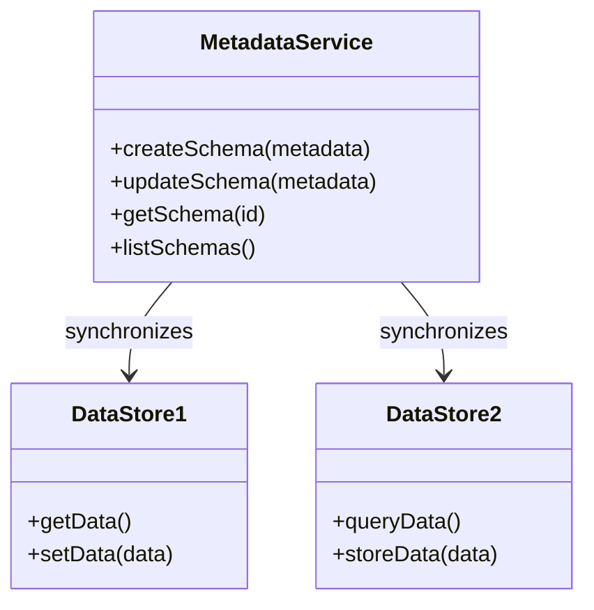

## Overview

Metadata services encompass the strategy of maintaining a comprehensive metadata repository that accurately depicts the data structures and schemas spread across multiple data stores within an organization. This centralized metadata management ensures consistency, availability, and clear governance across polyglot persistence systems.

### Purpose and Benefits

- **Consistency Across Data Stores**: By maintaining a consolidated view of all data schemas, metadata services prevent discrepancies that arise from managing multiple databases each with its unique structure.
- **Enhanced Data Governance**: Facilitates the enforcement of data governance policies by providing a clear understanding of data lineage and data relationships.
- **Schema Evolution Support**: Helps in managing schema changes over time, crucial for systems subjected to continuous enhancement and modification.

### Architectural Approaches

1. **Centralized Metadata Repository**: Integrate a central service that pulls metadata from each data source. This service updates schemas automatically and provides APIs for querying and manipulation.
  
2. **Decentralized Metadata Coordination**: Use a peer-to-peer approach where each data store manages a segment of the metadata, and updates are propagated through a distributed mechanism like Apache Kafka.

3. **Schema Registry**: Utilize technologies like Confluent Schema Registry to handle AVRO, JSON, or Protobuf schemas, promoting standardized data formats across the organization.

### Best Practices

- **Automated Schema Discovery**: Deploy tools and services that can automatically detect schema changes and update the metadata repository to reflect these changes in real time.
  
- **Versioned Metadata Management**: Facilitate versions of metadata to support backward compatibility and a historical overview of schema changes.
  
- **Access Control and Auditing**: Implement robust access control mechanisms and maintain detailed audit logs to ensure data security and compliance with regulatory standards.

### Diagrams

Below are sample diagrams that illustrate metadata services in the context of polyglot persistence.



### Example Code

Here is an example of how a metadata service API could be implemented using a RESTful approach with Node.js Express:

```javascript
const express = require('express');
const app = express();
app.use(express.json());

let schemas = {};

app.post('/schemas', (req, res) => {
  const { id, metadata } = req.body;
  schemas[id] = metadata;
  res.status(201).json({ message: 'Schema created', metadata });
});

app.get('/schemas/:id', (req, res) => {
  const id = req.params.id;
  const metadata = schemas[id];
  if (metadata) {
    res.json(metadata);
  } else {
    res.status(404).json({ message: 'Schema not found' });
  }
});

app.listen(3000, () => console.log('Metadata Service running on port 3000'));
```

### Related Patterns

- **Data Lake**: Often incorporates metadata services to manage the vast and varying data sources.
- **Command Query Responsibility Segregation (CQRS)**: May use metadata services for schema management in distinct read and write data stores.
- **Event Sourcing**: Often paired with a schema registry to ensure consistent event formats.

### Additional Resources

- "Managing Metadata: The Key to Transforming Data Repositories" by David Loshin.
- *Data Governance: The Definitive Guide* by Sunil Soares.
- Online documentation for [Confluent Schema Registry](https://docs.confluent.io/platform/current/schema-registry/index.html).

## Summary

Metadata services serve as a fundamental pattern in managing data schemas across polyglot persistence architectures. By centralizing and governing schemas, organizations can achieve consistency, enhance data governance, enable easier schema evolution, and improve overall data quality. Adopting metadata services, coupled with best practices and modern technologies, provides a robust foundation for managing complex data environments effectively.
