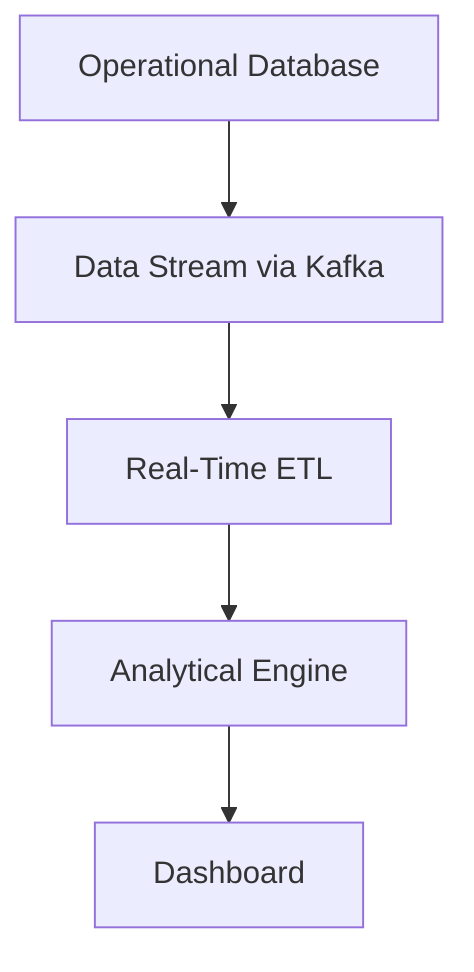

## Hybrid Transactional/Analytical Processing (HTAP) Solutions

Hybrid Transactional/Analytical Processing (HTAP) represents a modern data handling architecture that allows a single system to manage both transactional (OLTP) and analytical (OLAP) workloads simultaneously. This pattern eliminates the traditional need for separate databases for transactions and analytics by allowing organizations to run real-time reporting and analytics on transactional data without significant data movement or transformation latency.

### Description

HTAP solutions aim to provide a consistent, low-latency access to data, integrating transactional data immediately for analytical processing. This contrasts with traditional architectures that require regular Extract, Transform, Load (ETL) processes to move data between operational databases and dedicated data warehouses or lakes for analysis, introducing latency and operational complexity.

One common example is using Azure Cosmos DB, which offers native support for multimodal data and fully managed HTAP. In Azure Cosmos DB, transactional data can be immediately available for analytics through the integration with technologies such as Azure Synapse Analytics, providing seamless OLAP capabilities on the operational data without requiring data movement.

### Architectural Approaches

1. **Unified Data Platform**: Employs a single database system capable of processing both OLTP and OLAP queries efficiently. Apache Cassandra, SAP HANA, or Google's Spanner are examples of databases designed with these capabilities.

2. **Data Synchronization**: Integrates operational data stores with analytical engines in near real-time using change data capture (CDC) and streaming technologies like Apache Kafka, reducing ETL processing delays.

3. **In-Memory Data Processing**: Systems like SAP HANA utilize in-memory processing to accelerate data retrieval and processing across transactional and analytical workloads.

### Best Practices

- **Consistency Models**: Choose databases that support flexible consistency modeling to balance transactional integrity and analytical performance.
  
- **Scalable Architecture**: Leverage cloud-native designs that separate storage and compute resources for cost efficiency and scalability.
  
- **Indexing and Partitioning**: Optimize indexing and partitioning strategies to enhance performance for varied query patterns typical in HTAP workloads.
  
- **Data Governance**: Implement robust data governance and access controls to ensure security across diverse workloads and user bases.

### Example Code
 
This is a basic example of setting up an Azure Cosmos DB for HTAP, integrating with Azure Synapse for analytical workloads:

```javascript
const { CosmosClient } = require("@azure/cosmos");

const endpoint = "<your-cosmos-db-endpoint>";
const key = "<your-cosmos-db-key>";
const client = new CosmosClient({ endpoint, key });

async function queryContainer() {
  const databaseId = "SampleDB";
  const containerId = "SampleContainer";
  const query = "SELECT * FROM c WHERE c.creationDate >= @lastWeek";

  const { resources: items } = await client
    .database(databaseId)
    .container(containerId)
    .items.query({
      query,
      parameters: [{ name: "@lastWeek", value: getLastWeekDate() }],
    })
    .fetchAll();

  console.log(items);
}

queryContainer().catch((err) => {
  console.error(err);
});

function getLastWeekDate() {
  let date = new Date();
  date.setDate(date.getDate() - 7);
  return date.toISOString();
}
```

### Diagram

Below is a Mermaid diagram showcasing a typical HTAP architecture in a cloud environment:



### Related Patterns

- **Event-Driven Architecture**: Facilitates near real-time data processing and integration crucial for HTAP systems.
  
- **Compute-Storage Separation**: Optimizes resource allocation and cost management, especially important in cloud-based HTAP solutions.
  
- **CQRS (Command Query Responsibility Segregation)**: Separates command and query responsibilities, potentially fitting into hybrid workloads by optimizing retrieval and management.

### Additional Resources

- [Azure Cosmos DB HTAP Documentation](https://docs.microsoft.com/en-us/azure/cosmos-db/)
- [Google Cloud Spanner Overview](https://cloud.google.com/spanner)
- [SAP HANA Platform](https://www.sap.com/products/technology-platform/hana.html)

### Summary

HTAP Solutions address the historical divide between transactional and analytical databases, enabling organizations to optimize business processes with real-time insights, thus accelerating decision-making processes. By selecting a platform that offers scalable, real-time integration of operational and analytical workloads, businesses can achieve significant efficiencies and drive informed decision-making. The evolution towards HTAP stands as a testament to modern data architecture's push for comprehensive, unified data solutions.


