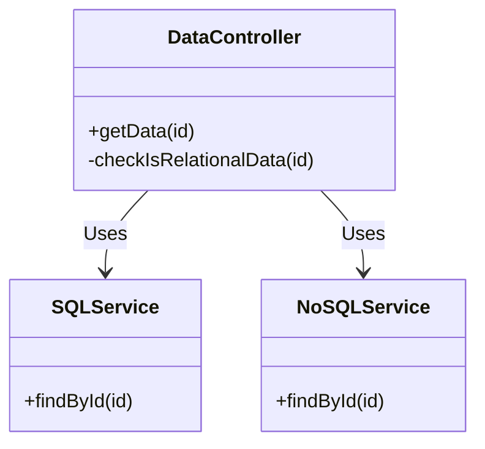

## API Layer Abstraction

### Overview 

The API Layer Abstraction is a design pattern that presents a uniform interface to an application's data access mechanisms. This pattern encapsulates the complexity of interacting with different databases by providing a unified API layer above them. It is valuable in scenarios with polyglot persistence, where an application may need to communicate with several kinds of data stores, each optimized for specific types of operations.

### Architectural Approach

In designing an API Layer Abstraction, attention should be paid to both the structure of the API and the processing logic it encapsulates:
- **Interface Coverage**: The API should comprehensively cover all necessary interactions with the underlying data stores.
- **Modular Design**: Employ modular design principles to ensure the API is extensible and maintainable, allowing integration with new data stores as needs evolve.
- **Routing Logic**: Include a routing logic layer to direct API calls to appropriate data stores based on the operation type and dataset characteristics.

### Example Code

Consider an API layer abstracting both SQL and NoSQL databases. Here is an illustrative example in Java using Spring Framework:

```java
@RestController
public class DataController {

    private final SQLService sqlService;
    private final NoSQLService noSQLService;

    public DataController(SQLService sqlService, NoSQLService noSQLService) {
        this.sqlService = sqlService;
        this.noSQLService = noSQLService;
    }

    @GetMapping("/data/{id}")
    public ResponseEntity<Data> getData(@PathVariable("id") String id) {
        if (checkIsRelationalData(id)) {
            return ResponseEntity.ok(sqlService.findById(id));
        } else {
            return ResponseEntity.ok(noSQLService.findById(id));
        }
    }
    
    private boolean checkIsRelationalData(String id) {
        // Example heuristic to determine the data type
        return id.startsWith("SQL_");
    }
}
```

### Diagrams

Below is a simplified Mermaid Class Diagram illustrating the concept:



### Related Patterns

**Repository Pattern**: Often implemented within the data access layer to provide further abstraction over CRUD operations.

**Gateway Pattern**: Acts as a single entry and exit point for network communication, reducing complexity in distributed systems.

**Facade Pattern**: Like the API Layer Abstraction, it provides a simplified interface to complex subsystems.

### Additional Resources

1. [Martin Fowler on Polyglot Persistence](https://martinfowler.com/bliki/PolyglotPersistence.html)
2. [Repository Pattern](https://www.martinfowler.com/eaaCatalog/repository.html)

### Summary

The API Layer Abstraction Design Pattern is essential for managing complexity in environments utilizing polyglot persistence. By creating a consolidated and streamlined access layer, applications can interact with various data stores without worrying about specific implementation details. This pattern contributes to maintainable, scalable, and flexible software architecture, proficiently supporting enterprise-level systems. With the growing diversity of database technologies, leveraging a well-designed API layer can be crucial for application success.
