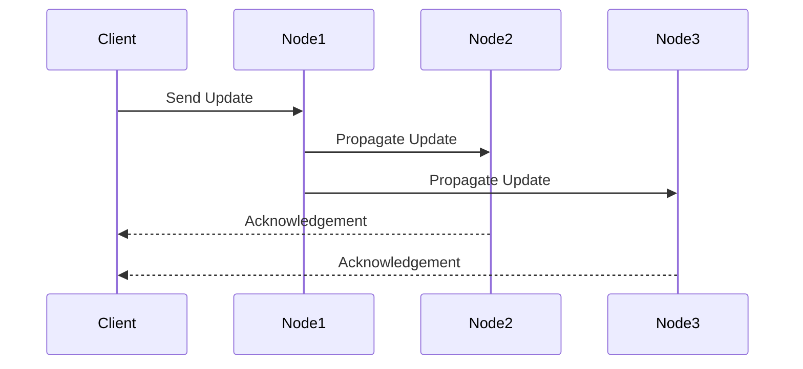

## Overview

Eventual Consistency is a consistency model used in distributed systems to ensure data integrity over time. It allows for temporary inconsistencies in data across different nodes or data stores, with the assurance that all updates will be propagated and the system will become consistent eventually. This model is pivotal when dealing with high availability and partition tolerance, as defined by the CAP theorem.

## Architectural Approach

### Key Concepts
- **Asynchronous Replication**: Updates are propagated to other nodes without needing immediate synchronization.
- **Convergence**: Despite delays, the system eventually reaches a consistent state.
- **Trade-offs**: Sacrifices strong consistency for improved performance and availability.
- **Reconciliation Mechanisms**: Tools and strategies for conflict detection and resolution.

### Technical Implementation

- **Versioning**: Track changes using version numbers or timestamps, facilitating conflict resolution.
- **Conflict Resolution**: Implement strategies like last-write-wins, application-specific reconciliation logic, or merge functions.
- **Message Passing**: Utilize messaging systems, such as Apache Kafka, to propagate changes effectively.
- **Gossip Protocols**: Utilize these for nodes to inform each other about updates, fostering eventual consistency.

### Example Code

###### Pseudocode for Asynchronous Update Propagation

```scala
case class Update(id: String, data: String, timestamp: Long)

val systemNodes = List("node1", "node2", "node3")

def propagateUpdate(update: Update): Unit = {
  systemNodes.foreach(node => sendUpdateAsync(node, update))
}

def sendUpdateAsync(node: String, update: Update): Future[Unit] = Future {
  // Simulate async sending update to a node
  println(s"Sending update to $node: ${update.id}")
}

// Usage
val update = Update("123", "newData", System.currentTimeMillis())
propagateUpdate(update)
```

### Diagrams

#### Mermaid Sequence Diagram for Update Propagation



## Related Patterns

- **Base Patterns**: Explores fundamental patterns such as CAP Theorem and SAGA Pattern.
- **Data Synchronization**: Discusses synchronization strategies in multi-node environments.
- **CQRS (Command Query Responsibility Segregation)**: Patterns that separate read and update paths to accommodate eventual consistency.

## Additional Resources

- [Amazon Dynamo Paper](https://www.allthingsdistributed.com/files/amazon-dynamo-sosp2007.pdf) - seminal paper discussing eventual consistency in practice.
- [CAP Theorem Overview](https://en.wikipedia.org/wiki/CAP_theorem) - Understanding the trade-offs between Consistency, Availability, and Partition Tolerance.

## Summary

Eventual Consistency provides a strategic balance for distributed systems between availability and latency on one side and data integrity on the other. By utilizing asynchronous replication mechanisms and embracing the temporary inconsistencies, distributed systems can deliver higher availability and partition tolerance. Understanding and implementing reconciliation strategies are crucial in implementing the Eventual Consistency model effectively.
