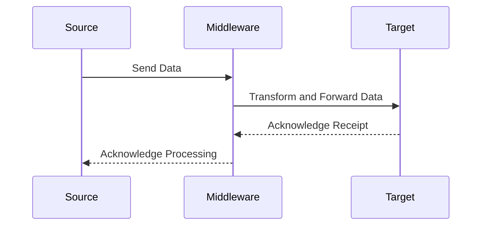

The Data Integration Layer pattern focuses on leveraging middleware technologies or integration platforms to facilitate smooth data flow across heterogeneous databases and systems. This approach is vital in modern architectures where multiple data stores with different technologies must communicate seamlessly.

## Detailed Explanation

### Design Pattern Overview

A Data Integration Layer acts as an intermediary, orchestrating and processing data flows between various source systems and target systems. This layer can manage complexities such as data format transformations, data enrichment, conflict detection, and resolution. Integration platforms are typically used to decouple systems, improve scalability, and enhance data alignment.

### Architectural Approaches

1. **Middleware Platforms**:
   - Utilizing platforms like Apache Kafka or Apache Flink can provide real-time data streaming and processing. These platforms can persist changes and propagate them across multiple database systems, ensuring data synchronization and consistency.
   
2. **ETL (Extract, Transform, Load) Processes**:
   - Traditional batch processing using ETL tools (e.g., Apache Nifi, Talend) can be employed where real-time synchronization isn't necessary. ETL can extract data periodically, transform it to the required schema, and load it into target systems.
   
3. **API-Driven Integration**:
   - RESTful or GraphQL APIs can provide endpoints for different services or databases to interact. This pattern supports loose coupling and easier management of services and databases.
   
4. **Event-Driven Architecture**:
   - Systems communicate with each other via events, allowing for more flexible and responsive data flows. Event brokers like Kafka or RabbitMQ facilitate decoupled services that react to state changes in real-time.

### Best Practices

- **Decouple Systems**: Ensure clear separation between integration logic and business logic to reduce complexity and improve maintainability.
- **Data Transformation**: Use schemas and transformation rules to handle different data formats and structures adaptively.
- **Error Handling**: Implement comprehensive error detection and resolution mechanisms to cater to data integrity and redundancy.
- **Security and Compliance**: Safeguard data flows with robust security measures, ensuring data protection and compliance with regulations.

### Example Code

Here's a simple example of using Apache Kafka for data integration between services:

```java
import org.apache.kafka.clients.producer.KafkaProducer;
import org.apache.kafka.clients.producer.ProducerRecord;

import java.util.Properties;

public class DataProducer {
    public static void main(String[] args) {
        Properties props = new Properties();
        props.put("bootstrap.servers", "localhost:9092");
        props.put("key.serializer", "org.apache.kafka.common.serialization.StringSerializer");
        props.put("value.serializer", "org.apache.kafka.common.serialization.StringSerializer");

        KafkaProducer<String, String> producer = new KafkaProducer<>(props);

        for (int i = 0; i < 100; i++) {
            producer.send(new ProducerRecord<String, String>("my_topic", Integer.toString(i), Integer.toString(i)));
        }

        producer.close();
    }
}
```

### Diagrams



### Related Patterns

- **Event Sourcing**: Tracks sequential changes to application state using an immutable event log.
- **Command Query Responsibility Segregation (CQRS)**: Separates read and write operations based on different data models.
- **Microservices Architecture**: Utilizes services to isolate integrated functionalities.

### Additional Resources

- [Cloud Design Patterns: Prescriptive Architecture Guidance for Cloud Applications](https://docs.microsoft.com/en-us/azure/architecture/patterns/)
- [Apache Kafka Documentation](https://kafka.apache.org/documentation/)
- [Enterprise Integration Patterns](https://www.enterpriseintegrationpatterns.com/)

### Summary

The Data Integration Layer pattern empowers organizations to orchestrate data efficiently across a blend of databases and systems. By employing strategic integration methods such as middleware platforms, ETL processes, and event-driven architecture, businesses can achieve seamless data synchronization, improved system decoupling, and enhanced operability of polyglot persistence environments. This pattern is instrumental in optimizing modern cloud-based solutions where heterogeneity in data management systems is prevalent.
