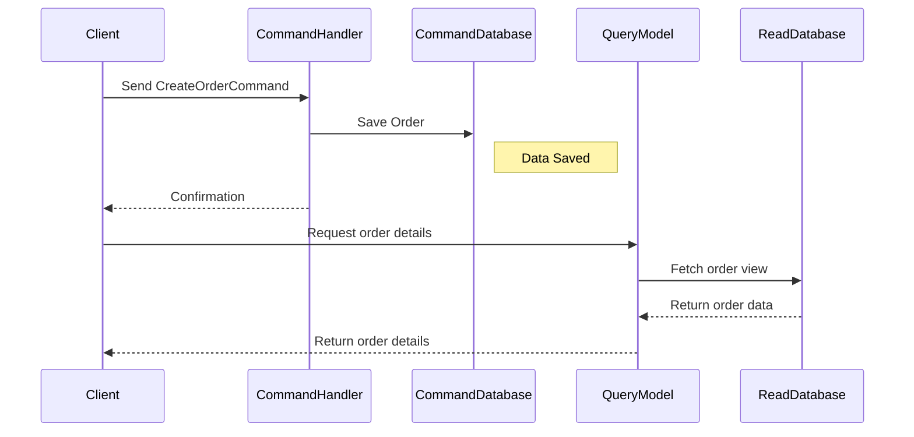

## Command Query Responsibility Segregation (CQRS)

Command Query Responsibility Segregation (CQRS) is an architectural pattern that separates read and write operations for improved performance, scalability, and security. This separation allows optimizing each part independently and can lead to more maintainable and flexible systems.

### Explanation

### Key Concepts

- **Commands**: In CQRS, commands are responsible for writing operations. They change the state of the application. The command side typically interacts with a transactional database to ensure data integrity.
  
- **Queries**: Queries, on the other hand, are read operations. The query model is designed to return data efficiently and quickly. It often uses denormalized views or NoSQL databases to optimize read performance.

- **Separation of Concerns**: By dividing responsibilities, CQRS adheres to the single responsibility principle and leads to better-organized codebases.

- **Polyglot Persistence**: CQRS can utilize different storage technologies for commands and queries. For example, a relational database might handle the transactional command operations, while a document or key-value store might serve the query-heavy operations.

### Architectural Approach

In CQRS, the system architecture includes two primary models, each designed for its particular purpose:

1. **Command Model**: 
   
   - Transactional storage, e.g., SQL databases like PostgreSQL or MySQL.
   - Optimized for write consistency and integrity.
   - Can employ Event Sourcing to improve scalability by storing state changes as events.
   
2. **Query Model**:

   - Efficient read databases, e.g., NoSQL databases like MongoDB, Elasticsearch, or DynamoDB.
   - Designed for fast query performance.
   - These models often have read replicas or cached views of data, using data denormalization if necessary.

### Implementation Example

Below is a simplified example of a CQRS architecture written in Java with pseudo-code to demonstrate its implementation:

#### Command Side Example:

```java
public class OrderService {

    private final OrderRepository orderRepository;

    public OrderService(OrderRepository orderRepository) {
        this.orderRepository = orderRepository;
    }

    public void createOrder(OrderCommand orderCommand) {
        Order order = new Order(orderCommand);
        orderRepository.save(order);
    }
}
```

#### Query Side Example:

```java
public class OrderQueryService {

    private final NoSQLDataStore noSQLDataStore;

    public OrderQueryService(NoSQLDataStore noSQLDataStore) {
        this.noSQLDataStore = noSQLDataStore;
    }

    public List<OrderView> getOrders() {
        return noSQLDataStore.queryOrders();
    }
}
```

### Diagram

Here's a simplified representation of a CQRS architecture using a Mermaid UML Sequence Diagram:



### Related Patterns

- **Event Sourcing**: Often paired with CQRS to manage state changes as a sequence of events, facilitating system recovery and synchronization in distributed systems.
  
- **Materialized Views**: In the query model, often use materialized views to optimize query performance.

### Best Practices

- **Consistency Management**: Since CQRS introduces eventual consistency between the command and query models, appropriately manage consistency across the data stores.
- **Security and Permission**: Strictly segregate access for commands and queries, often with separate services or endpoints to minimize risks.
  
- **Deployment Strategies**: Automate the update of view models to reflect command changes rapidly, often using message brokers like Apache Kafka or RabbitMQ.

### Additional Resources

- Martin Fowler’s blog on [CQRS](https://martinfowler.com/bliki/CQRS.html)
- Greg Young’s [CQRS introduction](https://cqrs.nu/Faq) handling complex processing logic

### Summary

CQRS is a robust design pattern that enhances separation of concerns in distributed systems by splitting command and query responsibilities. It is particularly valuable in scenarios requiring highly scalable architectures or systems with complex read and write operations. When correctly applied, CQRS can align with event-driven architectures and microservices to provide clear API boundaries and facilitate performance optimization, enabling effective and efficient enterprise solution deployment.
