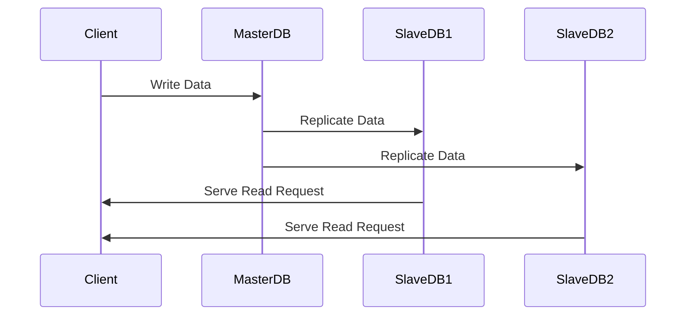

## Data Replication

Data replication is a fundamental design pattern in cloud computing and distributed systems. It involves copying data from one database to another, ensuring that multiple copies of the data are maintained across different geographical or logical locations. This pattern enhances data availability, fault tolerance, and performance, particularly in environments requiring high read throughput and uptime.

### Architectural Approaches

There are several architectural approaches to data replication, including:

1. **Master-Slave Replication**:
   - A single master node accepts all write requests, while one or more slave nodes replicate the master's data to serve read requests. This configuration reduces load on the master, thereby enhancing performance for read-heavy applications.

2. **Multi-Master Replication**:
   - Multiple nodes can accept write operations, and each node is incrementally updated with the others. This approach is more complex but offers higher availability and fault tolerance. Conflict resolution mechanisms are necessary to handle concurrent updates.

3. **Real-Time Data Replication**:
   - Data changes are propagated in real-time using streams or logs, often through technologies like Apache Kafka. This ensures that all replicas remain consistent with the latest data.

4. **Batch Replication**:
   - Data is copied in bulk at scheduled intervals. While not as immediate as real-time replication, it's useful for scenarios where slight latency is acceptable and resources need to be conserved.

### Best Practices

- **Consistent Data Models**: Ensure that the data schema remains consistent across replicated environments to prevent transformation errors.
- **Network Optimization**: Use network optimizations like data compression during transfer to reduce latency and data transfer costs.
- **Conflict Resolution**: Implement robust conflict resolution protocols, particularly in multi-master architectures, to handle data consistency issues.
- **Monitoring and Alerts**: Set up monitoring and automated alerts to manage the replication process and quickly address any failures.

### Example Code

Here's a simple example using Apache Kafka for real-time data replication:

```java
import org.apache.kafka.clients.producer.*;

public class DataReplicationExample {
    public static void main(String[] args) {
        // Kafka producer configuration
        Properties props = new Properties();
        props.put("bootstrap.servers", "localhost:9092");
        props.put("key.serializer", "org.apache.kafka.common.serialization.StringSerializer");
        props.put("value.serializer", "org.apache.kafka.common.serialization.StringSerializer");
        
        // Instantiate the producer
        Producer<String, String> producer = new KafkaProducer<>(props);
        
        // Replicate data by sending it to a topic
        for (int i = 0; i < 100; i++) {
            producer.send(new ProducerRecord<>("replicated-topic", Integer.toString(i), "Record " + i));
        }
        
        // Close the producer
        producer.close();
    }
}
```

### Diagrams



### Related Patterns

- **CQRS (Command Query Responsibility Segregation)**: Differentiating between command models (for writes) and query models (for reads) can be combined with replication for performance boosts.
- **Event Sourcing**: Storing state changes as a sequence of events that can be replicated across systems.
- **Sharding**: Dividing a dataset into smaller partitions to improve performance, often used in conjunction with replication.

### Additional Resources

- [Distributed Systems - Principles and Paradigms by Andrew S. Tanenbaum](https://www.google.com)
- [Designing Data-Intensive Applications by Martin Kleppmann](https://www.google.com)
- Apache Kafka [Official Documentation](https://kafka.apache.org/documentation/)

### Summary

Data replication is a robust design pattern essential for high availability and performance optimization in distributed systems. By understanding and implementing various replication strategies and utilizing technologies like Kafka for real-time data streaming, organizations can significantly enhance application resilience and scalability. Proper conflict resolution, consistent data schemas, and monitoring are key to successful replication.
