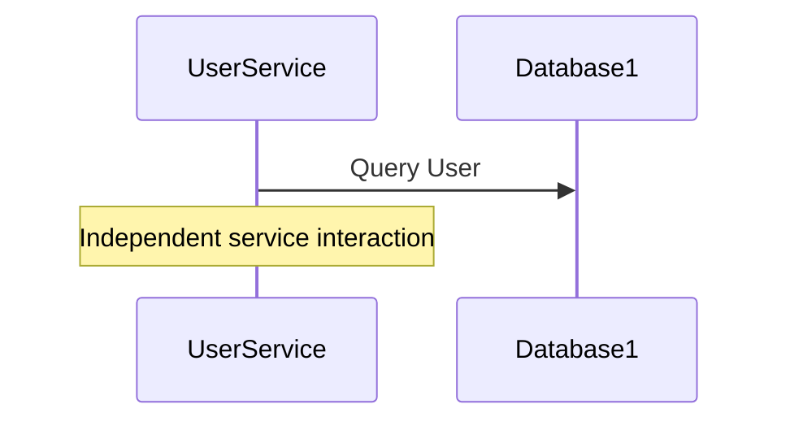

---

linkTitle: "Shared Nothing Architecture"
title: "Shared Nothing Architecture"
category: "Polyglot Persistence Patterns"
series: "Data Modeling Design Patterns"
description: "A design pattern where each component or service operates independently, with isolated storage, enhancing scalability and fault tolerance."
categories:
- cloud architecture
- distributed systems
- scalability
tags:
- microservices
- isolation
- scalability
- fault tolerance
- performance
date: 2024-07-07
type: docs

canonical: "https://softwarepatternslexicon.com/102/7/9"
license: "© 2024 Tokenizer Inc. CC BY-NC-SA 4.0"
---

## Shared Nothing Architecture

### Detailed Explanation

The Shared Nothing Architecture is a distributed computing pattern that segregates components or services in such a way that they share neither disk storage nor memory. This isolation enables the components to operate independently which significantly enhances scalability, reliability, and fault tolerance.

In traditional architectures, sharing resources like databases or memory can lead to bottlenecks under high loads. Conversely, the shared nothing approach ensures that each service or component has its own resources and can perform independently of others, eliminating single points of failure or resource contention.

### Architectural Approaches

1. **Microservices Architecture**: Each microservice manages its own database instance. This design allows individual services to scale on demand and employ the type of database that best suits their data access patterns.

2. **Cloud Native Services**: Adopting cloud native solutions that facilitate resource allocation and efficiency, such as Kubernetes for container orchestration, to effectively manage the lifecycle and distribution of independent services.

3. **Event Sourcing**: Leveraging event logs (e.g., Kafka brokers) where each service publishes and consumes events asynchronously, thus decoupling their operations.

### Paradigms and Best Practices

- **Independence**: Ensure no service is directly dependent on another, using APIs or messaging queues for communication.
- **Replication and Sharding**: Use data redundancy techniques to partition data across nodes for optimized performance and fault tolerance.
- **Decentralized Management**: Consider decentralized systems for handling coordination, such as using consensus algorithms for distributed data management.

### Example Code

An example of a microservice setup in a shared nothing environment using Spring Boot for a decomposed application:

```java
@SpringBootApplication
public class UserServiceApplication {
    public static void main(String[] args) {
        SpringApplication.run(UserServiceApplication.class, args);
    }
}

@RestController
@RequestMapping("/users")
class UserController {

    @Autowired
    private UserService userService;

    @GetMapping("/{id}")
    public User getUser(@PathVariable Long id) {
        return userService.getUserById(id);
    }
}

@Service
class UserService {

    @Autowired
    private UserRepository userRepository;

    public User getUserById(Long id) {
        return userRepository.findById(id).orElseThrow(() -> new UserNotFoundException(id));
    }
}

@Repository
interface UserRepository extends JpaRepository<User, Long> {}
```

In this setup, `UserService` might be using a database that is entirely separate from the services responsible for managing products or orders.

### Diagram

Here is a simple sequence diagram for clarity, demonstrating the interaction between independent services:



### Related Patterns

- **Service Oriented Architecture (SOA)**: While SOA encompasses the shared nothing principle, the focus in SOA might still include certain shared services.
- **CQRS (Command Query Responsibility Segregation)**: Partners well with shared nothing by splitting read and write operations to enhance performance.
- **Event-Driven Architecture**: Complements shared nothing by allowing services to react to events being processed in isolation.

### Additional Resources

- "Designing Data-Intensive Applications" by Martin Kleppmann.
- "Building Microservices" by Sam Newman.
- [Article: Polyglot Persistence Architecture with Microservices](https://example.com/polyglot-persistence-microservices).

### Summary

The Shared Nothing Architecture is immensely valuable in modern software systems, providing the architectural underpinnings for high-performance, scalable applications with every component running in isolation. Its compatibility with cloud technologies and microservices positions it as a cornerstone of current distributed computing practices.
