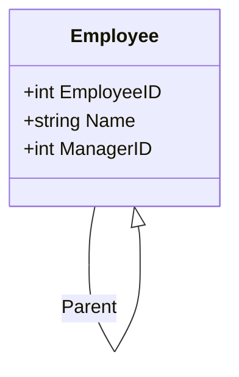

---

linkTitle: "Adjacency List Model"
title: "Adjacency List Model"
category: "8. Hierarchical and Network Modeling"
series: "Data Modeling Design Patterns"
description: "Represents hierarchical data using a table where each record has a reference to its parent. Commonly used in scenarios like organizational charts or file directories."
categories:
- Data Modeling
- Database Design
- Hierarchical Structures
tags:
- Adjacency List
- Hierarchical Data
- Database Schema
- SQL
- Data Modeling
date: 2024-07-07
type: docs
canonical: "https://softwarepatternslexicon.com/102/8/1"
license: "© 2024 Tokenizer Inc. CC BY-NC-SA 4.0"
---

## Adjacency List Model

### Description

The Adjacency List Model is a simple and widely used data model design pattern tailored for representing hierarchical data structures within a relational database. In this model, each record holds a reference to its parent, typically through a parent identifier field, facilitating the representation of hierarchical or tree-like relationships.

### Architectural Approach

The core of the Adjacency List Model is its straightforward structure, where each table row contains:

- **ID**: A unique identifier for the record.
- **ParentID**: An identifier pointing to the parent record. This creates a direct linkage between the child and its parent, emulating hierarchical dependencies.
  
This simplicity makes the Adjacency List Model highly adaptable and easy to implement, though it may not be as performant as other models for complex queries, especially those requiring traversal of large hierarchies.

### Best Practices

- **Normalization**: Ensure the relationship between parent and child is properly normalized to avoid data anomalies.
- **Indexing**: Index the ParentID field to enhance query performance, particularly when retrieving hierarchical paths or reconstructing hierarchies.
- **Constraints**: Use foreign keys and constraints to maintain referential integrity, ensuring every ParentID exists within the ID column.

### Example Code

In a relational database, the Adjacency List Model can be depicted as follows, using the example of an employees table:

```sql
CREATE TABLE Employees (
    EmployeeID INT PRIMARY KEY,
    Name VARCHAR(50),
    ManagerID INT,
    FOREIGN KEY (ManagerID) REFERENCES Employees(EmployeeID)
);
```

To find all employees and their respective managers, you could execute a query such as:

```sql
SELECT e1.EmployeeID, e1.Name, e2.Name AS ManagerName
FROM Employees e1
LEFT JOIN Employees e2 ON e1.ManagerID = e2.EmployeeID;
```

### Diagrams

Below is a simple Mermaid Class Diagram illustrating the Adjacency List structure for an employees table.



### Related Patterns

- **Path Enumeration**: Another hierarchical pattern where paths are stored directly.
- **Nested Set Model**: A complex pattern used to pre-compute paths to speed up hierarchy queries.
- **Closure Table**: Utilizes a separate table to store relationships between nodes, providing efficient hierarchy traversal.

### Additional Resources

1. [Managing Hierarchical Data in MySQL](https://dev.mysql.com/doc/)
2. [Hierarchical Data in SQLGitHub Resource](https://www.sqlshack.com/)
3. [Graph Data Modeling in Graph Databases](https://neo4j.com/developer/graph-data-modeling/)

### Summary

The Adjacency List Model remains a straightforward, easily implementable data modeling pattern for hierarchical structures. While straightforward and widely adopted, its performance may become a limitation as hierarchy depth increases, necessitating the evaluation of other hierarchical models like the Nested Set Model or Closure Table for more complex use cases. Proper implementation involving constraints, normalization, and indexing can significantly enhance the effectiveness of this model in practical applications.
