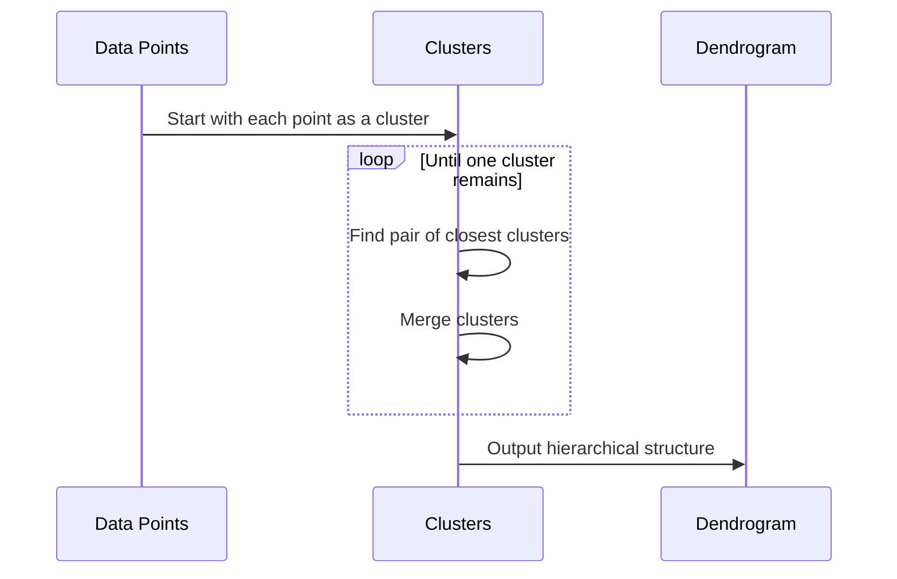

## Hierarchical Clustering

Hierarchical clustering is an unsupervised machine learning method used to group a set of objects in such a way that objects in the same cluster are more similar than those in other clusters. This is often used for data that exhibits a hierarchy of relationships or similarities, and where inferring these nested relationships is crucial.

### Design Pattern Category and Subcategory

- **Category**: 8. Hierarchical and Network Modeling
- **Subcategory**: Hierarchical Modeling

### Description

Hierarchical clustering creates a tree structure called a dendrogram, which encapsulates a sequence of merges (in agglomerative clustering) or splits (in divisive clustering). The process involves iteratively either merging internal nodes or splitting external clusters until a desired level of similarity or number of clusters is achieved. This pattern effectively reveals the nested relationships within a dataset.

### Architectural Approach

Hierarchical clustering takes two main forms:
1. **Agglomerative (Bottom-Up)**: This approach starts with each data point as a separate cluster. Steps involve:
   - Initialize each data point as its own cluster.
   - Iteratively merge the closest pair of clusters until only a single cluster remains or another stopping criterion is met.

2. **Divisive (Top-Down)**: This approach starts with a single cluster that includes all data points. Steps involve:
   - Begin with a single, extensive cluster.
   - Split the cluster iteratively into smaller clusters, one step at a time, based on the least similarity.

### Similarity Measures and Linkage Criteria

- **Similarity Measures**: Common methods include Euclidean distance, Manhattan distance, and cosine similarity.
  
- **Linkage Criteria**: Defines how the distance between two sets of observations is calculated:
  - **Single linkage**: Distance between the closest points.
  - **Complete linkage**: Distance between the furthest points.
  - **Average linkage**: Mean distance between all points.
  - **Ward's linkage**: Minimizes the total within-cluster variance.

### Best Practices

- **Choosing the Right Measure**: Select a distance or similarity measure that fits the dataset characteristics.
- **Visualizing Dendrograms**: Use dendrogram plots to decide on the stopping criterion effectively.
- **Scalability Concerns**: Computational complexity can be high. Preprocessing steps like dimensionality reduction (e.g., PCA) can help.

### Example Code

Here is a Python snippet using `scipy` for agglomerative clustering with hierarchical linkage:

```python
import numpy as np
from scipy.cluster.hierarchy import linkage, dendrogram
import matplotlib.pyplot as plt

data = np.array([[1.0, 2.0], [1.5, 1.8], [5.0, 8.0],
                 [8.0, 8.0], [1.0, 0.6], [9.0, 11.0]])

linked = linkage(data, method='ward')

plt.figure(figsize=(10, 7))
dendrogram(linked,
           orientation='top',
           distance_sort='descending',
           show_leaf_counts=True)
plt.show()
```

### Diagram

Below is a basic mermaid sequence diagram of the agglomerative hierarchical clustering process:



### Related Patterns

- **K-Means Clustering**: Often considered for flat clustering but does not provide the hierarchy like hierarchical clustering.
- **Graph-based Clustering**: Another methodology for clustering that uses graph structures to identify connected components.

### Additional Resources

- [Scipy Hierarchical Clustering Documentation](https://docs.scipy.org/doc/scipy/reference/cluster.hierarchy.html)
- [Machine Learning by Tom Mitchell](https://www.cs.cmu.edu/~tom/mlbook.html), excellent foundational resource on clustering techniques.
- [Hands-On Machine Learning with Scikit-Learn, Keras, and TensorFlow](https://www.oreilly.com/library/view/hands-on-machine-learning/9781492032632/) for practical implementation examples.

### Summary

Hierarchical clustering is a powerful technique when data contains inherent hierarchical relationships. It provides a wealth of insights into the natural grouping in the data and is useful in various applications, such as customer segmentation, social network analysis, and bioinformatics. Considerations around similarity measures, computational efficiency, and visualization can greatly enhance its usage and the insights derived from it.
