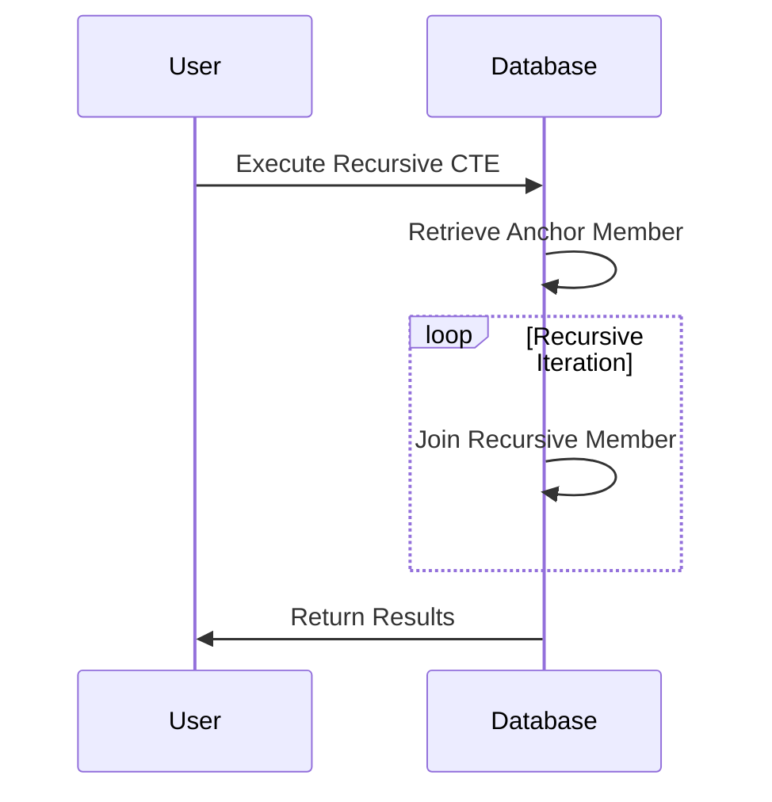

Recursive Queries are a powerful database feature allowing you to query hierarchical data structures efficiently. This pattern is particularly useful for managing and retrieving data from scenarios such as employee-manager relationships, category hierarchies, bill of materials, and organizational structures.

## Overview

Recursive queries enable you to process hierarchical and network data structures without requiring multiple round trips to the database. They allow for the construction of transitive closure queries, where you can retrieve all levels of the hierarchy from a given starting point. This pattern utilizes database constructs such as Common Table Expressions (CTEs) in SQL to achieve its functionality.

## Key Concepts

- **Common Table Expression (CTE):** A temporary result set that you can reference within a `SELECT`, `INSERT`, `UPDATE`, or `DELETE` statement. Recursive CTEs are particularly useful for handling hierarchical data.
  
- **Anchor Member:** The base part of a recursive CTE that defines the starting point of recursion. It generally selects the root nodes or starting entities of the hierarchy.
  
- **Recursive Member:** The part of a recursive CTE that joins the result of the previous level with the next level in the hierarchy, allowing you to traverse through all levels.

## Best Practices

- **Limit Recursion Depth:** To prevent infinite loops in recursive queries, always limit the depth of recursion. This can be done using a `WHERE` clause or by the number of recursive iterations.
  
- **Optimize with Indexes:** Ensure that indexes are applied on foreign keys and hierarchical columns to speed up query execution.
  
- **Test with Smaller Subsets:** Before executing a recursive query on large datasets, validate its correctness on smaller subsets for performance and accuracy.

## Detailed Example

Consider a scenario where you need to retrieve all employees under a specific manager in an organization.

```sql
WITH RECURSIVE EmployeeHierarchy AS (
    -- This is the anchor member
    SELECT employee_id, name, manager_id
    FROM employees
    WHERE manager_id IS NULL -- starting from the topmost manager

    UNION ALL

    -- This is the recursive member
    SELECT e.employee_id, e.name, e.manager_id
    FROM employees e
    INNER JOIN EmployeeHierarchy eh ON eh.employee_id = e.manager_id
)
SELECT * FROM EmployeeHierarchy;
```

## Diagram

The following is a mermaid sequence to illustrate the execution flow of a recursive query:



## Related Patterns

- **Adjacency List:** Typically used for storing hierarchical data, where each entry holds a reference to its parent.
- **Closure Table:** An alternative design pattern for representing hierarchical data that includes paths between nodes explicitly, making complex queries more straightforward.

## Additional Resources

- [Microsoft SQL Server Recursive Queries](https://docs.microsoft.com/en-us/sql/relational-databases/performance/recursive-queries-sql-server)
- [PostgreSQL Recursive Queries and CTEs](https://www.postgresql.org/docs/current/queries-with.html)
- [Oracle SQL Recursive Subquery Factoring (CTE)](https://oracle-base.com/articles/misc/with-clause)

## Summary

Recursive Queries provide a robust method for handling hierarchical data, leveraging the power of SQL's Common Table Expressions (CTE) to traverse and manage relationships efficiently. By understanding and implementing best practices associated with recursive querying, you can enhance the performance and clarity of your databases dealing with hierarchical schema.
