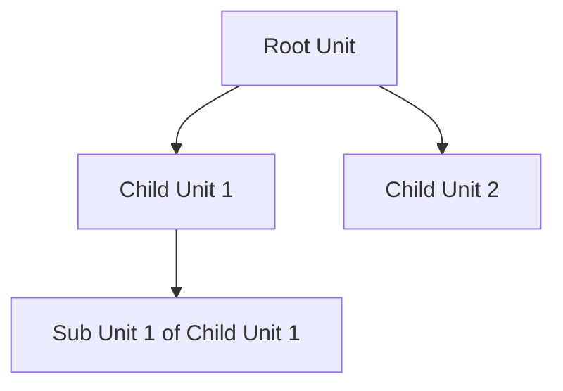

Self-referencing foreign keys, also known as recursive foreign keys, are used to model hierarchical structures within a database table. This design pattern allows a row to relate back to another row in the same table, effectively creating a parent-child relationship. The most common use case for this pattern is to represent organizational hierarchies, taxonomies, or any structure where an element of a set is related to another element of the same set.

## Description

In relational databases, a self-referencing foreign key occurs when a foreign key constraint is defined such that it references the primary key of the same table. This pattern is instrumental in describing hierarchical data structures, enabling the representation of entities with parent-child relationships within the same table, preserving the integrity and enforcing a structure within the data.

### Example: Organization Hierarchy

Consider an "Organization" table where each department or division may report to a parent department:

```sql
CREATE TABLE Organization (
    id INT PRIMARY KEY,
    name VARCHAR(255),
    parent_id INT,
    FOREIGN KEY (parent_id) REFERENCES Organization(id)
);
```

In this structure:
- `id` is the primary key identifying each organization unit uniquely.
- `parent_id` is a foreign key referencing the `id` field to establish hierarchical links between units.

### Implementation Considerations

- **Indexing**: Implement proper indexing on the foreign key for efficient retrievals.
- **Integrity Constraints**: Ensure referential integrity through foreign key constraints.
- **Traversal and Queries**: Use Recursive Common Table Expressions (CTEs) for querying hierarchical data.

## Architectural Approaches

### Advantages

- **Compact Representation**: Self-referencing foreign keys allow compact representations of nested structures without the need for separate linkage tables.
- **Simplicity**: Simplifies the schema design by keeping related data within a single table.
- **Flexibility**: Easily supports multiple hierarchy levels.

### Disadvantages

- **Complex Queries**: Requires recursive queries for certain operations, which can be complex to write and less performant with deep hierarchies.
- **Limited by Schema**: Schema changes can become complex if hierarchy depth flexibility is required.

## Best Practices

- Implement CTEs in SQL for traversing hierarchical data efficiently.
- Regularly validate data to ensure no cyclic dependencies exist.
- Use indexing to enhance performance, especially for large datasets.

## Example Code

Using SQL's CTE to retrieve the entire hierarchy of a specific organizational unit:

```sql
WITH RECURSIVE OrgHierarchy AS (
    SELECT id, name, parent_id
    FROM Organization
    WHERE id = ? -- Start with specific root node
    UNION ALL
    SELECT org.id, org.name, org.parent_id
    FROM Organization org
    INNER JOIN OrgHierarchy oh ON oh.id = org.parent_id
)
SELECT * FROM OrgHierarchy;
```

## Diagrams



## Related Patterns

- **Adjacency List**: Similar concept where each row stores a reference to its parent but in a more general manner.
- **Nested Set Model**: An alternative hierarchical model that generates numerical representations of tree structures.

## Additional Resources

- [SQL Recursive Queries](https://www.sqlservertutorial.org/sql-server-recursive-cte/)
- [Managing Hierarchical Data in RDBMS](https://devdocs.io/mysql/nested-sets)
- [Graph Data Modeling in Databases](https://neo4j.com/developer/data-modeling/)

## Summary

The self-referencing foreign key pattern is invaluable for modeling hierarchical data within the relational model, allowing efficient storage and retrieval of data with inherent parent-child relationships. While enabling a clean schema design, it demands careful consideration of query strategies and performance tuning through indexing, particularly with deep hierarchies. Recursive CTEs in SQL are a powerful tool for effectively navigating these structures.
