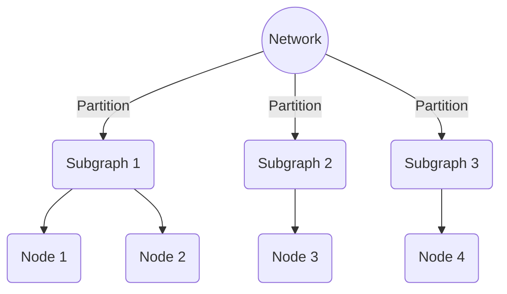

## Overview

Network Partitioning is a crucial design pattern that involves dividing a larger network into smaller, more manageable subgraphs or communities. This pattern is particularly useful in fields like social network analysis, telecommunications, cloud computing, and distributed systems, where understanding the interactions and dynamics within smaller segments can significantly enhance performance and efficiency.

## Architectural Approaches

1. **Graph Partitioning Algorithms**: Algorithms like Girvan-Newman, Louvain, and spectral clustering are widely used to partition networks. These algorithms focus on minimizing the edges between subgraphs while maximizing internal connectivity.

2. **Hierarchical Clustering**: This approach involves creating a hierarchy of nested clusters in a network. Agglomerative and divisive methods are popular, where the former builds clusters from individual nodes, and the latter divides the network into groups.

3. **Community Detection**: Techniques like modularity optimization and label propagation are used to detect densely connected subgroups (communities) within the network.

## Best Practices

- **Balancing Load and Efficiency**: When implementing network partitioning, consider the balance between load distribution and communication efficiency among partitions.

- **Scalability**: Ensure that the partitioning method can scale with the size of the network to maintain performance.

- **Dynamic Networks**: For networks that evolve over time, adopt dynamic partitioning strategies that can adapt to changes in real-time.

## Example Code

Below is an example in Python using the NetworkX library, which demonstrates a simple approach to partition a network using a community detection algorithm.

```python
import networkx as nx
from networkx.algorithms import community

G = nx.karate_club_graph()

comp = community.girvan_newman(G)
first_level_communities = next(comp)

communities = [list(c) for c in first_level_communities]
print("Detected communities:", communities)
```

## Diagrams

Here's a basic Mermaid diagram illustrating the concept of network partitioning:



## Related Patterns

- **Sharding**: In database systems, sharding is a similar concept where a large dataset is split into smaller partitions, often distributed across databases.

- **Load Balancing**: This pattern involves distributing network or application traffic across several servers or instances.

## Additional Resources

- "Community Detection Algorithms: A Comparative Analysis" – Paper discussing various algorithms for community detection.
- NetworkX Documentation: [NetworkX Community Detection](https://networkx.github.io/documentation/stable/reference/algorithms/community.html)

## Summary

Network Partitioning is a strategic approach to managing, analyzing, and optimizing large networks by dividing them into smaller, robust subgroups or communities. By leveraging this design pattern, organizations can enhance their understanding of complex network structures, improve performance, and ensure scalability. Whether applied to social networks, telecommunications, or distributed systems, network partitioning serves as a fundamental tool in network analysis and data modeling.
