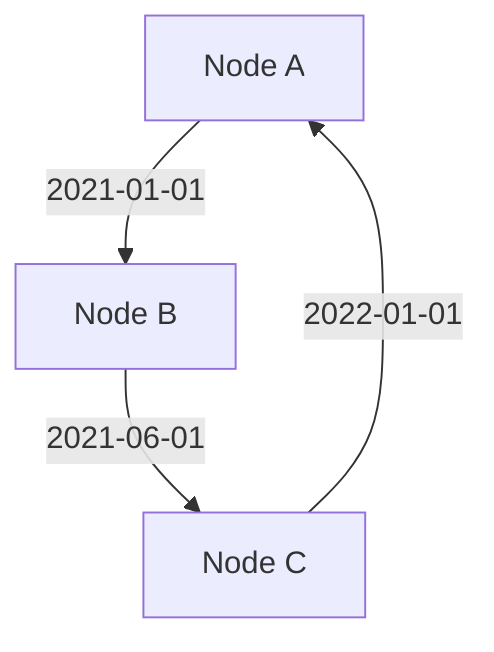

## Introduction

Temporal graph modeling is a powerful design pattern used to incorporate the time dimension into graph structures, enabling the tracking of changes and evolution over time. Unlike static graph models that capture a single snapshot of relationships, temporal graph models allow for the representation of dynamic interactions and relationships, making them extremely valuable in applications where time-awareness is crucial, such as social network analysis, communication networks, and historical data interpretation.

## Characteristics

- **Time-Variance**: Graphs that change over time, capturing relationships that are not static.
- **Multi-Dimensionality**: Incorporates both spatial (nodes and edges) and temporal dimensions.
- **Complex Structures**: Allows representation of complex temporal interactions and transitions.

## Architectural Approach

1. **Time Annotation**: Nodes and edges in the graph are annotated with timestamps or time intervals which represent their validity or occurrence time.
2. **Temporal Queries**: Support for complex temporal queries that allow retrieving state at a specific time or within a specific time range.
3. **Data Storage**: Utilizes graph databases that are optimized for storing and processing temporal information, such as Neo4j with its temporal extensions.
4. **Indexing Techniques**: Employs efficient indexing mechanisms to manage and query temporal data efficiently, such as time-trees or interval partitioning.

## Best Practices

- **Normalize Temporal Features**: Ensure that temporal attributes are consistently and accurately applied across the graph model.
- **Maintain Historical Accuracy**: Incorporate mechanisms to prevent retroactive modifications without proper versioning and audit trails.
- **Efficient Query Optimization**: Use dedicated indexes and query planners that can handle temporal aspects proficiently.
- **Balancing Granularity**: Decide on the level of temporal granularity (e.g., seconds, minutes, days) that best fits your use-case while maintaining performance.

## Example Code

Here's an example in a hypothetical query language manipulating a temporal graph to retrieve relationships over a period:

```sql
MATCH (person:Person)-[r:FRIEND_OF]-(friend:Person)
WHERE r.from <= '2023-01-01' AND (r.to IS NULL OR r.to >= '2023-01-01')
RETURN person, friend, r
```

## Diagram



## Related Patterns

- **Time-Series Databases**: Focused on capturing and analyzing series of data points indexed in time order.
- **Change Data Capture (CDC)**: Techniques to capture changes in databases for synchronization and ETL processes.

## Additional Resources

- [Temporal Graph Theory Concepts](https://link-to-resource)
- [Graph Database Handbook](https://link-to-resource)
- [Introduction to Temporal Networks](https://link-to-resource)

## Summary

Temporal Graph Modeling allows for the representation and querying of dynamic interactions that vary over time, offering a paradigm that is critical for systems needing to maintain historical accuracy and temporal querying capabilities. By integrating these structures with the right databases, indexes, and query languages, organizations can harness the power of temporal graphs to gain insights into the evolving nature of connected entities.
