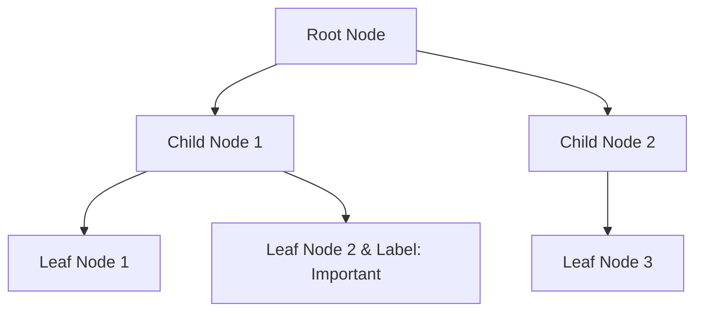

## Introduction

In data modeling, particularly for hierarchical and network-based structures, labeling hierarchies is a powerful pattern that facilitates efficient data classification, filtering, and querying. It involves assigning predefined labels or categories to nodes and edges within a hierarchy or network, thereby enhancing the ability to manage, manipulate, and analyze data structures such as file systems, organizational charts, decision trees, and network graphs.

## Detailed Explanation

### Core Concepts

1. **Node Labeling**: Assigning categories or attributes to nodes allows for easy identification and selection based on node characteristics. Node labels can denote types (e.g., file type), statuses (e.g., active/inactive), or permissions (e.g., read, write).

2. **Edge Labeling**: Similar to nodes, edges within a hierarchical structure can also be labeled. This is particularly useful when relationships between nodes need classification, such as defining connection types (e.g., parent-child, peer-to-peer) or semantic relationships (e.g., supports, informs).

3. **Filtering and Querying**: Labels enable efficient filtering and querying of hierarchical data. For example, in a content management system, one can quickly query all documents labeled as "draft" or filter files by type in a file system.

4. **Grouping and Aggregation**: Labels help in grouping nodes or edges for performative aggregation or summarization tasks, such as computing the total size of files labeled as "images" or identifying all subsidiaries in a corporate structure.

### Architectural Approaches

- **Schema Design**: When designing schemas for hierarchical structures, provide tables or fields dedicated to labels for both nodes and edges. This approach can leverage SQL for relational databases where indexing on label columns can significantly boost query performance.

```sql
CREATE TABLE Nodes (
    id INT PRIMARY KEY,
    name VARCHAR(100),
    label VARCHAR(50),
    parent_id INT,
    FOREIGN KEY (parent_id) REFERENCES Nodes(id)
);

CREATE INDEX idx_label ON Nodes(label);
```

- **Graph Databases**: Utilize graph databases which inherently support complex graph queries and often provide native support for labeling hierarchies. Technologies like Neo4j or Amazon Neptune offer optimized storage and retrieval mechanisms for such data models.

- **Document Stores**: In systems relying on NoSQL document stores, labels can be incorporated into JSON structures, allowing flexibility in label assignment and easy updates.

```json
{
    "id": "123",
    "name": "Document A",
    "type": "file",
    "labels": ["public", "important"],
    "children": []
}
```

### Best Practices

- **Consistency in Label Names**: Ensure a standardized and consistent naming convention for labels to avoid ambiguity and improve clarity in datasets.

- **Use of Taxonomies**: Define taxonomies or hierarchical classification schemes for labels especially in complex systems, enabling scalability and reducing redundancy.

- **Indexing Strategy**: Employ efficient indexing strategies for faster search and retrieval, especially when dealing with large datasets.

- **Metadata Management**: Maintain metadata information for labels to document their meaning, usage contexts, and any dependencies or relationships.

## Example Code

Here is a simple code example of filtering a hierarchical data structure using node labels:

```java
import java.util.List;
import java.util.stream.Collectors;

class Node {
    String name;
    String label;
    List<Node> children;

    // Constructor and other methods
}

public class LabelFilter {
    
    public List<Node> filterByLabel(List<Node> nodes, String desiredLabel) {
        return nodes.stream()
                .filter(node -> node.label.equals(desiredLabel))
                .collect(Collectors.toList());
    }
}
```

## Diagram



## Related Patterns

- **Composite Pattern**: Useful for representing part-whole hierarchies and using labeling to define behaviors or attributes at different hierarchy levels.
- **Visitor Pattern**: Can be employed alongside Labeling Hierarchies to traverse and apply operations selectively based on node labels.
- **Tagging Pattern**: Different from hierarchical labels, tagging allows for a more flexible and multi-faceted approach to categorizing data without a strict hierarchy.

## Additional Resources

- [Neo4j Documentation on Labeling](https://neo4j.com/docs/)
- [Amazon Neptune Graph Database Guidelines](https://aws.amazon.com/neptune/)
- [Graph Databases: The Definitive Guide](https://hardcopy.commneleutronsample.io/graph-databases)

## Summary

The Labeling Hierarchies design pattern empowers systems to efficiently organize and leverage hierarchical structures by providing rich contextual information through labels. This pattern improves data management capabilities, enhances search and filter functions, and supports sophisticated data queries, making it indispensable in various data-intensive applications. By adhering to best practices and leveraging appropriate technologies, organizations can unlock powerful capabilities for handling complex hierarchical data structures efficiently.
