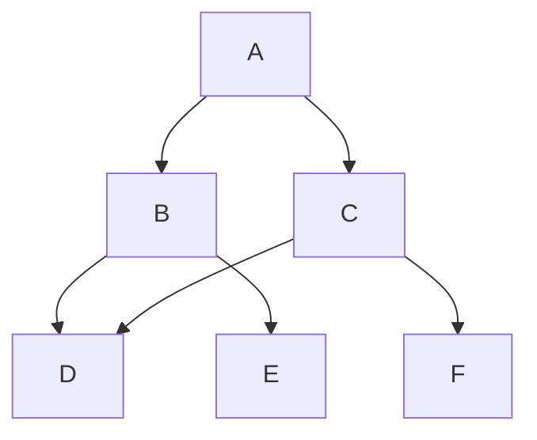

## Introduction

**Directed Acyclic Graphs (DAGs)** are a foundational pattern for modeling systems and processes that involve dependencies and directional flows. By definition, a DAG is a directed graph with no cycles, making it ideal for scenarios where a cyclic path would be nonsensical, such as task scheduling, build systems, and dependency resolution.

## Detailed Explanation

### Architectural Approach

Directed Acyclic Graphs are used to create structures where nodes represent entities (e.g., tasks, operations, states), and directed edges embody the relationships or dependencies between these nodes. The acyclic nature ensures that no node can eventually link back to itself, thereby preventing infinite loops and allowing for straightforward topological sorting.

#### Key Properties
- **Directionality**: Every edge in a DAG has a direction, denoting a one-way relationship or dependency from one node to another.
- **Acyclic**: There are no cycles, ensuring that any node is not revisited once traversed in the depth-first search manner.
- **Hierarchical Potential**: DAGs can easily be tailored to mimic hierarchical tree structures, supporting parent-child relationships without traditional hierarchical rigidity.

### Best Practices

- **Normalization**: Break down large tasks into granular subtasks to enhance the clarity and management of dependencies.
- **Topological Sorting**: Implement topological sorting algorithms to compute an execution order that respects all dependencies.
- **Change Management**: Ensure that updating node attributes/accounts for new dependencies does not unintentionally introduce cycles.
- **Use Libraries**: Employ graph databases or libraries that natively support DAG processing to handle complex operations efficiently.

## Example Code

Here’s a simple Python example illustrating the creation of a DAG and performing a topological sort using adjacency lists.

```python
from collections import defaultdict, deque

class DAG:
    def __init__(self):
        self.graph = defaultdict(list)
    
    def add_edge(self, u, v):
        self.graph[u].append(v)
    
    def topological_sort(self):
        in_degree = {node: 0 for node in self.graph}
        for node in self.graph:
            for neighbor in self.graph[node]:
                in_degree[neighbor] += 1

        zero_in_degree_queue = deque(node for node in self.graph if in_degree[node] == 0)
        topological_order = []

        while zero_in_degree_queue:
            u = zero_in_degree_queue.popleft()
            topological_order.append(u)

            for neighbor in self.graph[u]:
                in_degree[neighbor] -= 1
                if in_degree[neighbor] == 0:
                    zero_in_degree_queue.append(neighbor)

        if len(topological_order) == len(self.graph):
            return topological_order
        else:
            raise ValueError("Graph is not a DAG (contains cycles)")

dag = DAG()
dag.add_edge(5, 2)
dag.add_edge(5, 0)
dag.add_edge(4, 0)
dag.add_edge(4, 1)
dag.add_edge(2, 3)
dag.add_edge(3, 1)

try:
    print("Topological Sort Order:", dag.topological_sort())
except ValueError as e:
    print(e)
```

## Diagram

Below is a simple representation of a Directed Acyclic Graph using a Mermaid UML diagram:



## Related Patterns

- **Tree Structures**: For hierarchies that do not allow multiple parentage relationships for nodes.
- **State Machine**: Manages transitions but may allow cycles if extended beyond DAG scope.
- **Dependency Injection**: In software architecture, to handle service and component dependencies effectively.

## Additional Resources

1. [Graph Theory Textbooks](https://en.wikipedia.org/wiki/Graph_theory)
2. [Kahn's algorithm for topological sorting](https://en.wikipedia.org/wiki/Topological_sorting)
3. [Graph Databases with Native DAG Support](https://neo4j.com/)

## Summary

Directed Acyclic Graphs (DAGs) are indispensable when modeling systems with directional, non-cyclic dependencies. From project management to data processing pipelines, DAGs ensure components are executed in a sequence that respects all existing dependencies, thereby facilitating error-free operations across diverse fields. Through careful architecture and the right tooling, DAGs can propel efficiencies in system design and execution.
