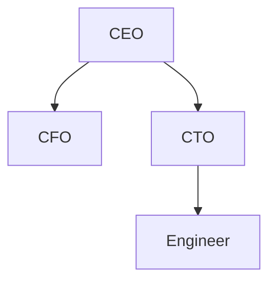

## Introduction

In modern data management, the representation and manipulation of hierarchical data is critical for various applications, including organizational structures, file systems, and XML document representation. Traditional relational databases often require complex joins and self-referential relationships to model such structures. To address these challenges, specialized data types, like SQL Server's `HierarchyID`, have been developed to efficiently manage hierarchical data.

## HierarchyID Data Type

`HierarchyID` is a system-defined data type in SQL Server designed to manage hierarchical data structures. It provides a compact, efficient way to represent and query hierarchical structures within a relational database, offering several advantages over traditional methods.

### Key Benefits
- **Scalability**: Efficiently store large hierarchical structures without the exponential increase in storage typical of self-joining hierarchies.
- **Simplicity**: Simplifies complex queries for hierarchy traversal, such as parent-child relationships, ancestor paths, and subtree identification.
- **Performance**: Supports fast access patterns and indexing to optimize common hierarchical operations like addition, deletion, and node movement.

## Example of Using HierarchyID

Let's consider the use case of storing and querying an organizational chart. Each node in the hierarchy represents an employee, and the `HierarchyID` data type helps manage the parent-child relationships among them.

### SQL Implementation

```sql
CREATE TABLE Employees (
    EmployeeID INT PRIMARY KEY,
    Name NVARCHAR(100),
    OrgNode HIERARCHYID,
    OrgLevel AS OrgNode.GetLevel() PERSISTED
);

INSERT INTO Employees (EmployeeID, Name, OrgNode)
VALUES
(1, 'CEO', HIERARCHYID::GetRoot()),
(2, 'CFO', HIERARCHYID::GetRoot().GetDescendant(NULL, NULL)),
(3, 'CTO', HIERARCHYID::GetRoot().GetDescendant(NULL, HIERARCHYID::GetRoot().GetDescendant(NULL, NULL))),
(4, 'Engineer', HIERARCHYID::Parse('/1/3/'));
```

In this schema:
- `OrgNode` is a `HierarchyID` column that represents the hierarchical position.
- `OrgLevel` is a calculated column that provides the depth level in the hierarchy.

### Queries

Retrieve all employees under the 'CTO':

```sql
SELECT EmployeeID, Name
FROM Employees
WHERE OrgNode.IsDescendantOf(
    (SELECT OrgNode FROM Employees WHERE Name = 'CTO')
) = 1;
```

This query efficiently finds all descendants of the 'CTO' node.

## Diagram Representation



This diagram represents the organizational hierarchy described in the SQL table, where the CEO is the root node with the CFO and CTO as direct children, and an Engineer reporting to the CTO.

## Related Patterns

- **Adjacency List**: A common method for hierarchical data that uses a self-referential foreign key; less efficient for large, complex structures.
- **Path Enumeration**: Uses path strings to denote hierarchy which enables fast traversal but can be more limiting on updates.

## Additional Resources

- [SQL Server Documentation on HierarchyID](https://docs.microsoft.com/en-us/sql/relational-databases/hierarchical-data-sql-server)
- Books and publications on hierarchical data management strategies.

## Summary

The `HierarchyID` data type in SQL Server presents a robust solution for modeling and querying hierarchical data efficiently. By facilitating easy manipulation and query operations within hierarchical structures, it simplifies database management and enhances performance considerably. Organizations leveraging SQL Server for their data solutions can benefit from adopting `HierarchyID` to maintain hierarchical relationships smoothly, reducing complexity and improving query efficiency.
