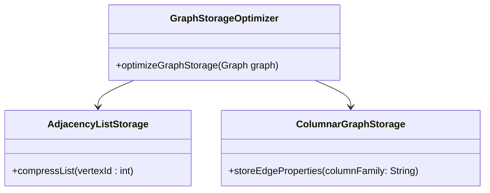

---

linkTitle: "Graph Storage Optimization"
title: "Graph Storage Optimization"
category: "8. Hierarchical and Network Modeling"
series: "Data Modeling Design Patterns"
description: "Techniques for optimizing the storage of graphs, such as adjacency lists or columnar storage, to enhance performance and scalability in handling large-scale graphs."
categories:
- Data Modeling
- Performance Optimization
- Graph Databases
tags:
- Graph Storage
- Performance
- Scalability
- Adjacency List
- Compression
date: 2024-07-07
type: docs

canonical: "https://softwarepatternslexicon.com/102/8/20"
license: "© 2024 Tokenizer Inc. CC BY-NC-SA 4.0"
---

## Introduction

Graph storage optimization is a critical design pattern for efficiently managing and storing graph data structures, especially in domains dealing with large-scale datasets such as social networks, semantic web, and biology. Proper optimization techniques ensure that storage space is minimized and retrieval and processing are faster, making systems more scalable and performant.

## Detailed Explanation

Graph data structures consist of vertices (nodes) and edges (relationships between nodes). The challenge lies in efficiently storing these elements to make retrieval and computations such as pathfinding and graph traversals fast and resource-efficient.

### Adjacency Lists

One traditional method of storing graphs is through adjacency lists. In this approach, each node maintains a list of its neighboring connected nodes. This technique is often optimized through several strategies:

- **Compression Techniques**: Utilizing methods like dictionary encoding or variable-byte encoding to compress adjacency lists can save significant storage without losing performance on read operations.
  
- **Partitioning**: Breaking down large graphs into smaller subgraphs can also optimize storage and processing. Each partition can be processed independently, which often fits well with distributed graph frameworks.

### Columnar Storage

For applications that leverage query-heavy operations, columnar storage offers a favorable alternative:

- **Vectorized Processing**: Columnar storage allows for operations over entire columns of data simultaneously. This can increase cache efficiency and speed up analytical queries against graph databases.
  
- **Enabling Fast Access**: By storing edge properties in columns, rapid access paths are enabled for algorithms analyzing the graph's properties without needing intensive joins or traversals.

### Hybrid Approaches

Combining row-based and columnar strategies can provide flexible optimization, allowing systems to take advantage of strengths specific to the data workload and access patterns.

## Best Practices

1. **Choose the Right Data Structure**: Understand the graph's structure and the operations your application performs most frequently to select the most appropriate storage mechanism.
   
2. **Leverage Compressed Formats**: Use graph libraries or databases that offer compressed storage options to avoid unnecessary disk usage and improve performance.
   
3. **Scale with Distribution**: Employ graph partitioning strategies and scalable graph databases like Neo4j, Apache TinkerPop, or AWS Neptune to handle very large datasets across distributed systems.

4. **Optimize Serialization/Deserialization**: For network-transferred graphs, efficient serialization formats like Protocol Buffers or Apache Avro can offer significant gains.

## UML Diagrams

## Related Patterns

- **Sharded Graph Pattern**: Extends the partitioning strategy by distributing partitions across multiple nodes to enhance graph scalability in distributed settings.
  
- **Batch Processing Pattern**: Complementary to storage, it involves optimizing graph processing and analytics in batch processes using frameworks like Apache Hadoop and Spark.

## Additional Resources

1. "Graph Databases" by Ian Robinson et al., for practical implementations of graph storage.
2. Neo4j's [Graph Data Science Library](https://neo4j.com/product/graph-data-science/) for optimized storage and analytics.
3. ACM's digital library on graph storage innovations.

## Summary

Graph Storage Optimization is essential for handling the burgeoning size and complexity of graph datasets in modern applications. By applying the right storage techniques such as adjacency lists and columnar storage, and harnessing compression and partitioning strategies, engineers can build efficient, performant graph databases that scale across large datasets while managing storage costs and access latency.

---
