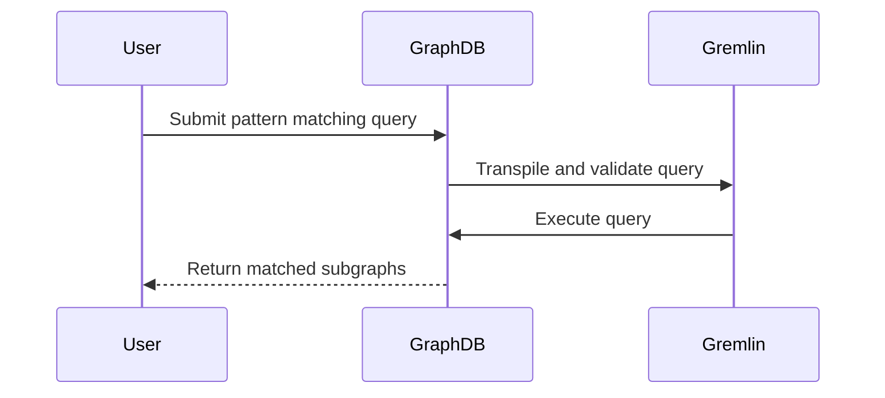

## Introduction

Pattern Matching in Graphs is a critical design pattern for identifying specific substructures within a larger graph. This is a fundamental problem in graph theory and finds numerous applications in fields like social network analysis, cybersecurity, biology, and financial services. The goal is to match subgraphs that exhibit certain properties within a complex network, aiding in the discovery of relevant patterns, anomalies, or frequent structures.

## Architectural Approach

The core idea behind pattern matching in graphs is to analyze a graph dataset to identify subgraphs that correspond to a predefined pattern:

1. **Graph Representation**: First, model data as a graph where entities are nodes, and relationships are edges. Choose between directed or undirected graphs based on the use case.

2. **Pattern Definition**: Define the pattern using graph patterns and query languages like Cypher (used with Neo4j) or Gremlin (used with Apache TinkerPop).

3. **Pattern Detection Algorithms**: Use algorithms tailored to detect patterns in graphs, including:
   - **Subgraph Isomorphism**: An NP-complete algorithm that checks if a subgraph H is isomorphic to any subgraph of graph G.
   - **Graph Neural Networks (GNNs)**: Leverage machine learning models to capture node interactions for pattern recognition.
   - **Frequent Subgraph Mining**: Identify frequently occurring subgraphs, often used for discovering common motifs in biological networks.

4. **Data Processing Frameworks**: Utilize frameworks like Apache Spark GraphX for handling large-scale graph data, especially in distributed environments.

## Best Practices

- **Optimization**: Tailor your graph algorithms for sparsity or density based on the nature of your graph data. Use heuristics to reduce computational overhead.
  
- **Scale with Distributed Processing**: Leverage distributed data processing platforms such as Apache Flink or Google Cloud Dataflow for handling big data graph analytics.

- **Topology-Aware Structures**: Develop topology-aware storage strategies to efficiently manage and query graph data.

- **Integrate with Continuous Data Feeds**: Use systems like Apache Kafka for streaming graph updates in near-real time, allowing the graph model to stay current for timely insights.

## Example Code

Here's a brief example using Apache TinkerPop with Gremlin for pattern matching in a graph:

```java
GraphTraversalSource g = graph.traversal();
List<Vertex> fraudPatterns = g.V().match(
    as("a").hasLabel("transaction").out("relatedTo").as("b"),
    as("b").has("amount", gt(1000)),
    as("a").in("connectedTo").as("c"),
    as("c").has("status", "suspicious")
).select("a").toList();
for (Vertex v : fraudPatterns) {
    System.out.println("Fraud pattern detected: " + v);
}
```

## Diagrams

Below is a UML sequence diagram illustrating the process of pattern matching in graphs with Apache Gremlin:



## Related Patterns

- **Graph Aggregation**: Used where summarization and simplification of a graph is required, often preceding pattern matching.
- **Event Query in Graphs**: Focused on querying complex event patterns within graphs.
- **Dependency Graphs**: For modeling dependencies between entities which might benefit from pattern detection.

## Additional Resources

- [Graph Algorithms by Mark Needham and Amy E. Hodler](https://www.oreilly.com/library/view/graph-algorithms/9781492047674/)
- [Apache TinkerPop Documentation](https://tinkerpop.apache.org/)
- [Neo4j Graph Data Platform](https://neo4j.com/developer/)

## Summary

Pattern Matching in Graphs provides powerful techniques for identifying specific patterns or anomalies within complex networks. By leveraging the right algorithms, architectures, and tools, one can efficiently manage, query, and analyze large-scale graph datasets. This design pattern is crucial for applications ranging from detecting fraudulent activities in financial transactions to understanding complex molecular structures in biology.
