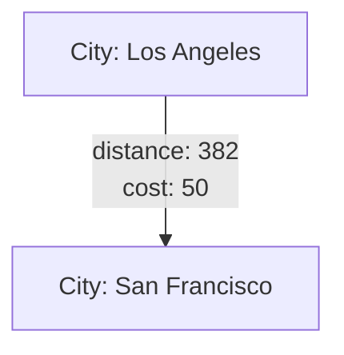

---

linkTitle: "Edge Attributes"
title: "Edge Attributes"
category: "8. Hierarchical and Network Modeling"
series: "Data Modeling Design Patterns"
description: "Storing properties or attributes on edges to represent weighted or typed relationships."
categories:
- Data Modeling
- Network Modeling
- Hierarchical Modeling
tags:
- Graph Databases
- Edge Computing
- Data Attributes
- Relationships
- Network Analysis
date: 2023-10-15
type: docs

canonical: "https://softwarepatternslexicon.com/102/8/22"
license: "© 2024 Tokenizer Inc. CC BY-NC-SA 4.0"
---


## Description

The Edge Attributes design pattern is used in graph data modeling to represent additional information about the relationships between nodes. By storing properties or attributes directly on edges, this pattern allows for a more nuanced and detailed representation of connections within a data set. It supports weighted or typed relationships, enabling complex queries and analyses in graph databases.

Edge attributes are valuable in numerous domains, such as logistics networks where edges can store distances, costs, or travel time; social networks where relationships might have attributes like 'friendship level' or 'interaction frequency'; and biological networks where interactions between entities can be categorized and weighed.

## Architectural Approaches

1. **Graph Database Integration**: Implementing edge attributes requires careful selection of a graph database that supports advanced modeling such as Neo4j, JanusGraph, or Amazon Neptune.

2. **Attribute Schema Design**: Define a schema that accurately captures all necessary attributes for edges. Design considerations include deciding on attribute data types, nullable fields, and default values.

3. **Node-Edge Relationship Management**: Ensure robust management of node and edge updates, including cascading changes when node attributes affect edge attributes.

4. **Query Optimization**: Leverage graph queries that specifically utilize edge attributes to efficiently retrieve and process data, employing query languages like Cypher for Neo4j or Gremlin for Apache TinkerPop.

## Best Practices

- **Use Specific Attributes**: Clearly define the attributes necessary for your specific application. Avoid overloading edges with extraneous data to prevent performance issues.

- **Consistent Naming Conventions**: Adopt naming conventions for edge attributes to maintain clarity and avoid confusion in complex graphs.

- **Validation and Constraints**: Implement validation logic to enforce constraints on edge attributes, ensuring data integrity and consistency.

- **Performance Testing**: Regularly test the performance of graph operations involving edge attributes, especially in large-scale networks.

## Example Code

Below is a basic example of how you might implement edge attributes in Neo4j using Cypher:

```cypher
// Create nodes
CREATE (a: City {name: 'Los Angeles'})
CREATE (b: City {name: 'San Francisco'})

// Create edge with attributes
MATCH (a: City {name: 'Los Angeles'}), (b: City {name: 'San Francisco'})
CREATE (a)-[r:ROAD {distance: 382, cost: 50}]->(b)
```

In this example, the relationship between 'Los Angeles' and 'San Francisco' is characterized by attributes `distance` and `cost`.

## Diagrams

### Sample Graph Schema



## Related Patterns

- **Property Graphs**: Edge Attributes is closely related to the broader Property Graph Data Model, where both nodes and edges can have associated properties.

- **Weighted Graphs**: Often used in conjunction with weighted graphs, where edges carry numerical values representing weights.

- **Type Attribute**: In some scenarios, edges also have a 'type' attribute, which designates the kind of relationship.

## Additional Resources

- [Neo4j Graph Data Modeling](https://neo4j.com/developer/graph-data-modeling/)
- [Graph Databases by O'Reilly](https://www.oreilly.com/library/view/graph-databases-2nd/9781491930867/)
- [Apache TinkerPop Documentation](https://tinkerpop.apache.org/docs/current/reference/)

## Summary

The Edge Attributes design pattern enriches graph data models by providing a flexible and efficient means to capture complex relationships. By smartly implementing attributes on edges, systems can significantly enhance their data processing capabilities and unveil deeper insights from networked data. Understanding the best practices and applying them strategically across domains ensures the robustness and scalability of such models.
