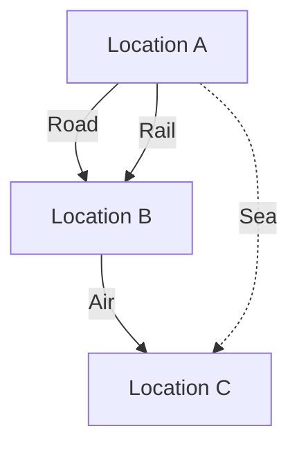

---

linkTitle: "Multigraphs"
title: "Multigraphs"
category: "Hierarchical and Network Modeling"
series: "Data Modeling Design Patterns"
description: "Allowing multiple edges between the same pair of nodes, representing different relationships. Example: In transportation networks, modeling multiple routes between two locations."
categories:
- Network Modeling
- Hierarchical Modeling
- Advanced Modeling
tags:
- Multigraph
- Network Design
- Data Relationships
- Graph Databases
- Complex Systems
date: 2024-07-07
type: docs

canonical: "https://softwarepatternslexicon.com/102/8/23"
license: "© 2024 Tokenizer Inc. CC BY-NC-SA 4.0"
---


## Introduction to Multigraphs

Multigraphs serve as a robust framework for modeling complex relationships and networks where it is necessary to represent multiple edges or connections between two nodes. Unlike simple graphs that allow only a single edge between a pair of nodes, multigraphs enable the representation of various types of interactions or relationships that exist between entities in a system.

### Key Characteristics
- **Multiple Edges**: Each edge represents a different type of relationship or connection.
- **Non-unique Edge Labels**: Edges can possess different attributes but connect the same nodes.
  
## Use Cases and Examples

### 1. Transportation Networks
In transportation systems, multiple routes or connections between two locations must be efficiently managed. This could include road, railway, air, or sea connections, each represented as a distinct edge in a multigraph.

### 2. Social Networks
Platforms such as LinkedIn or Facebook can leverage multigraphs to illustrate different types of relationships between users, such as friendship, professional connections, or shared interests.

### 3. Communication Networks
For networks like telecommunication or the internet, different communication channels (wired, wireless, satellite) can be modeled between the same towers or nodes.

## Architectural Approaches

### Modeling Multigraphs
1. **Node Representation**: Establish a node for each entity within the network.
2. **Edge Representation**: Differentiate edges based on their relationships or attributes using labels and weights.

### Database Considerations
- **Graph Databases**: Ideal for managing multigraph structures, handling variable relationships efficiently.
- **NoSQL Databases**: Offer flexibility in managing schema-less data required for multigraphs.

Example in Neo4j (Graph Database):
```cypher
CREATE (a:Location {name: 'LocationA'})
CREATE (b:Location {name: 'LocationB'})
CREATE (a)-[:ROAD {distance: 100}]->(b)
CREATE (a)-[:RAIL {distance: 80}]->(b)
```

## Best Practices

1. **Design for Flexibility**: Anticipate changes in relationships; employ schemas that are adaptable to new types of edges.
2. **Optimize Query Performance**: Use indexing and efficient data retrieval methods to manage multiple connections.
3. **Data Consistency**: Ensure consistent labeling and attributes for edges to maintain integrity across the multigraph.

## Diagrams

### Example: A Simple Transportation Multigraph



## Related Patterns

- **Graph Databases**: Harnessing the power of database systems specifically designed for graph structures.
- **Event Sourcing**: Captures changes to a data entity as a sequence of events, often leveraging graph-like models.
- **Distributed Graph Processing**: Techniques for processing graphs that are distributed across multiple machines.

## Additional Resources

- [Neo4j Documentation](https://neo4j.com/docs/)
- [Graph Theory with Applications to Engineering and Computer Science by Narsingh Deo](https://www.amazon.com/Graph-Theory-Applications-Engineering-Computer/dp/0486462671)
- [Graph Databases by Ian Robinson, Jim Webber, and Emil Eifrém](https://www.oreilly.com/library/view/graph-databases/9781449356272/)

## Summary

Multigraphs offer an advanced modeling strategy for systems where complex, multifaceted relationships exist between entities. By employing graph databases and flexible data modeling techniques, organizations can effectively represent and manage such networks, optimizing decision-making, and resource allocation processes.

Embrace multigraphs to unlock insights and manage interconnections robustly within your data systems!
