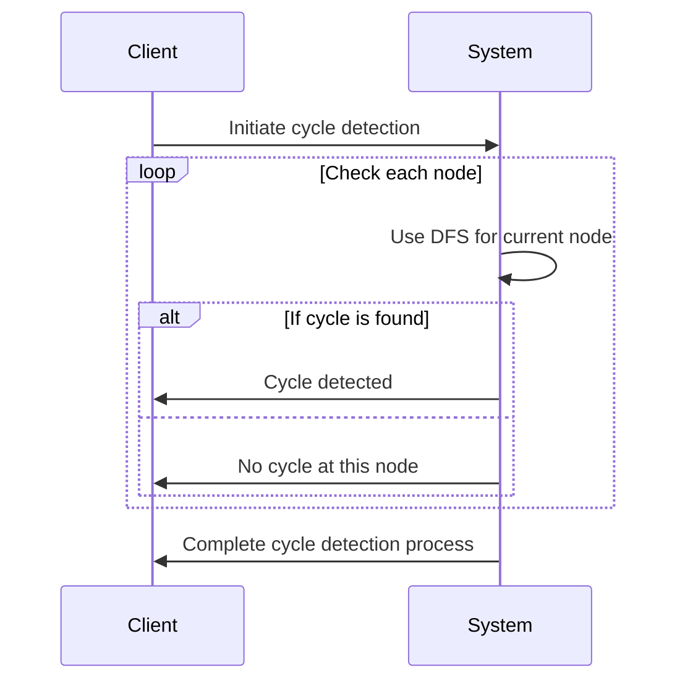

Managing circular references is crucial in many domains, especially when dealing with hierarchical and network modeling systems, such as social networks or organizational charts. Circular references can lead to issues like infinite loops and inconsistent data processing. This pattern focuses on methods to detect, manage, and resolve these cycles effectively.

## Detailed Explanation

Circular references arise when two or more objects are interdependent, forming a closed loop. In programming, this can occur when objects refer to each other in ways that make it difficult to access them independently, oftentimes leading to infinite loops or stack overflows during recursive processing. Addressing these circular dependencies is critical to ensuring data integrity and consistency.

### Approaches to Handling Circular References:

1. **Graph Theory Techniques:**
   - Use graph traversal algorithms like Depth First Search (DFS) to detect cycles. Implement cycle detection as a necessary step when adding relationships or during data processing.

2. **Reference Counters:**
   - Implement reference counting to break cycles. Keeping track of reference counts allows the system to identify and release references that create redundant cycles.

3. **Weak References:**
   - Utilize weak references where applicable. These allow the garbage collector to discard entities when they are only accessible by circular references that are not strong.

4. **Hierarchy Flattening:**
   - Flatten hierarchical data into tabular forms that are easier to check for cycles, especially in network graphs or trees.

5. **Database Constraints:**
   - Implement database constraints or triggers that prevent the insertion of data responsible for creating a cycle within the data model.

## Example Code

Below is a simple example in Python demonstrating cycle detection using DFS in a network graph:

```python
def has_cycle(graph):
    def dfs(vertex, visited, rec_stack):
        visited[vertex] = True
        rec_stack[vertex] = True

        for neighbor in graph[vertex]:
            if not visited[neighbor]:
                if dfs(neighbor, visited, rec_stack):
                    return True
            elif rec_stack[neighbor]:
                return True
        
        rec_stack[vertex] = False
        return False

    visited = {key: False for key in graph}
    rec_stack = {key: False for key in graph}

    for node in graph:
        if not visited[node]:
            if dfs(node, visited, rec_stack):
                return True
    return False

graph = {
    'A': ['B'],
    'B': ['C'],
    'C': ['D', 'A'],  # This introduces a cycle (C -> A -> B -> C)
    'D': []
}

print("Cycle detected:" if has_cycle(graph) else "No cycle found.")
```

## Diagrams

Below is a UML sequence diagram illustrating cycle detection in a graph:



## Related Patterns

- **Reference Management**: Techniques for managing object references that help prevent and resolve circular dependencies.
- **Observer Pattern**: Involves managing dependencies, often in a hierarchical or network layout.
- **Garbage Collection Strategies**: Utilize weak references and garbage collection to automatically handle unreferenced circular structures.

## Additional Resources

- [Graph Algorithms and Implementations](https://en.wikipedia.org/wiki/Graph_theory)
- **Book**: "Design Patterns: Elements of Reusable Object-Oriented Software" by Erich Gamma et al.
- **Article**: "Cycle Detection in Graph Theory"

## Summary

Circular References Handling is an essential design pattern when dealing with networked data structures or hierarchical models that can foster cycles. By implementing cycle detection algorithms, utilizing weak references, and enforcing database constraints, developers can maintain data integrity and avoid the pitfalls often associated with circular dependencies. With the right strategies, breaches in data consistency and performance issues like infinite loops can be effectively mitigated.
