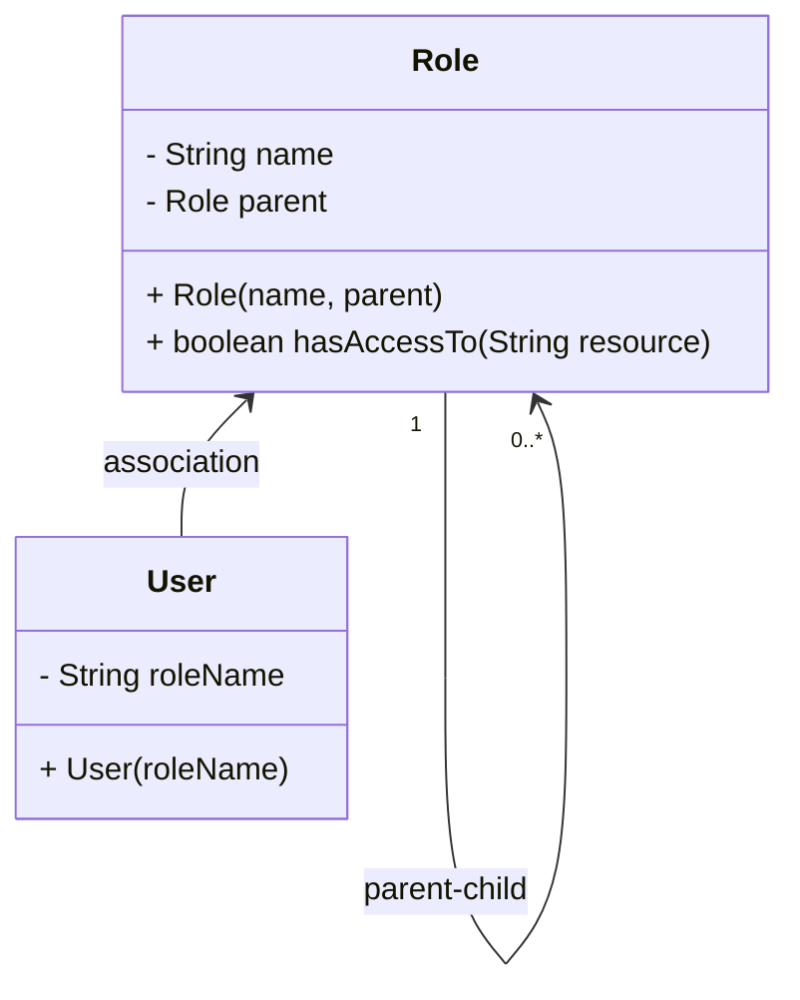

## Overview

In cloud computing and distributed systems, managing data access permissions efficiently is crucial, particularly within organizational hierarchies. **Hierarchical Data Access Control** is a design pattern that addresses the need to grant or restrict access based on an entity's position within a hierarchy. This approach is pivotal in complex environments, where data access may vary at different levels of the hierarchy based on roles, projects, or departments.

## Architectural Approach

Hierarchical access control leverages the hierarchical structures within an organization to determine data permissions. This model ensures that each user's access rights are determined by their position and the authority flowing through the hierarchy.

- **Role-Based Access Control (RBAC)**: Enhances RBAC by adding hierarchy-based constraints.
- **Attribute-Based Access Control (ABAC)**: Incorporates organizational attributes to define permissions.

### Key Considerations

1. **Hierarchy Mapping**: Model the organization's hierarchical structure accurately. Consider positions, departments, and managerial reporting lines.
2. **Parent-Child Relationships**: Defined permissions cascade through hierarchy levels, allowing parent roles to inherit permissions set for child roles, facilitating ease of management.
3. **Inheritance**: Ensure that higher-level entities can access data permissible to lower-level entities unless explicitly overridden.

## Best Practices

- Maintain up-to-date organizational charts reflecting changes in hierarchy.
- Implement auditing mechanisms to trace access permissions actively.
- Define clear rules for permission inheritance, including conflict resolution strategies when overlapping permissions occur.

## Example Code

Here's an example of modeling hierarchical access permissions using a hypothetical role-based system:

```java
public class AccessControl {
    private Map<String, Role> roles = new HashMap<>();

    // Define roles and hierarchy
    public AccessControl() {
        Role ceo = new Role("CEO");
        Role manager = new Role("Manager", ceo);
        Role intern = new Role("Intern", manager);

        roles.put(ceo.getName(), ceo);
        roles.put(manager.getName(), manager);
        roles.put(intern.getName(), intern);
    }

    public boolean hasAccess(User user, String resource) {
        Role role = roles.get(user.getRoleName());
        return role.hasAccessTo(resource);
    }
}
```

## Related Patterns

- **Role-Based Access Control (RBAC)**: Utilizes predefined roles for access management, often lacking hierarchical context.
- **Attribute-Based Access Control (ABAC)**: Offers a more dynamic approach using user attributes as criteria for access, extendable with hierarchical attributes.
- **Policy-Based Access Control (PBAC)**: Manages access controls through high-level policies, adaptable to hierarchical conditions.

## Diagram

Below is a sample mermaid UML class diagram illustrating hierarchy-based access control:



## Additional Resources

- [NIST's Guide to Attribute-Based Access Control](https://csrc.nist.gov/publications/detail/sp/800-162/final)
- [Access Control Models Research Papers](https://dl.acm.org/doi/10.1145/1832755.1832767)

## Summary

Hierarchical Data Access Control enhances traditional access control models by integrating organizational hierarchies. It offers scalable and efficient management of permissions, aligning with the complex nature of enterprise data access requirements. By adopting hierarchical constraints within your security framework, you can ensure more granular and effective data protection practices that reflect real-world organizational structures.
