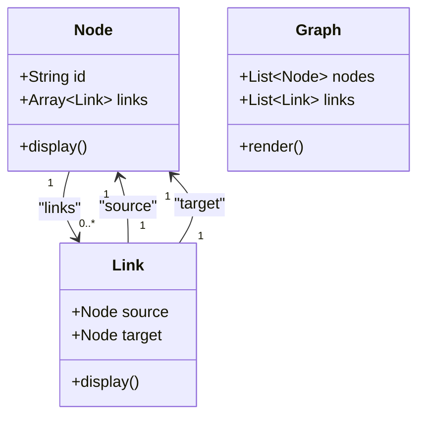

## Introduction

Network Visualization is a crucial aspect of data modeling, especially when dealing with complex systems that naturally form hierarchical or networked structures. It involves graphically representing networks, such as social networks, communication networks, or organizational hierarchies, to facilitate understanding, exploration, and analysis.

## Architectural Approaches

### Graph-Based Modeling

One of the primary approaches to Network Visualization is based on graph theory. Nodes represent entities, and edges represent relationships. Graph databases like Neo4j, or frameworks like Apache TinkerPop, provide robust capabilities for modeling and querying such data.

### Visualization Tools

For visualizing networks, several tools can be utilized:
- **Gephi**: An open-source network analysis and visualization software package.
- **D3.js**: A JavaScript library for producing dynamic, interactive data visualizations in web browsers.
- **Cytoscape**: An open-source platform for complex network analysis and visualization.

### Integration with Big Data

For scaling network visualizations, especially with large datasets commonly found in big data environments, integration with technologies like Apache Hadoop, Apache Spark, or Google BigQuery can be beneficial.

## Best Practices

- **Layered Visualization**: Use layers to manage complexity, allowing users to focus on different levels of interest.
- **Interactivity**: Implement features such as zoom, pan, and filter to aid exploration.
- **Performance Optimization**: For large graphs, use aggregation techniques or filter unnecessary details to keep visualizations responsive.
- **Color Coding and Labeling**: Use colors and labels to differentiate and highlight categories or significant nodes and edges.

## Example Code

Here's a basic example using D3.js to visualize a simple network:



### UML Diagram

Here is a basic class diagram for network visualization entities:

## Related Patterns

- **Hierarchical Visualization**: Focused on trees and hierarchies.
- **Geographical Mapping**: Involves mapping networks on geographical scales.
- **Time-Series Analysis**: Includes temporal aspects of network changes.

## Additional Resources

- [D3.js Documentation](https://d3js.org)
- [Gephi User Manual](https://gephi.org/users/)

## Summary

Network Visualization provides a powerful paradigm for representing and analyzing complex relationships and hierarchies visually. By adopting effective architectural approaches, utilizing suitable tools, and adhering to best practices, this pattern significantly enhances data understanding and insights.
