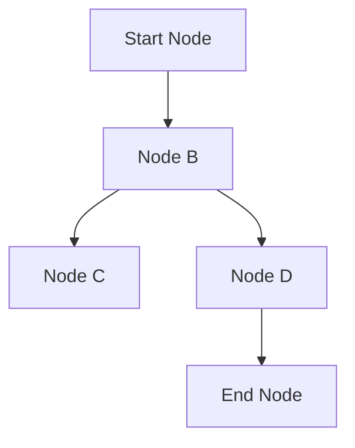

## Graph Analytics

Graph Analytics is a design pattern focused on extracting insights from graph data structures, which represent entities as nodes and their relationships as edges. This pattern underlies powerful analysis techniques that are essential for understanding complex networks such as social networks, communication networks, biological systems, and web graphs.

### Detailed Explanation

Graph Analytics involves various techniques and algorithms to process and analyze graph data:

1. **Centrality Measures**: Identifying the most important vertices within a graph. Measures include Degree Centrality, Betweenness Centrality, Closeness Centrality, and Eigenvector Centrality.
   
2. **Community Detection**: Grouping nodes into clusters based on their connectivity. Algorithms include Louvain method, Girvan-Newman, and Label Propagation.
   
3. **Shortest Path Algorithms**: Determining the shortest path between nodes. Dijkstra's algorithm and Floyd-Warshall algorithm are classic examples.

4. **Graph Traversal**: Exploring nodes and edges, used for searching within graphs. Depth-First Search (DFS) and Breadth-First Search (BFS) are fundamental techniques.

5. **PageRank**: A special case of eigenvector centrality used primarily to rank web pages in search engine results.

### Architectural Approaches

- **In-Memory Graph Databases**: Such as Neo4j, which allow efficient graph traversals and dynamic updates.
  
- **Distributed Graph Processing**: Platforms like Apache Giraph or GraphX (a component of Apache Spark) offer capabilities to process large-scale graphs across distributed environments.

- **Hybrid Models**: Combining graph databases with conventional databases to handle different data types side by side.

### Best Practices

- **Choose the Right Graph Model**: Ensure the graph model (directed, undirected, weighted, etc.) aligns with your use case.
  
- **Efficient Indexing**: Utilize indexing to optimize query performance, especially in large graphs.

- **Scalability Considerations**: Opt for distributed models if dealing with extremely large or complex graph data.

### Example Code

Here's an example in Python using the NetworkX library to compute PageRank:

```python
import networkx as nx

G = nx.DiGraph()

G.add_edge('A', 'B')
G.add_edge('B', 'C')
G.add_edge('C', 'A')
G.add_edge('D', 'C')

pagerank = nx.pagerank(G, alpha=0.85)

print("PageRank of nodes:", pagerank)
```

### Mermaid UML Diagram

Below is a simple UML representation of graph traversal:



### Related Patterns

- **Map Reduce**: Often used for parallelizing tasks in big data that require processing over graph structures.
  
- **Batch Processing**: Essential for handling large datasets, often preceding graph analytics.

- **Stream Processing**: Useful for real-time graph data analytics, as seen in communication networks.

### Additional Resources

- [NetworkX Documentation](https://networkx.github.io/documentation/stable/)
- [Neo4j Graph Database](https://neo4j.com/)
- [Apache GraphX](https://spark.apache.org/graphx/)

### Summary

Graph Analytics is fundamental for unlocking insights from complex, interconnected systems. By leveraging various algorithms and architectural styles, organizations can assess connectivity, influence, and clustering within networks, leading to data-driven decisions in marketing, logistics, resource management, and more. Understanding and implementing this pattern effectively enables robust and scalable solutions tailored to dynamic datasets.
