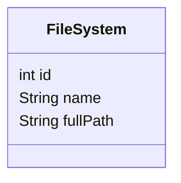

## Materialized Path

### Description

The Materialized Path pattern is a data modeling design pattern used to represent hierarchical data. It involves storing the entire path from a root node to a particular node as a single string or array in a given data record. This design pattern is especially helpful for performing efficient queries on hierarchical data structures without the need for complex recursive queries or joins.

### Architectural Approach

In hierarchical and network modeling contexts, the Materialized Path pattern underpins efficient data retrieval by maintaining a fully materialized version of the hierarchy within each node. By representing the location of nodes within the hierarchy as a path (like a filesystem path), it reduces the complexity associated with traversing tree structures. 

### Best Practices

- **Choosing Delimiters**: When representing paths, choose a delimiter that is not part of the node’s identifier content (e.g., a slash `/` or hyphen `-`).
- **Indexing**: Consider indexing the materialized path column to improve query performance for path-based queries.
- **Optimization**: Store paths in a manner optimized for the database in use, such as using VARCHAR in SQL databases or specific field types in NoSQL databases.
- **Consistency Checks**: Implement checks or use constraints to maintain the consistency and validity of the paths stored.

### Example Code

Here's a SQL example using the Materialized Path pattern in a PostgreSQL database:

```sql
CREATE TABLE file_system (
    id SERIAL PRIMARY KEY,
    name VARCHAR(255) NOT NULL,
    full_path TEXT NOT NULL UNIQUE
);

-- Inserting a directory and a file
INSERT INTO file_system (name, full_path) VALUES
    ('documents', '/home/user/documents'),
    ('report.docx', '/home/user/documents/report.docx');

-- Query to find all items under /home/user
SELECT * FROM file_system WHERE full_path LIKE '/home/user/%';
```

### Diagrams

Below is a simple Mermaid diagram representing a file system using the Materialized Path pattern:



### Related Patterns

- **Node-Labelled Trees**: Similar but labels nodes individually without recording full paths.
- **Nested Sets**: Represents hierarchical data using set intervals to denote node range.
- **Adjacency List**: Traditional method of modeling trees where each record points to its parent.

### Additional Resources

- **Books**: 
  - "SQL Antipatterns" by Bill Karwin
  - "Design Patterns" by Erich Gamma et al. for understanding structural design patterns.
  
- **Online Articles**:
  - "Handling Hierarchical Data in MySQL" from MySQL community blogs.
  - Comparisons on tree modeling patterns.

### Summary

The Materialized Path pattern offers an effective means of storing hierarchical data, facilitating rapid and simple queries by avoiding complex recursion and joins often associated with traditional tree traversal methods. By embedding path data directly into records, querying and maintaining your data remains efficient and streamlined, making it an increasingly popular choice in modern data architectures.
