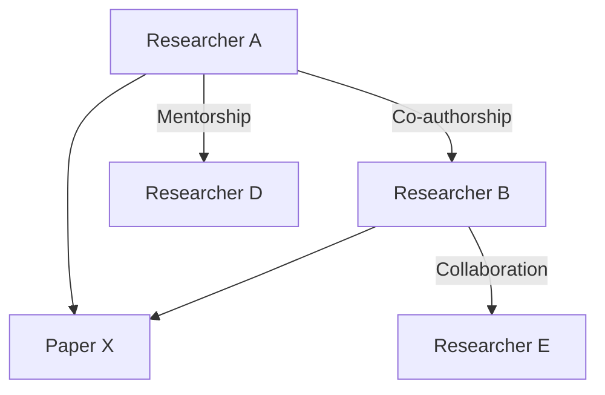

## Overview

Multi-Relational Graph Modeling is a pattern used to represent complex networks in which entities (nodes) may have multiple, differentiated types of relationships (edges) among them. This design pattern is essential for domains where understanding various interactions between entities provides significant insight, such as social network analysis, semantic web, fraud detection, and more.

## Architectural Approach

In a multi-relational graph, a node can represent any discrete entity, and the edges denote distinct types of interactions or relationships among these entities. Each edge type carries its own semantic meaning. This approach enables a more nuanced understanding of the dataset, supporting richer analytical insights.

### Key Characteristics

1. **Node Versatility**: Nodes can represent varying entities such as people, places, concepts, or events.
2. **Edge Diversity**: Edges can quantify relationships such as friendship, collaboration, hierarchy, influence, or transactions.
3. **Contextualized Analytics**: Ability to perform contextual network analysis based on different relationship types.

## Example Models

### Academic Network

In an academic setting, consider a network of researchers where nodes are individual researchers and edges represent their relationships:

- **Co-authorship**: Two researchers have co-authored one or more papers.
- **Mentorship**: One researcher mentors another, indicating a hierarchical relationship.
- **Collaboration**: Researchers have collaborated on projects, grants, etc., without co-authorship.



## Implementation

### Technology Stack

To implement a multi-relational graph model, leverage graph databases like Neo4j, Amazon Neptune, or Azure Cosmos DB. These offer native support for graph structures and operations needed to manage complex relationships efficiently.

```cypher
CREATE (a:Researcher {name: 'Researcher A'}),
       (b:Researcher {name: 'Researcher B'}),
       (c:Researcher {name: 'Researcher D'}),
       (d:Researcher {name: 'Researcher E'}),
       (a)-[:CO_AUTHOR]->(b),
       (a)-[:MENTOR]->(c),
       (b)-[:COLLABORATE]->(d);
```

### Best Practices

- **Define Clear Relationship Types**: Employ clear naming conventions for relationships to avoid ambiguity.
- **Optimize Queries for Relationship-specific Searches**: Utilize index-based searches where applicable.
- **Manage Relationship Directionality**: Clearly define the directed or undirected nature of each relationship.

## Related Patterns

- **Graph Aggregation**: Simplifying complex networks by collapsing sets of nodes or edges.
- **Hypergraph Modeling**: Extending beyond pairwise relationships, allowing hyperedges connecting more than two nodes.
- **Bipartite Graphs**: Special types of graphs with two sets of nodes with relationships only across sets.

## Additional Resources

- **Books**
  - "Graph Databases" by Ian Robinson, Jim Webber, and Emil Eifrem — A practical guide to using graph databases and modeling.

- **Online Articles**
  - "Multi-Relational Graph Models: Beyond Simple Connections" on Medium.
  - "Advanced Graph Data Modeling Techniques" by Apache Cassandra blog.

- **Courses**
  - "Introduction to Graph Theory" on Coursera.
  - "Applied Graph Analytics" on edX.

## Summary

Multi-Relational Graph Modeling is an advanced framework for encoding and analyzing data within a network of complex, interlinked relationships. By distinguishing various relationship types in a graph structure, this model supports granular and sophisticated data analyses ideal for nuanced insights in domains like academia, social networks, and beyond. Deploying this pattern with the right graph database can significantly enhance network data interpretability and uncover deeper application insights.

---
