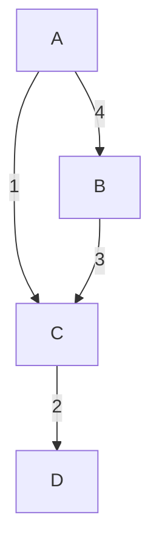

## Introduction

In graph theory and network modeling, **Weighted Edges** in graphs are used to represent the strength, cost, distance, or capacity of relationships or connections between nodes. Assigning weights to edges transforms the graph into a weighted graph, which provides additional information crucial for various analytical and optimization tasks.

## Architectural Approaches

### Conceptual Understanding

Weighted edges are integral in scenarios where mere connections between data points (nodes) are insufficient, and quantifiable attributes of these connections are necessary. For example:

- **Supply Chain Networks**: Where weights may represent shipping costs, delivery time, or quantity of goods.
- **Communication Networks**: In which weights can signify signal strength or latency.
- **Social Networks**: With weights indicating the strength of friendships or frequency of interactions.

### Implementation Details

To leverage weighted edges, graphs need to include numerical values on their edges. These values could be static or dynamic, depending on the application's requirements. Here are some typical approaches:

1. **Adjacency Matrix**: A 2D matrix where each cell [i, j] denotes the weight of the edge from node i to node j. Suitable for dense graphs.
  
2. **Adjacency List**: A collection where each node maintains a list of adjacent nodes and their associated edge weights. Ideal for sparse graphs.

3. **Edge List**: A list of all edges with their respective weights. This approach is simple and direct for certain computational purposes.

### Patterns and Algorithms

Numerous algorithms utilize weights to achieve different goals:

- **Dijkstra’s Algorithm**: Computes the shortest path from a single source node to all other nodes in a graph with non-negative weights.

- **Floyd-Warshall Algorithm**: Finds shortest paths between all pairs of nodes, able to handle graphs with negative weight edges.

- **Prim’s and Kruskal’s Algorithms**: Used to find the Minimum Spanning Tree (MST) of a graph, essential for optimizing network design.

## Example Code

Here's an example of implementing a weighted graph using an adjacency list in Python:

```python
class Graph:
    def __init__(self):
        self.graph = {}

    def add_edge(self, u, v, weight):
        if u not in self.graph:
            self.graph[u] = []
        self.graph[u].append((v, weight))

    def display(self):
        for node, edges in self.graph.items():
            print(f"{node}: {edges}")

g = Graph()
g.add_edge('A', 'B', 4)
g.add_edge('A', 'C', 1)
g.add_edge('B', 'C', 3)
g.add_edge('C', 'D', 2)
g.display()
```

## Diagrams

The conceptual representation of a weighted graph, showcasing nodes A, B, C, and D with directional edges and assigned weights, can be illustrated using a Mermaid diagram:



## Related Patterns

- **Graph Partitioning**: For dividing graphs into subgraphs while minimizing edge cut costs.
- **Navigation Patterns**: To enhance traversal by considering edge weights in pathfinding algorithms.
- **Load Balancing**: Where weights determine the traffic load carried over network paths.

## Additional Resources

- *"Introduction to Algorithms" by Cormen, Leiserson, Rivest, and Stein* for comprehensive algorithm coverage.
- [Graph Visualization](https://d3js.org/) tools like D3.js for implementing and displaying rich, interactive graph representations.

## Summary

Weighted edges in graphs empower data scientists and engineers to model complex networks more realistically by capturing the quantitative aspects of relationships. This capability is crucial in telecommunications, logistics, social dynamics, and numerous other domains where decision-making is enhanced by considering the strength, cost, or capacity of connections. Effective utilization of weighted graphs leads to optimized resources, better strategic planning, and improved system efficiencies.
