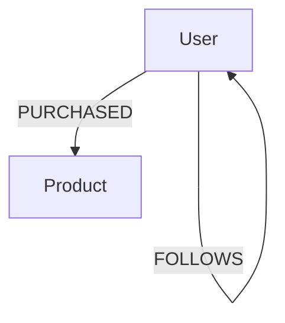

---

linkTitle: "Graph Schema Definition"
title: "Graph Schema Definition"
category: "8. Hierarchical and Network Modeling"
series: "Data Modeling Design Patterns"
description: "A comprehensive guide on defining schemas for graphs to enforce consistency and validate data, encompassing node and edge type specifications in property graph models."
categories:
- Data Modeling
- Graph Databases
- Network Structures
tags:
- Graph Schema
- Data Consistency
- Property Graph
- Schema Validation
- Graph Data Model
date: 2024-07-07
type: docs

canonical: "https://softwarepatternslexicon.com/102/8/32"
license: "© 2024 Tokenizer Inc. CC BY-NC-SA 4.0"
---

## Graph Schema Definition

### Introduction

Graph database systems have become increasingly popular thanks to their ability to model complex relationships and connect massive datasets. Unlike traditional relational databases, graph databases employ nodes, edges, and properties to represent and store data, making them incredibly effective in domains such as social networking, recommendation systems, and bioinformatics.

A graph schema defines the allowed structures within a graph database, including constraints for node types and edge relationships. Establishing such schemas is crucial for maintaining data consistency and integrity, enabling effective data validation, and supporting efficient querying.

### Key Concepts

- **Nodes and Edges**: The fundamental components of a graph. Nodes represent entities and edges describe the relationships between these entities.
  
- **Properties**: Attribute-value pairs associated with nodes and edges. They offer further information and context.

- **Graph Schema**: A blueprint or a set of rules that defines the structure of a graph by specifying permissible node and edge types, as well as any constraints on those types.

### Architectural Approaches

To implement Graph Schema Definitions, you need a robust understanding of your data model and the relations between different data entities. Here are steps and strategies used in defining graph schemas:

1. **Define Node Types**: Identify and categorize different entities (e.g., User, Product) in the data and specify the properties associated with each node type.

2. **Define Edge Types**: Enumerate possible relationships between node types (e.g., "follows" relation between User nodes). Specify properties related to these relationships, such as metadata or weights.

3. **Impose Constraints**: Ensure data integrity through rules. These may include cardinality constraints (e.g., max one "birthplace" node per person), type constraints, and uniqueness constraints.

4. **Schema Validation Tools**: Leverage conforming tools to ensure incoming data adheres to schema rules. 

### Example Code

Here’s how Graph Schema Definition can be implemented using a popular graph database system like Neo4j:

```cypher
// Define node types with constraints
CREATE CONSTRAINT ON (u:User) ASSERT u.userId IS UNIQUE;
CREATE CONSTRAINT ON (p:Product) ASSERT p.productId IS UNIQUE;

// Define edge types
MATCH (u:User {userId:'123'}), (p:Product {productId:'456'})
CREATE (u)-[:PURCHASED {purchaseDate: date()}]->(p)
```

### Diagrams

#### Basic Graph Schema Diagram in Mermaid



This simple diagram demonstrates entities, namely `User` and `Product`, and the possible relationships (`FOLLOWS`, `PURCHASED`) between them.

### Related Patterns

- **Polymorphic Schemas**: Allow a node to assume multiple roles or types.
- **Graph Query Patterns**: Structuring queries to effectively retrieve graph data.
- **Data Lake Schema-on-Read**: Define schemas that are not enforced until the data is read.

### Additional Resources

- **Neo4j Documentation**: Comprehensive guide to schema and query capabilities. [Neo4j Schema Management](https://neo4j.com/developer/graph-data-modeling/)
- **GraphQL**: An increasingly popular data query language that can be implemented on top of graph schemas.

### Summary

Graph Schema Definition is critical for maintaining data integrity and efficient data retrieval in graph databases. By enforcing structured schemas, developers can ensure their systems remain robust, consistent, and scalable. Embracing defined schemas empowers the implementation of reliable applications that can effectively leverage graph data for complex domain-specific problems.
