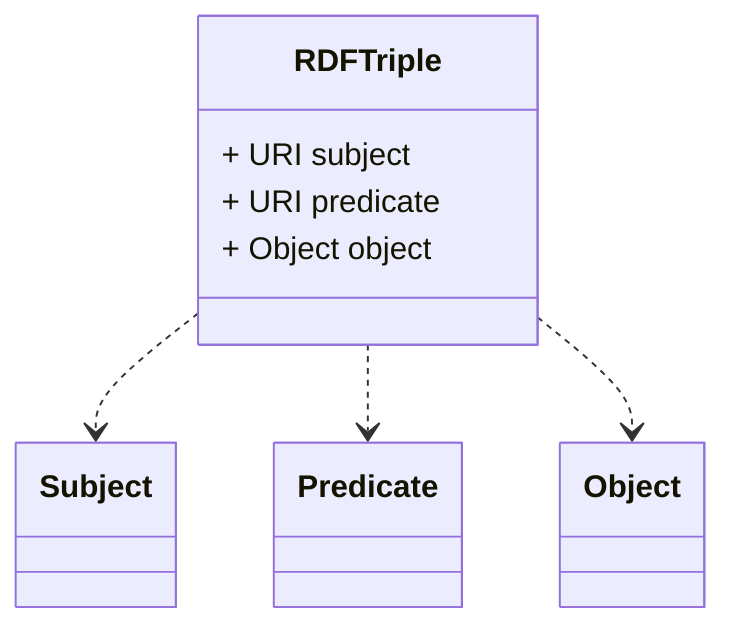

---

linkTitle: "Resource Description Framework (RDF)"
title: "Resource Description Framework (RDF)"
category: "8. Hierarchical and Network Modeling"
series: "Data Modeling Design Patterns"
description: "Using RDF to represent information about resources in subject-predicate-object expressions."
categories:
- Data Modeling
- Semantic Web
- Knowledge Graphs
tags:
- RDF
- Semantic Web
- Knowledge Graphs
- Data Modeling
- Linked Data
date: 2024-07-07
type: docs

canonical: "https://softwarepatternslexicon.com/102/8/33"
license: "© 2024 Tokenizer Inc. CC BY-NC-SA 4.0"
---

## Resource Description Framework (RDF)

### Overview

The Resource Description Framework (RDF) is a foundational specification developed by the W3C for modeling and representing information about resources on the web. It utilizes a simple yet robust structure where data is expressed in the form of triples comprising subject-predicate-object. This approach enables the creation of flexible and machine-interpretable data schemas ideal for the Semantic Web and supports complex interrelations, hierarchies, and networks among web resources.

### Detailed Explanation

#### Triple Structure

- **Subject**: The resource being described.
- **Predicate**: A property or characteristic of the subject.
- **Object**: The value or resource associated with the predicate.

For example, a triple can be:
- Subject: `http://example.org/person/1234`
- Predicate: `http://xmlns.com/foaf/0.1/name`
- Object: `"John Doe"`

This expresses that the entity identified by the URI (`person/1234`) has a property `name` with the value `"John Doe"`.

#### RDF Graphs

A collection of RDF triples forms an RDF graph, where each triple represents a directed edge from the subject to the object, labeled by the predicate. This enables the representation of complex relationships and hierarchies within data.

### Architectural Approaches

#### Semantic Web and Ontologies

RDF facilitates semantic web applications where data is interconnected across disparate databases, enabling richer data interoperation. Ontologies leverage RDF schema (RDFS) and Web Ontology Language (OWL) to provide an explicit conceptualization of each domain.

#### Knowledge Graphs

RDF is central to the construction of knowledge graphs, which model domain-specific relationships and entities, representing interconnected networks of facts. Knowledge graphs have seen widespread application across various domains, including assisting AI systems and powering search engines.

### Best Practices

1. **URI Naming**: Design meaningful, stable, and resolvable URIs to identify resources unambiguously.
2. **Vocabulary Reuse**: Leverage existing vocabularies (e.g., FOAF, Dublin Core) to promote data interoperability.
3. **Graph Linking**: Connects disparate datasets, fostering a linked data ecosystem.

### Example Code (Turtle Syntax)

```ttl
@prefix ex: <http://example.org/> .
@prefix foaf: <http://xmlns.com/foaf/0.1/> .

ex:person1234
  a foaf:Person ;
  foaf:name "John Doe" ;
  foaf:mbox <mailto:johndoe@example.com> .
```

### Diagrams



### Related Patterns

- **Entity-Attribute-Value (EAV)**: Used in modeling data where entities without a fixed schema vary widely in possible attributes.
- **Graph-Based Storage**: Utilizes the graph data model for efficiently storing and querying interconnected data such as RDF.

### Additional Resources

- W3C RDF Primer: [Link](https://www.w3.org/TR/rdf-primer/)
- ontOlogy Vocabulary Specification: [Link](https://www.w3.org/TR/owl2-overview/)

### Summary

The Resource Description Framework is a pivotal component of the semantic web architecture. By providing a flexible method to describe interlinked data, RDF enables enhanced data sharing and integration across systems. It remains integral to semantic data ecosystems, knowledge representation, and ontology management, driving interoperability on a global scale.


