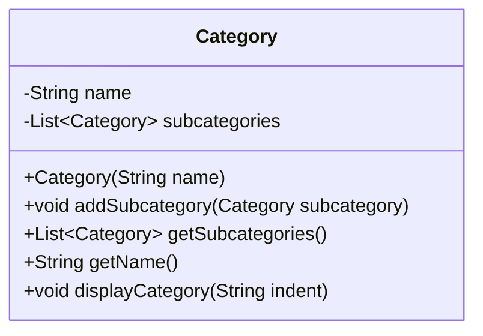

## Overview

Recursive data structures are powerful concepts in data modeling and software design that allow elements to reference instances of the same type. This enables the representation of complex hierarchical and network structures such as file systems, organizational charts, and category taxonomies.

### Characteristics

- **Self-Referential**: Nodes or elements may point to other instances of the same class.
- **Hierarchical Structure**: They naturally map to tree-like architectures, with parent-child relationships.
- **Scalability**: Can easily accommodate dynamic growth and shrinking as new elements are added or removed.
- **Flexibility**: Suitable for representing nested structures and variably deep hierarchies.

### Use Cases

- **File System Hierarchies**: Directories containing files and subdirectories.
- **Organizational Charts**: Departments with nested teams and members.
- **Product Categories**: Categories with nested subcategories.

## Architectural Approaches

When designing recursive data structures, the architecture often mirrors real-world hierarchical systems:

1. **Tree Structures**: Elements have a parent-child relationship featuring a base or root, but not cyclic; filesystems often implement tree structures.
   
2. **Graph Structures**: More flexible than tree structures, they can handle cyclic dependencies; used in complex organizational relationships.

## Example Code 

Let's examine a simple example in Java, modeling a category with subcategories:

```java
import java.util.ArrayList;
import java.util.List;

public class Category {
    private String name;
    private List<Category> subcategories;

    public Category(String name) {
        this.name = name;
        this.subcategories = new ArrayList<>();
    }

    public void addSubcategory(Category subcategory) {
        subcategories.add(subcategory);
    }

    public List<Category> getSubcategories() {
        return subcategories;
    }

    public String getName() {
        return name;
    }

    public void displayCategory(String indent) {
        System.out.println(indent + name);
        for (Category subcategory : subcategories) {
            subcategory.displayCategory(indent + "  ");
        }
    }
}
```

In this example, each `Category` object can hold a list of `subcategories` that are instances of `Category` themselves. This permits the creation of potentially infinite nesting levels.

## Diagram

Here is a simple representation using **Mermaid UML Class Diagram**:



## Best Practices

- **Avoid Cycles**: Ensure that cycles do not unintentionally occur unless intentionally using a graph structure.
- **Efficient Traversal**: Implement recursive functions wisely for operations like traversal or search to avoid stack overflow errors or excessive computational costs.
- **Clear Termination Conditions**: Especially in recursive methods, clarify base conditions for termination to avoid infinite loops.

## Related Patterns

- **Composite Pattern**: Used to treat individual objects and compositions uniformly.
- **Decorator Pattern**: Can be used to add responsibilities to objects dynamically, helpful with recursive trees.
- **Observer Pattern**: Often used when a tree or hierarchical structure has elements that need to react to state changes.

## Additional Resources

- [Recursive Programming Techniques](https://en.wikipedia.org/wiki/Recursion_(computer_science))
- [Effective Java by Joshua Bloch](https://www.oreilly.com/library/view/effective-java-3rd/9780134686097/)
- [Design Patterns: Elements of Reusable Object-Oriented Software by GoF](https://en.wikipedia.org/wiki/Design_Patterns)

## Summary

Recursive data structures provide a framework for efficiently managing and manipulating hierarchical information, reflecting both natural and complex artificial structures. By adopting the recursive model, developers can elegantly extend functionality across diverse applications while maintaining robust, scalable systems. From organizing data into tree-like structures to handling complex graph configurations, there is versatility in recursive design patterns integral to modern software architecture.
