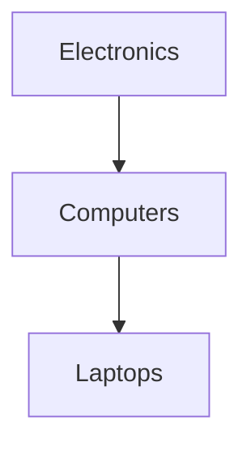

---

linkTitle: "Closure Table"
title: "Closure Table"
category: "Hierarchical and Network Modeling"
series: "Data Modeling Design Patterns"
description: "Explore the Closure Table pattern for efficiently handling and querying hierarchical data structures, providing powerful solutions for complex ancestor-descendant queries within relational databases."
categories:
- Hierarchical Modeling
- Data Modeling
- SQL
tags:
- Closure Table
- Hierarchical Data
- SQL
- Database Design
- Data Modeling Patterns
date: 2024-07-07
type: docs

canonical: "https://softwarepatternslexicon.com/102/8/4"
license: "© 2024 Tokenizer Inc. CC BY-NC-SA 4.0"
---

## Closure Table Design Pattern

### Overview

The Closure Table pattern is a robust approach for managing hierarchical relationships within relational databases. Unlike traditional methods such as adjacency lists or nested sets, which deal with direct parent-child links, the Closure Table method maintains all ancestor-descendant relationships. This provides significant performance benefits for complex hierarchical queries.

### Structural Explanation

The Closure Table design pattern involves three main components:

1. **Entity Table**: This is the primary table representing the items in your hierarchy. For instance, in a category hierarchy, this would be the "Category" table.

2. **Closure Table**: This auxiliary table stores all ancestor-descendant relationships. Each entry represents a path from one node (ancestor) to another node (descendant), including paths of length zero for node self-reference.

3. **Attributes of the Closure Table**:
   - **Ancestor ID**: References an ancestor node from the entity table.
   - **Descendant ID**: References a descendant node from the entity table.
   - **Depth**: Optional but useful attribute representing the distance between ancestor and descendant.

### Example Code

Here's a simple representation using SQL:

```sql
CREATE TABLE Category (
    id INT PRIMARY KEY,
    name VARCHAR(100)
);

CREATE TABLE CategoryClosure (
    ancestor_id INT,
    descendant_id INT,
    depth INT,
    PRIMARY KEY (ancestor_id, descendant_id),
    FOREIGN KEY (ancestor_id) REFERENCES Category(id),
    FOREIGN KEY (descendant_id) REFERENCES Category(id)
);

-- Populate the tables with sample data
INSERT INTO Category (id, name) VALUES (1, 'Electronics'), (2, 'Computers'), (3, 'Laptops');

-- Example closure table entries for the hierarchy
INSERT INTO CategoryClosure (ancestor_id, descendant_id, depth) VALUES (1, 1, 0), (1, 2, 1), (1, 3, 2), (2, 2, 0), (2, 3, 1), (3, 3, 0);
```

### Diagram Representation



### Best Practices

- **Consistency**: Maintain consistency during insertion and deletion to update the closure table. Use triggers or procedural code to automatically generate the necessary entries in the closure table whenever modifications occur in the entity table.
  
- **Indexing**: Index both the `ancestor_id` and `descendant_id` for efficient querying, especially in large-scale datasets.

- **Bulk Operations**: Optimize the insertion and batch processing strategies to reduce overhead while populating the closure table data.

### Related Design Patterns

- **Adjacency List**: Suitable for simple and smaller hierarchical datasets, where performance is not the primary concern.
  
- **Nested Set Model**: Offers another approach for hierarchical storage, using left and right indices to determine hierarchy levels but at the cost of expensive tree restructuring.

### Additional Resources

- [Hierarchical Data in SQL: An Overview](https://www.sqlservercentral.com/articles/hierarchical-data-in-sql-an-overview)
- [Managing Hierarchical Data in MySQL](https://mikehillyer.com/articles/managing-hierarchical-data-in-mysql/)

### Summary

The Closure Table pattern provides an efficient and powerful mechanism to manage and query hierarchical data within relational databases. Its ability to represent complex ancestor-descendant relationships simplifies retrieval operations significantly, making it ideal for applications with intensive hierarchical querying requirements while ensuring maintainability and scalability.

By adopting the Closure Table pattern, developers can leverage relational databases to process and analyze complex hierarchical structures effectively, ensuring high performance and clarity in data management endeavors.

---
