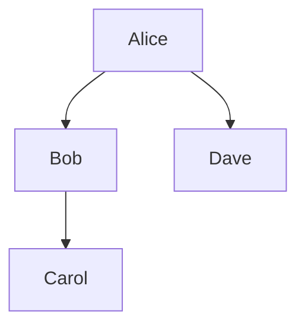

## Edge List Representation

### Description

The Edge List Representation is a fundamental data modeling pattern used to depict the relationships between entities in a network. It's implemented using a two-column table, where each row signifies a connection (or "edge") between two nodes. This model is particularly useful in scenarios where the focus is on the connections rather than the nodes themselves, and where node attributes are secondary.

### Key Concepts

- **Nodes and Edges**: Nodes are the entities, and edges are the connections between these entities. Each entry in the Edge List table corresponds to a designated edge.
  
- **Simplicity**: This method provides a straightforward approach to graph representation, ideal for scenarios where quick access and modification of connections are critical.

- **Directional Notes**: If the relationship has a direction, entries should indicate this by maintaining a consistent order for the two nodes that form each edge.

### Example

Consider a social network where users are nodes, and friendships between them are edges. An Edge List could look like this:

| NodeA | NodeB |
|-------|-------|
| Alice | Bob   |
| Bob   | Carol |
| Alice | Dave  |

In this table, a connection is recorded between the two nodes (or users), representing a friendship or following relationship in the network.

### Architectural Approaches

- **Storage in Databases**: 
  - **SQL**: Utilize SQL tables with indexes on both Node columns for efficient querying.
  - **NoSQL**: Particularly in document or column-oriented databases, store the edge list for quick directional or bi-directional lookups.
  - **Graph Databases**: Some graph databases efficiently convert and store edge lists while offering highly optimized traversal operations.

- **In Memory**: In applications like real-time processing, storing the edge list in memory can facilitate fast lookups and updates.

### Best Practices

- **Indexing**: Ensure both NodeA and NodeB columns are indexed to optimize the performance of queries that involve looking up edges or neighboring nodes.
  
- **Normalizing Data**: While an edge list is straightforward, it’s often useful to normalize or denormalize based on specific use cases, such as data analysis or real-time processing.

- **Directionality Considerations**: If relationships are directional (e.g., follows vs. friendships), keep a clear, consistent policy on how edges are recorded to avoid confusion.

### Example Code

Below is a simple SQL table definition and query to store and retrieve edges efficiently:

```sql
-- Edge List Table Definition
CREATE TABLE EdgeList (
  NodeA VARCHAR(255),
  NodeB VARCHAR(255),
  PRIMARY KEY (NodeA, NodeB)
);

-- Query to find all nodes connected to 'Alice'
SELECT NodeB FROM EdgeList WHERE NodeA = 'Alice';
```

### Related Patterns

- **Adjacency Matrix**: Another representation form which uses a matrix to show node connections. Primarily used for dense graphs.
  
- **Adjacency List**: A preferable option for sparse graphs, where each node points to a list of adjacent nodes.

### Diagrams



This diagram illustrates the connections between nodes, effectively visualized as an edge list in diagrammatic form.

### Additional Resources

- [Graph Theory](https://en.wikipedia.org/wiki/Graph_theory)
- [Efficient Graph Representation and Storage](https://example.com/efficient-graph-storage)

### Summary

The Edge List Representation is an elegant method for modeling graphs, focusing on simplicity and ease of handling relationships. Especially useful where connections are more crucial than node attributes, this pattern finds extensive use in applications ranging from social networks to networking infrastructure and beyond. Whether used in-memory for rapid processing or stored in databases for persistence, the edge list remains a versatile tool for data-driven and network-focused architectures.
