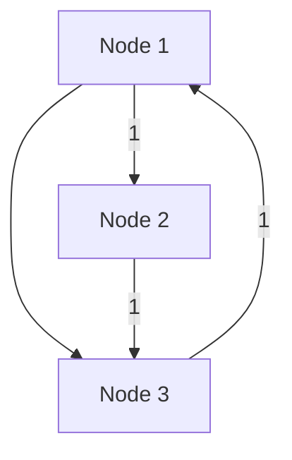

## Adjacency Matrix Design Pattern

### Description

The Adjacency Matrix is a fundamental design pattern in computer science, primarily used to represent finite graphs. It is a two-dimensional square matrix where each element indicates the presence or absence of an edge between two nodes. An entry at row `i` and column `j` in the matrix is typically `1` (or a true value) if there is an edge from node `i` to node `j`, otherwise it is `0` (or a false value). This pattern is particularly useful for dense graphs with a significant number of edges.

### Advantages

- **Simplicity**: Provides a straightforward way to implement graph representations that are intuitive and easy to understand.
- **Constant Time Edge Queries**: Allows checking the existence of an edge between any two nodes in constant time, O(1), which is advantageous for algorithms requiring frequent edge lookups.
- **Dense Graph Efficiency**: Well-suited for dense graphs where the number of edges is close to the number of nodes squared.
- **Easy Integration in Algorithms**: Adjacency matrices can be directly used in matrix operations, making them suitable for implementing algorithms like the Floyd-Warshall for shortest paths.

### Disadvantages

- **Space Inefficiency**: Requires O(V^2) memory, which might be inefficient for sparse graphs with few edges relative to the number of nodes.
- **Complexity in Updating Edges**: Adding or removing vertices can be cumbersome since it may require resizing the matrix.

### Example Code

Here is an example of how you might represent a graph using an adjacency matrix in Python:

```python
class Graph:
    def __init__(self, num_vertices):
        # Initialize a VxV matrix
        self.adjacency_matrix = [[0] * num_vertices for _ in range(num_vertices)]
        self.num_vertices = num_vertices
    
    def add_edge(self, start_vertex, end_vertex):
        if 0 <= start_vertex < self.num_vertices and 0 <= end_vertex < self.num_vertices:
            self.adjacency_matrix[start_vertex][end_vertex] = 1

    def remove_edge(self, start_vertex, end_vertex):
        if 0 <= start_vertex < self.num_vertices and 0 <= end_vertex < self.num_vertices:
            self.adjacency_matrix[start_vertex][end_vertex] = 0

    def is_edge(self, start_vertex, end_vertex):
        return self.adjacency_matrix[start_vertex][end_vertex] == 1
```

### Diagram using Mermaid



### Related Patterns

- **Adjacency List**: Another strategy for representing graphs, ideal for sparse graphs, which uses a list of lists to handle vertices and their neighboring nodes.
- **Incidence Matrix**: Represents graphs wherein rows represent vertices while columns represent edges, capturing relationships between the two.
- **Matrix Operations for Graphs**: Techniques that perform calculations like finding paths or flows in networks using matrix multiplications.

### Additional Resources

- "Algorithms" by Robert Sedgewick and Kevin Wayne
- "Introduction to Algorithms" by Cormen, Leiserson, Rivest, and Stein
- Online resources for graph theory, such as the [Graph Theory overview](https://en.wikipedia.org/wiki/Graph_theory)

### Summary

The Adjacency Matrix Design Pattern is a robust mechanism for graph representation, offering a clear view of connections between nodes. While not always space-efficient for sparse graphs, it provides the advantage of constant-time edge queries and is integral to certain algorithms and applications. Understanding how to efficiently leverage adjacency matrices not only entails grasping their conceptual underpinnings but also integrating them effectively within algorithms that benefit from their structure. For dense network contexts, adjacency matrices provide a straightforward and potent tool for graph manipulation and computational operations.
