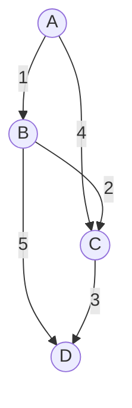

---

linkTitle: "Network Analysis"
title: "Network Analysis"
category: "Hierarchical and Network Modeling"
series: "Data Modeling Design Patterns"
description: "Applying algorithms like shortest path, centrality measures, and clustering to understand network properties."
categories:
- Networking
- Data Modeling
- Algorithms
tags:
- Network Analysis
- Graph Theory
- Algorithms
- Data Science
- Big Data
date: 2024-07-07
type: docs

canonical: "https://softwarepatternslexicon.com/102/8/9"
license: "© 2024 Tokenizer Inc. CC BY-NC-SA 4.0"
---

## Introduction

Network Analysis is a pivotal design pattern in hierarchical and network modeling that leverages algorithms to extract insights and understanding from complex networks. Whether in social networks, transportation systems, or biological systems, analyzing how nodes and edges interact can reveal essential characteristics such as connectivity, efficiency, and resilience.

## Key Algorithms in Network Analysis

1. **Shortest Path Algorithm**: 
   - **Description**: Finds the shortest path between two nodes in a network. Common algorithms include Dijkstra's and Bellman-Ford.
   - **Use Case**: Efficient routing in a transportation network or internet data packet routing.

2. **Centrality Measures**:
   - **Description**: Identify the most important nodes within a network. Types include degree, closeness, and betweenness centrality.
   - **Use Case**: Detecting influential users in social media platforms.

3. **Clustering and Community Detection**:
   - **Description**: Group nodes into clusters such that nodes within the same cluster are more densely connected among themselves than with nodes in other clusters.
   - **Use Case**: Market segmentation based on customer interaction networks.

## Example: Dijkstra's Algorithm in Network Analysis

Implementing Dijkstra's algorithm can effectively determine the shortest routes in various network applications:
```java
import java.util.*;

public class DijkstraAlgorithm {

    private static class Node implements Comparable<Node> {
        private final String name;
        private final List<Edge> edges = new ArrayList<>();
        private double shortestDistance = Double.POSITIVE_INFINITY;
        private Node previousNode = null;

        public Node(String name) {
            this.name = name;
        }

        public void addEdge(Node target, double weight) {
            edges.add(new Edge(this, target, weight));
        }

        @Override
        public int compareTo(Node other) {
            return Double.compare(this.shortestDistance, other.shortestDistance);
        }
    }

    private static class Edge {
        private final Node source;
        private final Node destination;
        private final double weight;

        public Edge(Node source, Node destination, double weight) {
            this.source = source;
            this.destination = destination;
            this.weight = weight;
        }
    }

    public static void computeShortestPaths(Node source) {
        source.shortestDistance = 0;
        PriorityQueue<Node> queue = new PriorityQueue<>();
        queue.add(source);

        while (!queue.isEmpty()) {
            Node current = queue.poll();
            for (Edge edge : current.edges) {
                Node target = edge.destination;
                double newDistance = current.shortestDistance + edge.weight;
                if (newDistance < target.shortestDistance) {
                    target.shortestDistance = newDistance;
                    target.previousNode = current;
                    queue.add(target);
                }
            }
        }
    }

    public static List<Node> getShortestPathTo(Node target) {
        List<Node> path = new LinkedList<>();
        for (Node node = target; node != null; node = node.previousNode) {
            path.add(node);
        }
        Collections.reverse(path);
        return path;
    }
}
```

## Diagrams: Network Representation

Below is a Mermaid diagram representing a simple network used for Dijkstra's Algorithm implementation:



## Related Patterns

- **Graph Database Model**: Storing and querying graphs efficiently using databases like Neo4j.
- **MapReduce for Big Graph Processing**: Distributed processing of large graphs, commonly using frameworks like Apache Hadoop.
- **Machine Learning on Graphs**: Applying ML algorithms to predict attributes or classify nodes within a graph.

## Summary

Network Analysis provides powerful methods for dissecting and understanding complex systems across various domains. By using advanced algorithms, we can derive actionable insights about connectivity and network dynamics, making it a critical tool for applications from logistics and telecommunications to social network analysis and bioinformatics. With a firm grasp of these strategies, practitioners can design and implement more resilient and efficient systems.

## Additional Resources

- **Books**: 
  - "Networks, Crowds, and Markets: Reasoning About a Highly Connected World" by David Easley and Jon Kleinberg
- **Online Courses**: 
  - "Network Analysis in Python" available on Coursera and edX.
- **Tools**: 
  - NetworkX for Python and GraphX for Apache Spark for large-scale network analysis.

This comprehensive mapping of Network Analysis imbues engineers and analysts with techniques to navigate the realm of interconnected systems, ensuring robust and insightful outcomes.
