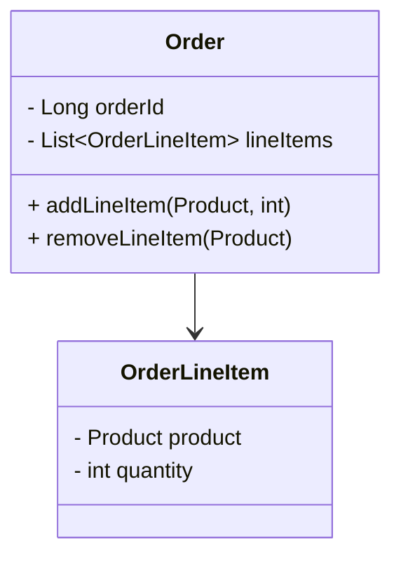

---

linkTitle: "Aggregate Entities"
title: "Aggregate Entities"
category: "9. Aggregation Patterns"
series: "Data Modeling Design Patterns"
description: "Aggregation of related entities into a cohesive unit for encapsulation and integrity, widely used in Domain-Driven Design (DDD)."
categories:
- cloud-computing
- data-modeling
- domain-driven-design
tags:
- aggregate-entities
- DDD
- data-integrity
- encapsulation
- entity-modeling
date: 2024-07-07
type: docs
canonical: "https://softwarepatternslexicon.com/102/9/1"
license: "© 2024 Tokenizer Inc. CC BY-NC-SA 4.0"
---

## Introduction

The **Aggregate Entities** design pattern is a fundamental concept in Domain-Driven Design (DDD), which focuses on grouping related entities into a single logical unit. These entities share a cohesive boundary, enabling encapsulation and maintaining data integrity. Aggregates are critical for managing complex data interactions and ensuring that operations performed across entities maintain consistency and business invariants.

## Detailed Explanation

### Concepts and Structure

Aggregates consist of a root entity and a collection of associated entities and value objects. The root entity serves as the entry point for accessing entities within the aggregate and is responsible for maintaining the aggregate's state and invariants. By containing all related entities within a boundary, aggregates promote strong encapsulation and autonomy.

#### Key Properties:
- **Atomic Consistency**: All modifications to the aggregate boundary are atomic, meaning they either complete fully or not at all.
- **Encapsulation of Operations**: All state modifications are performed through methods on the aggregate root, preventing direct manipulation of its internal state.
- **Transaction Boundary**: Aggregates define a natural boundary for transactional operations.

#### Example in E-commerce:

```java
class Order {
    private Long orderId;
    private List<OrderLineItem> lineItems;

    public Order(Long orderId) {
        this.orderId = orderId;
        this.lineItems = new ArrayList<>();
    }

    public void addLineItem(Product product, int quantity) {
        lineItems.add(new OrderLineItem(product, quantity));
    }

    public void removeLineItem(Product product) {
        lineItems.removeIf(item -> item.getProduct().equals(product));
    }

    // Additional aggregate logic...
}

class OrderLineItem {
    private Product product;
    private int quantity;

    public OrderLineItem(Product product, int quantity) {
        this.product = product;
        this.quantity = quantity;
    }

    // Getter methods...
}
```

In this scenario, `Order` is the aggregate root, which manages `OrderLineItem` entities. Any addition or removal of line items is performed through `Order` methods, ensuring that integrity constraints are met.

### Architectural Approaches

1. **Consistency Boundaries**: Each aggregate ensures its internal consistency. When designing aggregates, consider opting for smaller sizes as excessively large aggregates may lead to decreased performance due to frequent locks and resource bottlenecks.

2. **Eventual Consistency in Distributed Systems**: In distributed systems, strict consistency across aggregates may be impractical. The pattern allows for eventual consistency, where changes are propagated asynchronously.

3. **Domain Events**: Use domain events triggered by changes in aggregates to notify other components or services of state changes.

### Best Practices

- **Define Clear Boundaries**: Clearly define what is within and outside the aggregate. This decision largely impacts performance and maintainability.
- **Single Responsibility**: An aggregate should embody a single responsibility, representing a specific business concept or transaction.
- **Separate Concerns**: Focus aggregates on managing state and business logic, delegating unrelated responsibilities to other patterns or components.

## Diagrams

### Aggregate Structure Example



## Related Patterns

- **Repository Pattern**: Often used alongside aggregates to manage data sourcing and persistence.
- **Domain Event Pattern**: Utilized with aggregates for communication of events across the system.
- **Saga Pattern**: Can be applied for handling long-running transactions across multiple aggregates.

## Additional Resources

- *Domain-Driven Design: Tackling Complexity in the Heart of Software* by Eric Evans: A comprehensive guide to DDD principles.
- *Implementing Domain-Driven Design* by Vaughn Vernon: Detailed insights on applying DDD practices effectively.

## Summary

The Aggregate Entities pattern is critical for encapsulated data modeling within Domain-Driven Design. By bounding related entities into a consistent and functional unit, developers can maintain data accuracy and system integrity. Aggregates improve system architecture by enforcing clear boundaries and simplifying complex workflows. They serve as a linchpin in managing structural and operational complexities in distributed systems, laying the foundation for scaling and solid design.
