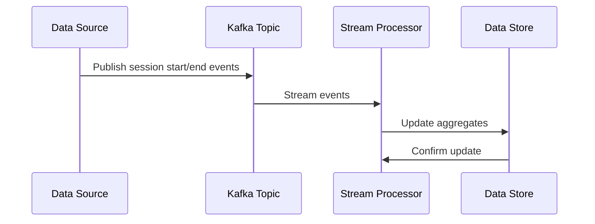

---

linkTitle: "Real-Time Aggregation"
title: "Real-Time Aggregation"
category: "9. Aggregation Patterns"
series: "Data Modeling Design Patterns"
description: "Computing aggregations in real-time as data is ingested or updated."
categories:
- Data Processing
- Streaming Architectures
- Real-Time Systems
tags:
- Real-Time Processing
- Aggregation
- Data Streams
- Event-Driven Architecture
- Apache Kafka
date: 2024-07-07
type: docs
canonical: "https://softwarepatternslexicon.com/102/9/10"
license: "© 2024 Tokenizer Inc. CC BY-NC-SA 4.0"
---

## Real-Time Aggregation

Computing aggregations in real-time as data is ingested or updated is crucial for many modern applications that demand immediate insights and responses. The "Real-Time Aggregation" design pattern is essential in contexts where data needs to be analyzed instantaneously, like tracking online user sessions, calculating transaction totals on the fly, or updating metrics dashboards.

### Architectural Approach

The real-time aggregation pattern involves processing and aggregating data streams as they arrive, rather than relying on batch processing. This requires an architecture that supports low latency and high throughput, usually implemented using stream processing frameworks coupled with a distributed messaging system such as Apache Kafka.

**Key Components:**

- **Ingestion System**: Captures the raw data in real-time from various sources.
- **Messaging System**: Used to transport data streams efficiently, ensuring fault tolerance and scalability. Apache Kafka is a popular choice.
- **Stream Processing Framework**: Tools like Apache Flink, Apache Storm, or Kafka Streams process incoming data, compute aggregations, and output results.
- **Data Store**: Results of aggregations are stored in a low-latency and high-throughput database for querying in real-time. Apache Cassandra or AWS DynamoDB are viable options.

### Example Code

Here's a simple real-time aggregation example using Kafka Streams in Java to compute the total number of online users:

```java
Properties props = new Properties();
props.put(StreamsConfig.APPLICATION_ID_CONFIG, "online-user-aggregation");
props.put(StreamsConfig.BOOTSTRAP_SERVERS_CONFIG, "localhost:9092");

StreamsBuilder builder = new StreamsBuilder();
KStream<String, String> sessionStream = builder.stream("user-sessions");

KTable<String, Long> activeUsers = sessionStream
    .groupByKey()
    .aggregate(
        () -> 0L,
        (key, session, total) -> session.equals("START") ? total + 1 : total - 1,
        Materialized.as("activeUsersStore")
    );

activeUsers.toStream().to("active-users-topic", Produced.with(Serdes.String(), Serdes.Long()));

KafkaStreams streams = new KafkaStreams(builder.build(), props);
streams.start();
```

### Diagrams

#### Real-Time Aggregation Sequence Diagram



### Related Patterns

- **Event Sourcing**: Capturing changes to an application state as a sequence of events, which can be replayed to compute current state.
- **CQRS (Command Query Responsibility Segregation)**: Keeping the read and write operations separated to allow better optimization and scaling.
- **Data Lake Pattern**: Storing large volumes of raw data in its native format without processing.

### Additional Resources

- **[Apache Kafka](https://kafka.apache.org/)**: Learn more about distributed streaming platforms.
- **[Kafka Streams](https://kafka.apache.org/documentation/streams/)**: Learn about building real-time applications.
- **[Apache Flink](https://flink.apache.org/)**: Explore this powerful stream and batch processing framework.
- **[Building Event-Driven Microservices](https://www.oreilly.com/library/view/designing-event-driven-systems/9781492038257/)** by Ben Stopford.

### Summary

Real-Time Aggregation enables applications to handle and derive insights from continuous streaming data efficiently. By leveraging distributed stream processing ecosystems, businesses and systems can perform immediate analyses, making this pattern essential for real-time analytics, monitoring, and rapid data-driven decision-making. This design pattern is fundamental in maintaining competitiveness and operational excellence in a data-centric world.
