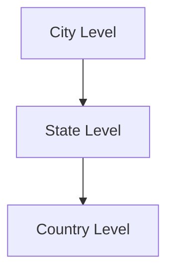

## Hierarchical Aggregation

### Overview

Hierarchical Aggregation is a design pattern used to aggregate data across hierarchical levels. This pattern is particularly useful in scenarios where data needs to be summed or averaged in a structured and layered manner, such as organizational units or geographical regions.

### Context

When dealing with large datasets spread across different dimensions, hierarchical aggregation allows for efficient data retrieval and summarization. This is common in enterprise environments where data is inherently hierarchical, such as sales data organized by city, state, and country.

### Problem

The challenge lies in efficiently aggregating data across various hierarchical levels without redundancy or performance bottlenecks. The key is to maintain the granularity of lower levels while accurately reflecting the aggregated information at higher layers.

### Solution

Implementing Hierarchical Aggregation involves:

- Structuring data into a tree or graph-like format representing the hierarchy.
- Using algorithms to aggregate data at each level and propagate these aggregates upwards through the hierarchy.
- Ensuring data immutability where changes in base data automatically reflect in all hierarchical levels.

### Example Code

```sql
WITH Sales_Hierarchy AS (
  SELECT 
    city, 
    state, 
    country, 
    SUM(sales) AS total_city_sales
  FROM 
    Sales
  GROUP BY 
    city, state, country
),
State_Aggregation AS (
  SELECT 
    state, 
    country, 
    SUM(total_city_sales) AS total_state_sales
  FROM 
    Sales_Hierarchy
  GROUP BY 
    state, country
),
Country_Aggregation AS (
  SELECT 
    country, 
    SUM(total_state_sales) AS total_country_sales
  FROM 
    State_Aggregation
  GROUP BY 
    country
)
SELECT 
  *
FROM 
  Country_Aggregation;
```

### Diagram



### Related Patterns

- **Map-Reduce Pattern**: This pattern deals with processing and aggregating large datasets across distributed compute nodes.
- **Partitioning**: Involves splitting a dataset into partitions to streamline processing and aggregation.

### Best Practices

- Ensure data consistency and correctness by implementing ETL (Extract, Transform, Load) processes to cleanse and prepare hierarchical data for aggregation.
- Leverage caching mechanisms to improve aggregation retrieval speed at higher levels.
- Consider eventual consistency models in distributed systems to manage data synchronization between hierarchical levels.

### Additional Resources

- [Understanding OLAP and OLAP Cubes](https://www.ibm.com/docs/en/informix-olap/11.5?topic=overview-understanding-online-analytical-processing-olap)
- [Aggregation Strategies for Data Warehousing](https://techjourney.net/data-warehousing-aggregation-methods/)

### Summary

Hierarchical Aggregation enables organizations to gain insights from layered data structures, facilitating decision-making processes. By implementing this pattern, companies can better understand their data architecture, leading to optimized data analytics and reporting efforts across hierarchical domains.
