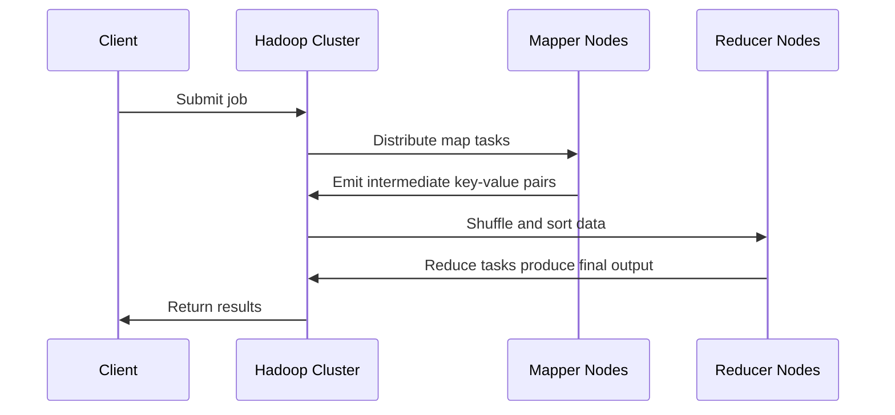

## MapReduce Aggregation

### Description

MapReduce Aggregation is a design pattern used to distribute aggregation tasks across multiple nodes in a distributed system. This pattern utilizes the MapReduce paradigm, which significantly enhances the efficiency of processing and computing large datasets. Specifically, MapReduce consists of two distinct tasks: the 'Map' task, which organizes data, and the 'Reduce' task, which performs aggregations and summaries.

### Example

Consider the use of Hadoop MapReduce to process large datasets stored in HDFS (Hadoop Distributed File System). The Map phase involves segregating the input data into manageable subsets and allocating them to mapper nodes. Each node processes its subset to output intermediate key-value pairs. During the Reduce phase, these key-value pairs are shuffled and sorted, before being aggregated into a final result. This method is particularly advantageous in handling vast quantities of data, allowing the system to parallelize tasks and leverage distributed computing.

### Architectural Approaches

- **Parallel Data Processing**: Segregating data into chunks allows parallel processing across nodes, increasing computational efficiency.
- **Fault Tolerance**: Inherent in Hadoop MapReduce, if a node fails, tasks are seamlessly reassigned without disrupting the operation.
- **Scalability**: By adding more nodes, the system can handle increased data loads, adding to both storage and processing capabilities.
  
### Paradigms and Best Practices

- **Data Partitioning**: Ensure that data is effectively partitioned to achieve optimal load balancing across nodes.
- **Combiner Functions**: Use combiners to perform local aggregation on mapper nodes before the shuffle and sort phase. This minimizes data transfer.
- **Resource Management**: Utilize resource managers (e.g., YARN for Hadoop) to efficiently allocate cluster resources and manage workloads.
- **Optimize I/O Operations**: Limit read and write operations as they tend to be the bottleneck in MapReduce jobs.

### Example Code

```java
import java.io.IOException;
import org.apache.hadoop.conf.Configuration;
import org.apache.hadoop.fs.Path;
import org.apache.hadoop.io.IntWritable;
import org.apache.hadoop.io.Text;
import org.apache.hadoop.mapreduce.Job;
import org.apache.hadoop.mapreduce.Mapper;
import org.apache.hadoop.mapreduce.Reducer;
import org.apache.hadoop.mapreduce.lib.input.FileInputFormat;
import org.apache.hadoop.mapreduce.lib.output.FileOutputFormat;

public class WordCount {

    public static class TokenizerMapper extends Mapper<Object, Text, Text, IntWritable>{

        private final static IntWritable one = new IntWritable(1);
        private Text word = new Text();

        public void map(Object key, Text value, Context context) throws IOException, InterruptedException {
            String[] tokens = value.toString().split("\\s+");
            for (String token : tokens) {
                word.set(token);
                context.write(word, one);
            }
        }
    }

    public static class IntSumReducer extends Reducer<Text, IntWritable, Text, IntWritable> {
        public void reduce(Text key, Iterable<IntWritable> values, Context context) throws IOException, InterruptedException {
            int sum = 0;
            for (IntWritable val : values) {
                sum += val.get();
            }
            context.write(key, new IntWritable(sum));
        }
    }

    public static void main(String[] args) throws Exception {
        Configuration conf = new Configuration();
        Job job = Job.getInstance(conf, "word count");
        job.setJarByClass(WordCount.class);
        job.setMapperClass(TokenizerMapper.class);
        job.setCombinerClass(IntSumReducer.class);
        job.setReducerClass(IntSumReducer.class);
        job.setOutputKeyClass(Text.class);
        job.setOutputValueClass(IntWritable.class);
        FileInputFormat.addInputPath(job, new Path(args[0]));
        FileOutputFormat.setOutputPath(job, new Path(args[1]));
        System.exit(job.waitForCompletion(true) ? 0 : 1);
    }
}
```

### Diagrams



### Related Patterns

- **Batch Processing**: Uses batch jobs to process large volumes of data; often used with MapReduce.
- **Stream Processing**: In contrast to batch, processes data in real time, suitable for continuous aggregation.
- **Shared Nothing Architecture**: Parallelize operations across independent nodes to maximize distribution efficiency.

### Additional Resources

- [Hadoop: The Definitive Guide by Tom White](https://oreilly.com)
- [MapReduce: Simplified Data Processing on Large Clusters](https://research.google.com/archive/mapreduce.html)
- [Hadoop Official Documentation](https://hadoop.apache.org/docs/)

### Summary

The MapReduce Aggregation design pattern is a crucial approach within the realm of large-scale data processing. It leverages parallel computing strategies to efficiently manage and process large datasets, ensuring scalability and fault tolerance. By deploying this pattern, organizations can achieve accelerated data processing capabilities in distributed systems, allowing them to derive actionable insights from significant data volumes.
