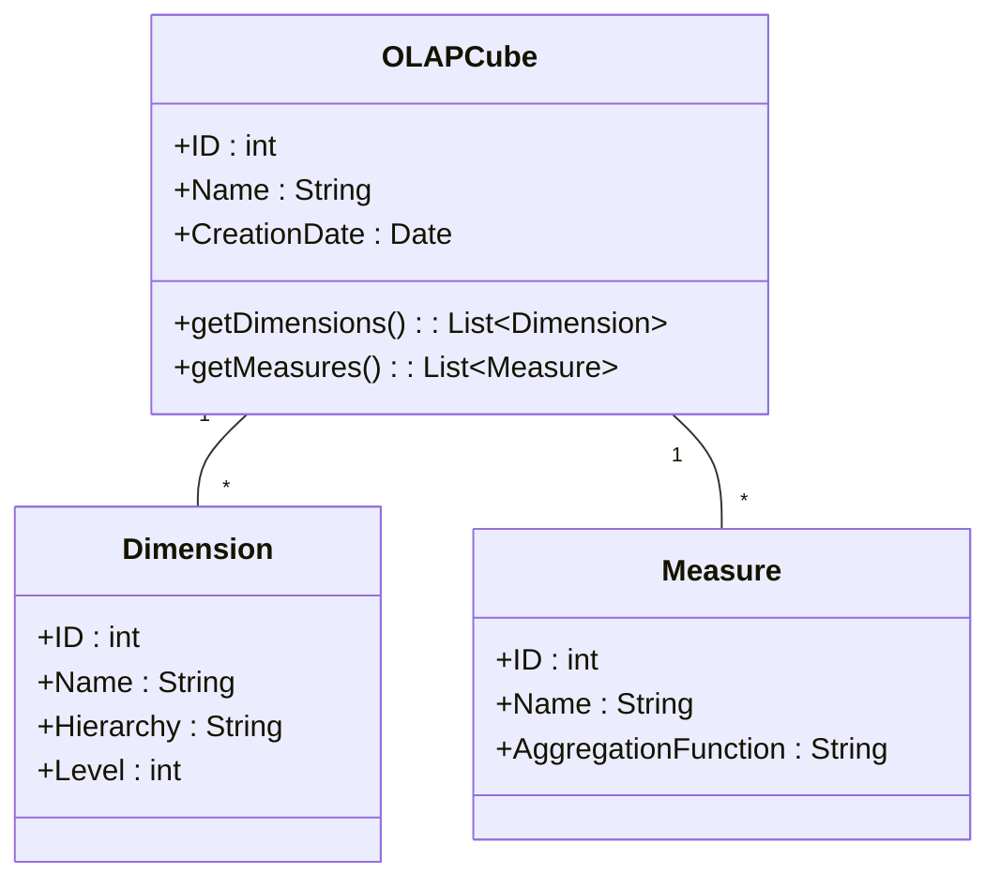

## Introduction

OLAP (Online Analytical Processing) Cubes are a design pattern used to structure data into multidimensional cubes, optimizing it for quick query and aggregation processes. This pattern is prevalent in business intelligence applications where rapid analysis of large datasets across various dimensions, such as time, product, or geography, is necessary. OLAP cubes help transform raw data into meaningful insights by pre-aggregating and summarizing information.

## Detailed Explanation

### Design and Architecture

OLAP cubes are conceptually structured into dimensions and measures:

- **Dimensions**: These are the perspectives or entities with respect to which an organization wants to keep records. Common dimensions include time, geography, and products. Each dimension can have a hierarchical structure, such as year > quarter > month > day for time.

- **Measures**: These are the numerical data that users want to analyze. Examples include sales revenue, profit, or units sold. Measures are aggregated facts that are derived from the datasets.

The cube allows for data aggregation at various intersection points of dimensions, making it easier to extract multi-faceted insights.

### Example

Consider a fictional retail company's sales data cube with three dimensions:

1. **Time**: Year, Quarter, Month, Day
2. **Product**: Category, Subcategory, Product ID
3. **Geography**: Region, Country, State, City

A typical query might be: "What are the total sales for electronic products in North America over the last quarter?"

```sql
SELECT
  SUM(sales_amount) AS total_sales
FROM
  sales_cube
WHERE
  product_category = 'Electronics' AND
  region = 'North America' AND
  time_quarter = '2023-Q4';
```

In this example, the OLAP system can quickly retrieve pre-aggregated data to efficiently answer the query.

### Architectural Approaches

1. **ROLAP (Relational OLAP)**: Uses relational databases for storing data, representing multidimensional data in a tabular format. It leverages complex SQL queries for analysis. Suitable for handling large datasets that change frequently.

2. **MOLAP (Multidimensional OLAP)**: Stores data in optimized, multidimensional arrays, generally from a data warehouse. It provides faster query performance for smaller static datasets.

3. **HOLAP (Hybrid OLAP)**: Combines ROLAP and MOLAP technologies, offering a trade-off between performance and scalability by storing summarized data in a cube (similar to MOLAP) but detailed data in a relational database (similar to ROLAP).

### Best Practices

- Pre-calculate and store frequently accessed aggregates to improve performance.
- Carefully design dimensions and hierarchies by considering how decisions are made in your specific domain.
- Regularly refresh and update the cube data to reflect the most current insights.
- Consider indexing strategies to improve retrieval times.

### Diagrams

Below is a simple UML Class diagram illustrating the structure of an OLAP Cube:



## Related Patterns and Concepts

- **Data Lake**: A storage repository that holds vast sets of raw data in its native format until it is needed.
- **Data Warehouse**: A centralized repository for integrated data from various sources, used for reporting and data analysis.
- **ETL (Extract, Transform, Load)**: Processes importing data from outside sources into a data warehouse.

## Additional Resources

- [Kimball's Data Warehouse Toolkit](https://www.oreilly.com/library/view/the-data-warehouse/9781118530801/)
- [MDX Query Language](https://docs.microsoft.com/en-us/sql/mdx/mdx-query-language?view=sql-server-ver15) - Useful for querying OLAP cubes.

## Summary

OLAP Cubes efficiently facilitate business intelligence needs by providing a multifaceted approach to data analysis. They offer diverse ways to slice-and-dice data and quickly execute complex queries, empowering organizations with rich, insightful analytics capabilities. Understanding the needs and context of data interaction is crucial for their effective implementation.
