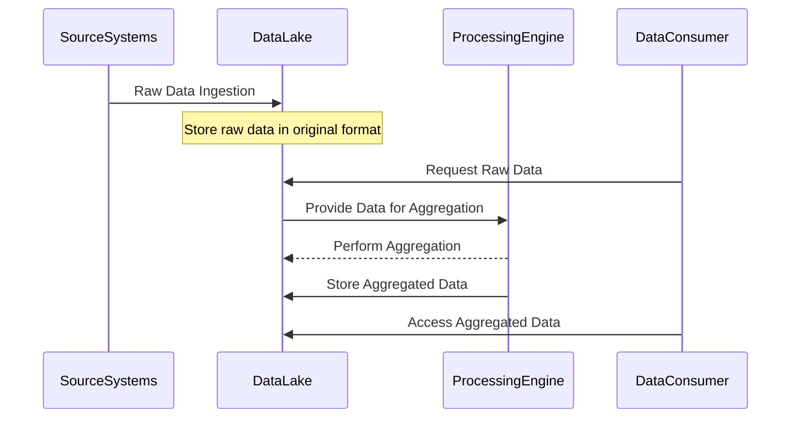

Data Lake Aggregation is an architectural pattern that facilitates the aggregation of raw, unprocessed data within a data lake for specific analytical purposes. This pattern leverages the inherent capabilities of data lakes—such as scalability, flexibility, and the ability to handle diverse data types—to allow efficient data aggregation and processing.

## Architectural Approaches

1. **Partitioning and Segmentation**: Data is partitioned based on specific keys (e.g., date, region, or type) to enable efficient querying and aggregation. Segmentation helps in isolating chunks of data for targeted analytical processes.

2. **ETL and ELT Processes**:
   - **ETL (Extract, Transform, Load)**: Data is extracted from source systems, transformed to fit analytical requirements, and then loaded into the data lake.
   - **ELT (Extract, Load, Transform)**: Data is first loaded into the data lake and transformations are performed afterward, leveraging data lake processing power.

3. **Data Cataloging**: Maintain a catalog of metadata that describes the datasets stored in the data lake. This metadata facilitates seamless data discovery and aggregation operations.

4. **Data Schema-on-Read**: Follow a schema-on-read approach to flexibly parse and aggregate data at read time, without needing predefined schemas.

5. **Use of Distributed Frameworks**: Leverage big data frameworks like Apache Spark or Flink for distributed processing and aggregation of massive data sets.

## Example Code

Here's an example using Apache Spark for aggregating data within a data lake:

```scala
import org.apache.spark.sql.SparkSession
import org.apache.spark.sql.functions._

val spark = SparkSession.builder
  .appName("DataLakeAggregation")
  .getOrCreate()

// Load data from data lake
val rawData = spark.read
  .format("parquet")
  .load("s3://datalake/raw/logs")

// Perform data aggregation
val aggregatedData = rawData.groupBy("date", "errorType")
  .agg(count("*").alias("errorCount"))

// Save aggregated results back to data lake
aggregatedData.write
  .format("parquet")
  .save("s3://datalake/aggregated/errorRates")

spark.stop()
```

## Diagram

Below is a Mermaid sequence diagram detailing the process flow of data lake aggregation:



## Related Patterns

- **Lambda Architecture**: Combines batch and real-time stream processing for handling massive data volumes—can coexist with data lakes for real-time analytics.
- **Data Warehousing**: Traditional data warehousing patterns also relate, particularly in structured data aggregation and providing insights.

## Additional Resources

- [Understanding Data Lakes](https://example.com/data_lakes_guide)
- [Apache Spark for Data Aggregation](https://spark.apache.org/)
- [Best Practices for Data Lake Architecture](https://aws.amazon.com/big-data/datalakes-and-analytics/)

## Final Summary

Data Lake Aggregation is essential for extracting value from diverse and vast data sets stored in data lakes. By utilizing this pattern, organizations can efficiently process and analyze huge volumes of data, supporting informed decision-making and insights. Adopting cloud-based solutions and big data technologies ensures scalability, flexibility, and robustness in analytical operations. Understanding and implementing this pattern enables leveraging the full potential of a data lake ecosystem.
